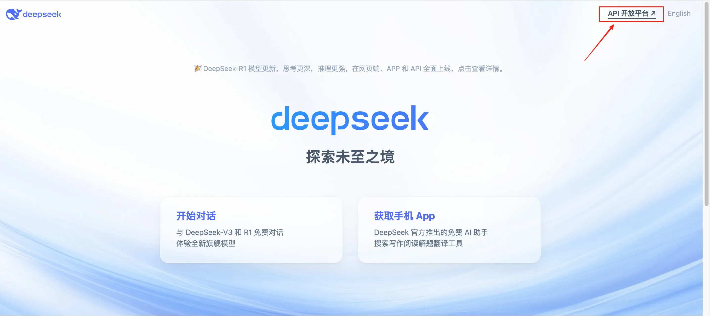
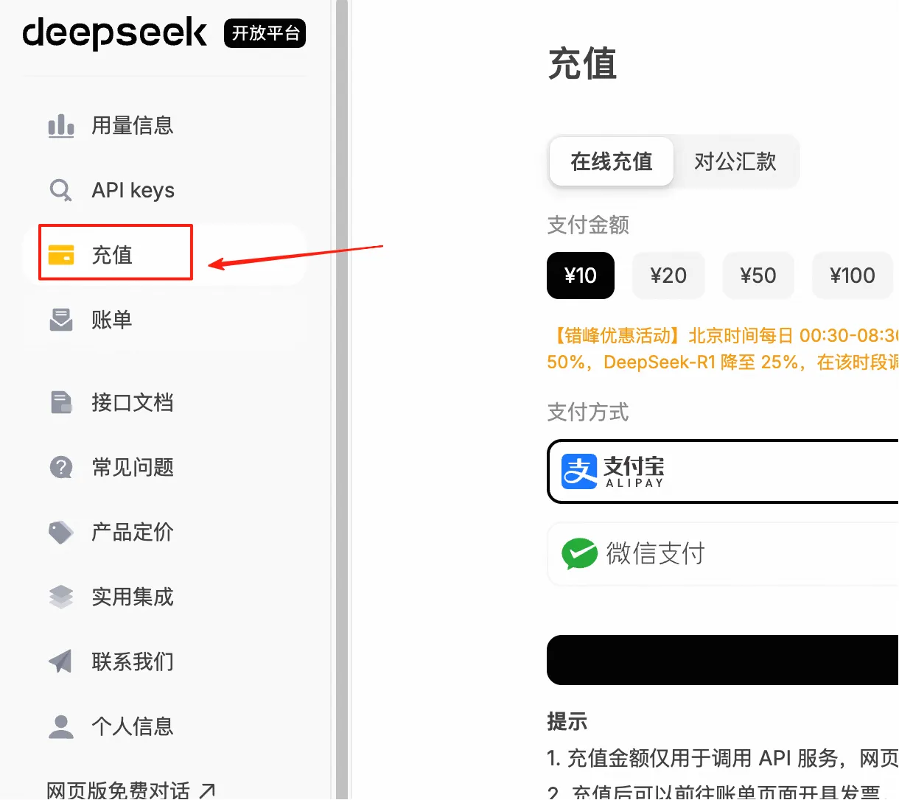
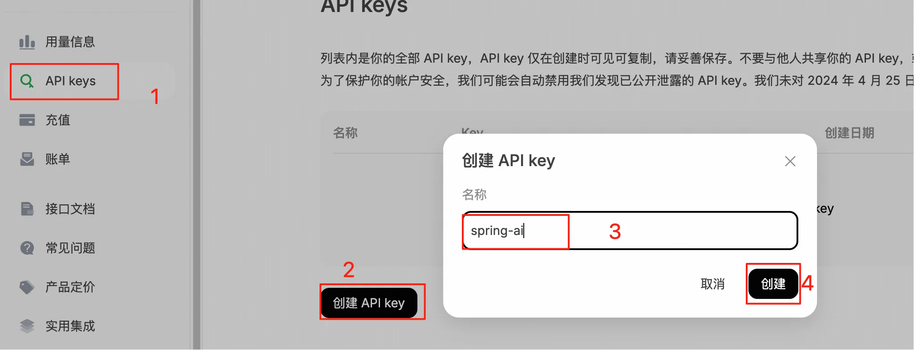
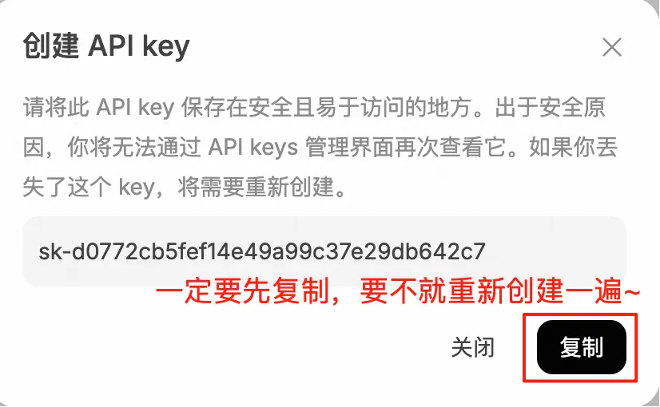
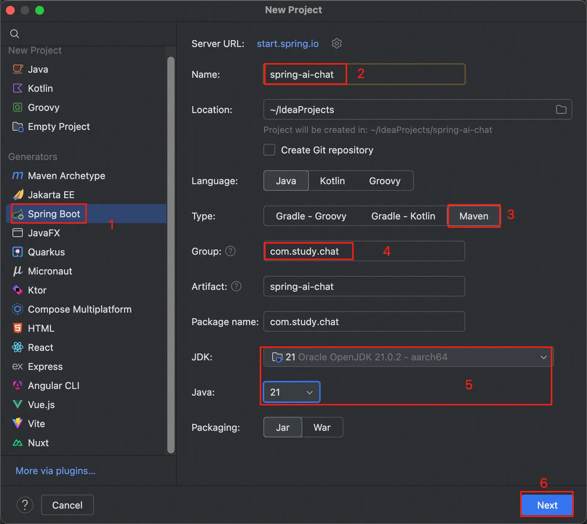
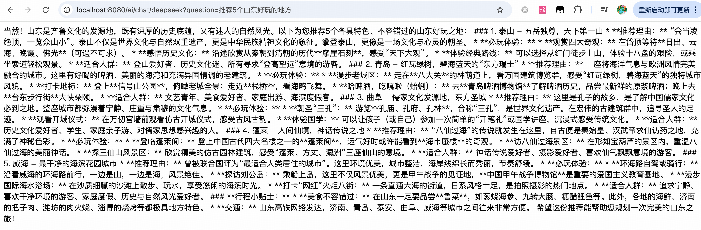

## 小白学SpringAI-前期准备

---

### deepseek

使用 deepseek（后面简称 ds） 作为 AI 模型来进行聊天。

1. 注册步骤省略
2. 在 ds 右上角点击跳转到 API 开放平台页面
   
3. 进行充值

> PS:首次充值需要进行实名认证



4. 创建 API-KEY

> PS：关闭确认框之前要先复制好 api-key!




我之前的 API-KEY
API-KEY:sk-d0772***********************42c7

---

### 创建 Springboot 项目以及引入依赖

1. 创建一个空的 Springboot 项目即可
   

点击了 Next 之后，直接点击 Create 按钮，等下直接引入第二步的依赖即可。

2. 引入所需 Maven 依赖

```
   <properties>
        <maven.compiler.source>21</maven.compiler.source>
        <maven.compiler.target>21</maven.compiler.target>
        <project.build.sourceEncoding>UTF-8</project.build.sourceEncoding>
        <spring-boot.version>3.5.4</spring-boot.version>
        <spring-ai.version>1.0.0</spring-ai.version>
    </properties>

    <dependencies>
        <!-- 引入 spring-ai-->
        <dependency>
            <groupId>org.springframework.ai</groupId>
            <artifactId>spring-ai-bom</artifactId>
            <version>${spring-ai.version}</version>
            <type>pom</type>
            <scope>import</scope>
        </dependency>
        <!-- Spring Web 启动器-->
        <dependency>
            <groupId>org.springframework.boot</groupId>
            <artifactId>spring-boot-starter-web</artifactId>
            <version>${spring-boot.version}</version>
        </dependency>
        <!-- Spring AI 模型启动器-->
        <dependency>
            <groupId>org.springframework.ai</groupId>
            <artifactId>spring-ai-starter-model-openai</artifactId>
            <version>1.0.1</version>
        </dependency>
    </dependencies>
```

3. 参数配置 application.yml

```
spring:
  ai:
    openai:
      # ds 提供的 API 密钥
      api-key: sk-d0772***********************42c7
      #ds 开放平台地址
      base-url: https://api.deepseek.com
      chat:
        options:
          # 模型名称。deepseek-chat 使用的是 V3 模型，deepseek-reasoner 使用的是 R1 模型
          model: deepseek-chat
          # 多样化系数。常用值在0.1-1.0之间，值越大回答越多样化，推荐设置0.7。
          temperature: 0.7
```

### 第一次与 AI 聊天

```java
// 创建 controller 并进行访问
@RestController
public class ChatController {

   @Resource
   private ChatModel chatModel;

   @GetMapping("/ai/chat/deepseek")
   public String deepSeek(@RequestParam(value = "question") String question) {
      return chatModel.call(question);
   }
}
```

测试结果：


至此环境搭建成功，并且实现了与 AI 聊天，非常 easy，你的第一步已经迈出来成功啦~~~🎉🎉🎉