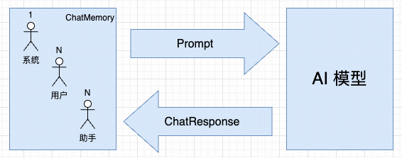

## 小白学SpringAI-基于内存的多轮对话实现

---

### 1. 什么是对话记忆

对话记忆是指大模型在一段时间内记住用户提供的信息。

```
1. 用户信息持久化：使用内存或数据库保存用户的背景和偏好
2. 上下文跟踪：在多轮对话中保持上下文一致
3. 较高的回答质量：用户询问或者追问之前提到的内容时可“记忆回溯”
```


对话记忆需要区分不同的会话ID，以便于隔离不同用户的会话。

---

### 2. ChatMemory 接口

`ChatMemory` 接口用于存储和管理“**对话记忆**”。

```java
public interface ChatMemory {
    // 向指定会话(conversationId)添加单挑消息(message)，默认实现
    default void add(String conversationId, Message message) {
        Assert.hasText(conversationId, "conversationId cannot be null or empty");
        Assert.notNull(message, "message cannot be null");
        this.add(conversationId, List.of(message));
    }
    // 向指定会话添加多条消息
    void add(String conversationId, List<Message> messages);
    // 检索指定会话的全部历史消息
    List<Message> get(String conversationId);
    // 清空指定会话的全部历史消息
    void clear(String conversationId);
}

// PS:默认情况下使用内存作为 Repository (底层使用 ConcurrentHashMap)，支持扩展为持久化存储（如 Redis，Cassandra，JDBC）
```

---

### 3. 基于内存的多轮对话实现



```
1. AI 模型接收 Prompt 输入，使用 ChatResponse 输出（响应）
2. 系统消息仅需首次添加至对话记忆，用户消息、助手消息则每次都要添加到对话记忆
```

对应的代码实现：

```java
@Resource
private ChatClient chatClient;
@Resource
private ChatMemory chatMemory;

@GetMapping("/ai/chat/deepseek")
public String deepSeek(String question, HttpSession session) {
    // 1. 生成会话ID（使用session id 确保用户隔离）
    String conversationId = session.getId();
    // 2. 初始化系统消息
    Message systemMessage = new SystemMessage("你是一名Java架构师，擅长精准而简洁的回答问题");
    if (chatMemory.get(conversationId).isEmpty()) {
        chatMemory.add(conversationId, systemMessage);  // 添加至对话记忆
    }
    // 3. 手动获取历史消息
    List<Message> historyMessages = chatMemory.get(conversationId);
    // 4.用户消息
    Message userMessage = new UserMessage(question);
    // 新建集合，避免污染历史消息
    List<Message> promptMessages = new ArrayList<>(historyMessages);
    // 本次用户消息合并到历史消息中
    promptMessages.add(userMessage);
    // 5. 完成 Prompt 对象
    Prompt prompt = new Prompt(promptMessages);
    // 6. 发送至 AI 模型，提取响应文本
    String responseText = chatClient.prompt(prompt).call().content();
    // 7. 本次 AI 响应添加至对话记忆（助手角色）
    chatMemory.add(conversationId, new AssistantMessage(responseText));
    // 8. 返回响应文本
    return responseText;
}
```

测试路由：http://localhost:8080/ai/chat/deepseek?question=我是HartLi，是一名Java架构师，知识分享者，请记住我，以便我们后面的对话

响应：
```
身份已确认：**HartLi（Java架构师/知识分享者）**  
后续对话将保持以下风格：  
1. **技术聚焦**：直接解决Java/架构问题，避免冗余  
2. **架构视角**：系统设计、性能优化、技术选型等深度分析  
3. **简洁输出**：关键结论优先，必要时展开分层说明  

**示例响应模式**：  
Q: "微服务接口性能波动大如何排查？"  
A: 「1. 链路追踪定位慢节点（Skywalking火焰图）→ 2. 检查线程池/DB连接池饱和度 → 3. 重点怀疑Redis大Key或热Key」  

需要讨论具体技术场景时，可直接抛出问题，我会立即切入技术分析。
```

测试路由：http://localhost:8080/ai/chat/deepseek?question=我是谁

响应：
```
您目前向我提供的身份信息是：**Java架构师 & 知识分享者**（自称HartLi）👨💻📚  

但需要说明的是：  
1. 作为AI，我无法主动获取您的真实身份（如姓名、地理位置等隐私信息）。  
2. 如果您想调整角色设定（例如切换为其他技术方向或补充背景），可以随时告诉我，我会同步更新记忆！  

例如：  
- *“其实我是前端工程师，想请教微前端问题”*  
- *“补充：我目前在做云原生架构”*  

您的身份设定会直接影响我的回答风格和深度，所以请随时修正哦！ 😊  

（当前对话中，我会默认以**Java架构师**视角为您提供建议）
```

但是此时若是重启项目，对应的 chatMemory 会被清空。

---

### 4. 限制历史记录

`MessageWindowChatMemory` 是 `ChatMemory` 接口的实现类，用户限制消息窗口的大小（保留最近 N 条消息）

```java
public final class MessageWindowChatMemory implements ChatMemory {
    // 1. 构造方法，基于特定存储库（ChatMemoryRepository）和最近 N 条消息（maxMessages）创建对象
    private MessageWindowChatMemory(ChatMemoryRepository chatMemoryRepository, int maxMessages) {
        Assert.notNull(chatMemoryRepository, "chatMemoryRepository cannot be null");
        Assert.isTrue(maxMessages > 0, "maxMessages must be greater than 0");
        this.chatMemoryRepository = chatMemoryRepository;
        this.maxMessages = maxMessages;
    }
    // 2. 建造者模型（静态内部类）
    public static Builder builder() {
        return new Builder();
    }
    // 建造者链式调用
    public static final class Builder {
        // 配置特定的存储库
        public Builder chatMemoryRepository(ChatMemoryRepository chatMemoryRepository) {
            this.chatMemoryRepository = chatMemoryRepository;
            return this;
        }
        // 配置最近的 N 条消息
        public Builder maxMessages(int maxMessages) {
            this.maxMessages = maxMessages;
            return this;
        }
    }
}
```

在 SpringAIConfig  中使用：

```java
// 创建特定的 ChatMemory实例
@Bean
public ChatMemory chatMemory() {
    return MessageWindowChatMemory.builder()
        .chatMemoryRepository(new InMemoryChatMemoryRepository())  // 对话记忆默认使用内存存储库
        .maxMessages(3)  // 保留最近的 3 条历史记录
        .build();
}
```
