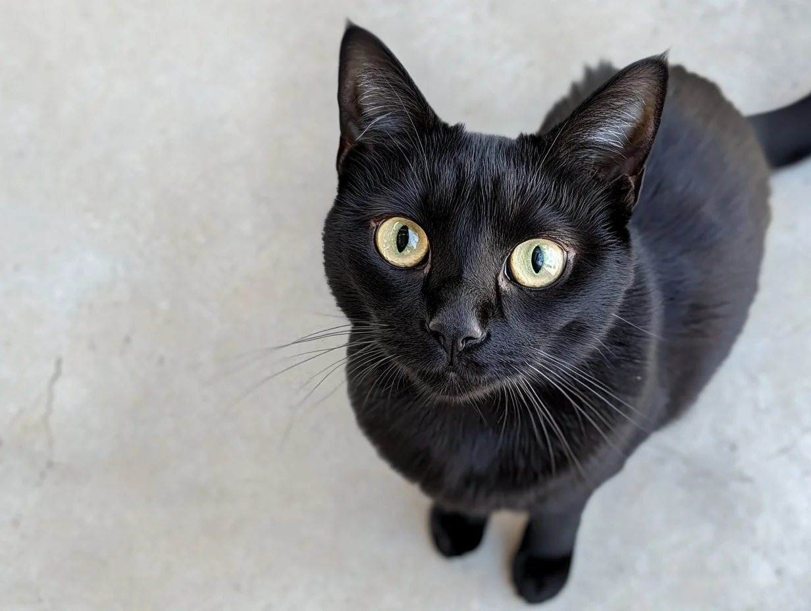
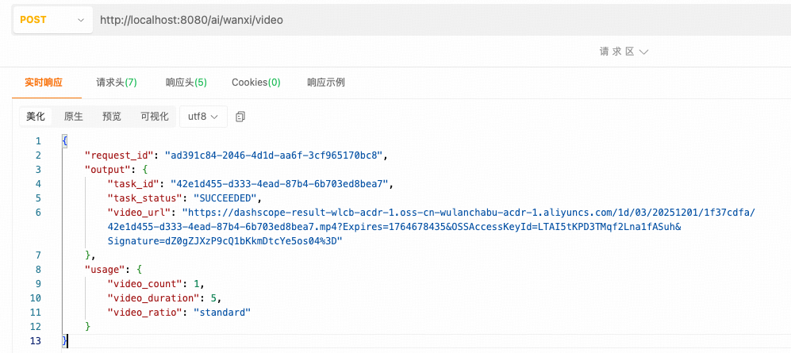

## 小白学SpringAI-图生视频

---

### 1. 什么是图生视频

图生视频，通过单图或者多图（如：首尾帧图像）生成动态视频的技术。

1. 社交媒体创作：制作爆款短视频内容
2. 影视与广告创作：制作产品演示、品牌宣传视频等，降低拍摄成本
3. 教育与知识传播：将文字转换视频增强学习趣味
4. ......

---

### 2. 图生视频模型

支持图生视频的模型，例如：
1. OpenAI Sora ：支持文生视频、图生视频。未明确体积支持首尾帧生成视频
2. CogVideoX 系列：支持文生视频、图生视频。未明确体积支持首尾帧生成视频
3. wanx2.1：通义万相推出的模型，支持文生视频、首尾帧生成视频

> PS: `SpringAI` 尚未提供任何可支持的图生视频模型接口实现类。

---

### 3. Wanx2.1 模型

`Wanx2.1` 模型是阿里“**通义实验室**”推出的视频生成模型，核心能力是通过首尾帧生成连贯的视频。[`Wanx2.1` 模型的官方文档](https://bailian.console.aliyun.com/?tab=api#/api/?type=model&url=2880649)

本次教程使用模型为 `wanx2.1-kf2v-plus`。

> PS:
>   1. 模型使用前现在阿里云百炼平台完成注册、实名认证和创建 API Key。[可参考 17-text-to-speech 第 4 步](../17-TextToSpeech/README.MD)
>   2. 生成视频为 5s 无声视频。

---

### 4. 实现图生视频

下面 4.1~4.2 步骤与 [17-text-to-speech.MD](../17-TextToSpeech/README.MD) 中 5.1~5.2 步骤一致。

#### 4.1 引入 DashScope 依赖

`DashScope` 提供综合性 AI 解决方案，支持开发者通过 API 调用各类大模型。针对不同语言， `DashScope` 提供了不同软件开发工具包（SDK）。

添加依赖：

```
<!-- dashscope -->
<dependency>
    <groupId>com.alibaba</groupId>
    <artifactId>dashscope-sdk-java</artifactId>
    <!-- Qwen-TTS 模型要求 DashScope Java SDK 版本需要不小于 2.19.0 -->
    <version>2.20.8</version>
</dependency>
```

#### 4.2 配置 API-Key

```
spring:
  ai:
    dashscope:
      api-key: sk-f427c6f***************5afbfd  # 百炼平台创建的 API-Key
```

#### 4.3 开发工具类

工具类主要负责向模型发送生成视频的请求，并获取响应的视频地址。

> 视频地址：模型生成的视频存储于阿里云的 OSS，OSS 链接允许公开访问，仅在 24 小时内有效。

```java
@Component
public class WanxI2V {

    // 读取 application.yml 文件中配置的 api-key
    @Value("${spring.ai.dashscope.api-key}")
    private String apiKey;

    // 模型名称
    private static final String MODEL = "wanx2.1-kf2v-plus";

    @Value("classpath:images/cat_first_frame.png")
    private Resource firstImage;
    @Value("classpath:images/cat_last_frame.png")
    private Resource lastImage;

    // 生成视频
    public String generateVideo() {
        // 1. 创建视频合成工具
        VideoSynthesis videoSynthesis = new VideoSynthesis();
        // 2. 创建视频处理参数
        Map<String, Object> params = new HashMap<>();
        // 开启 prompt 智能改写，会增加耗时，默认为 true
        params.put("prompt_extend", true);
        // 3. 首尾帧图像URL
        String firstFrameUrl = null;
        String lastFrameUrl = null;
        try {
            firstFrameUrl = "file:///" + firstImage.getFile().getAbsolutePath().replace("\\", "/");
            lastFrameUrl = "file:///" + lastImage.getFile().getAbsolutePath().replace("\\", "/");
        } catch (Exception e) {
            throw new RuntimeException(e);
        }
        // 4. 创建视频参数
        VideoSynthesisParam param = VideoSynthesisParam.builder()
            .model(MODEL)
            .apiKey(apiKey)
            .prompt("镜头从平视逐渐上升推进，最后俯拍")
            .firstFrameUrl(firstFrameUrl)
            .lastFrameUrl(lastFrameUrl)
            .parameters(params)
            .build();
        // 5. 存储视频合成的结果
        VideoSynthesisResult result = null;
        try {
            // 6. 发送请求并获取响应结果
            result = videoSynthesis.call(param);
        } catch (Exception e) {
            throw new RuntimeException(e);
        }
        // 7. 返回
        return JsonUtils.toJson(result);
    }
}
```

#### 4.4 创建 Controller

```java
@RestController
public class VideoGenerationController {

    @Resource
    private WanxI2V wanxI2V;

    @PostMapping("/ai/wanxi/video")
    public String generateVideo() {
        return wanxI2V.generateVideo();
    }
}
```

测试图片：<br/>
首帧图片：<br/>

尾帧图片：<br/>


测试路由：<br/>
http://localhost:8080/ai/wanxi/video

> PS: 首尾帧生成视频耗时较长， plus 模型需要 7-10 分钟左右。实际耗时取决于排队任务数量和网络情况，在获取结果时需要耐心等待。

测试结果：

