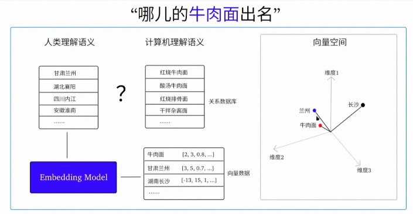
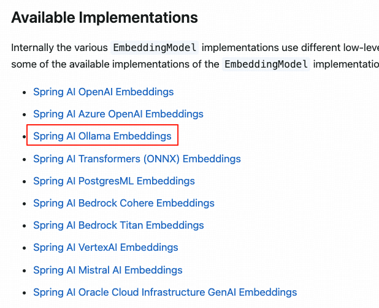
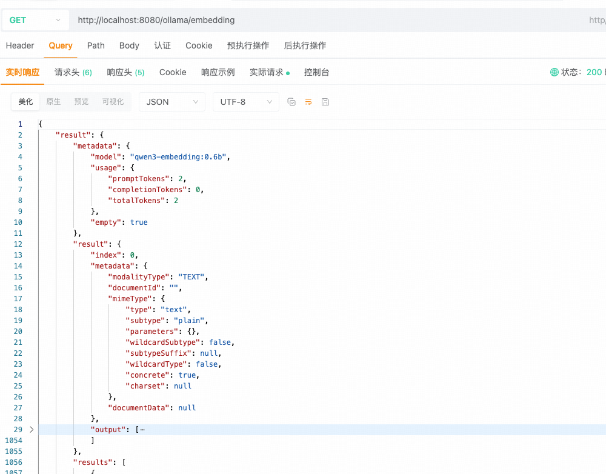
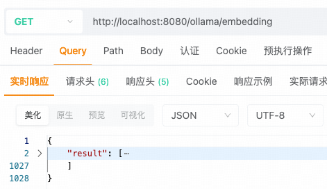
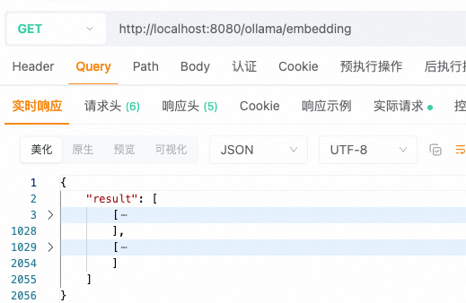
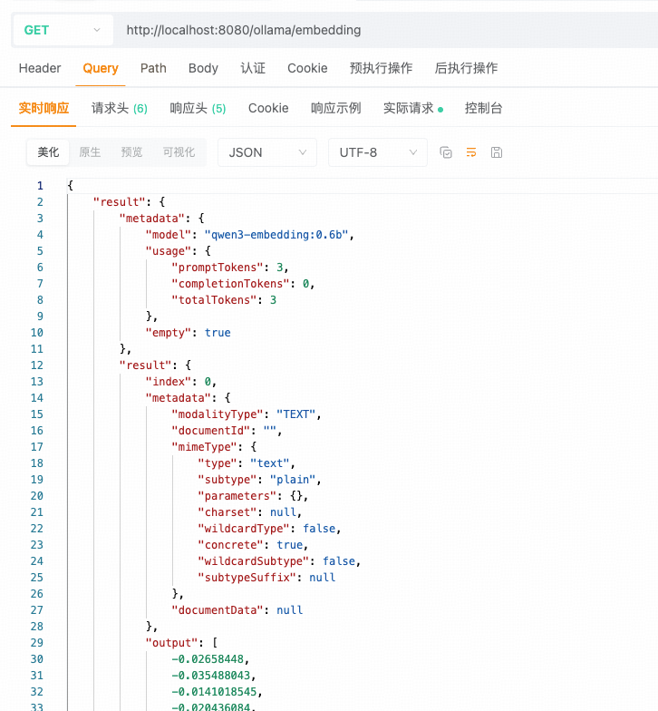

## 小白学SpringAI-RAG & Embedding Model

### 1. 什么是 RAG？

`RAG` 即单次 "**Retrieval-Augmented Generation**"首字母的组成，中文叫做“检索增强生成”。当模型需要生成文本或者回答问题时，会先从一个庞大的文档集合中检索出相关的信息，然后利用检索出来的信息指导文本的生成，从而提高回答的质量和准确性。

### 2. 为什么需要 RAG？

众所周知，模型的知识库都是基于通用信息训练的，存在以下两个显著的问题：

```
1. 无法回答实时性的问题
    模型训练有截止日期，在截止日期之后的数据，模型都无法回答
2. 无法回答特定领域或私密的问题
    模型基于公开的通用数据来进行训练，垂直领域或公司机密知识无法回答
```

解决上述问题的方法有两种：

```
1. 模型微调：通过特定任务数据来优化模型参数，使其适配新任务并提升性能。
2. RAG：模型根据检索到的数据，来生成高质量的回答。
```

模型微调的方式需要付出大量的时间成本和高昂的训练成本，因此`RAG`成为迅速提升模型能力的首选方式。

### 3. RAG 涉及到的知识点

RAG 技术目前涉及到如下知识点：

```
1. 数据向量化：普通的文本、图形、音频和视频数据，均需要转换成使用数字坐标表示的向量数据。
2. 向量模型：完成数据向量化的专用模型。
3. 向量数据库：向量数据库存储向量数据，并提供相似性检索功能。
4. 聊天模型+向量数据库：聊天模型结合向量数据库，完成数据的相似性检索并为用户提供高度准确的回答。
5. 文档向量化：常见的文档如 Word/PDF 等，都可以作为 RAG 的知识库文档，将他们转换成向量并保存到向量库中进行使用。
```

### 4. Embedding Model

#### 4.1 什么是 Embedding Model？

`Embedding Model` 即 "嵌入模型"，也叫"向量模型"。
1. 将普通的数据（如文本、图像、音频、视频等）转换为"**向量数据**"的机器学习模型。
2. "**向量数据**"能够通过不同的维度描述原始数据，维度越高能描述的特征或属性就越多。
3. 数据"向量化"后，可以帮模型轻松得实现在"**向量空间**"中寻找"**语义相似**"的数据。



#### 4.2 Embedding Model

`Embedding Model` 分不同领域的模型，例如：
```
1. 文本领域
    Google 的 "Word2Vec"、OpenAI 的 "text-embedding"等。
2. 图像领域
    Google 的 "ViT"、微软的 "ResNet"等。
3. 音频领域
    Google 的 "VGGish"、Facebook的 "Wav2Vec"等。
4. 多模态领域
    OpenAI 的 "CLIP"。
```

本视频选择的是 2025 年 6 月 6 日开源的 `Qwen3-Embedding` 模型，该模型支持 Ollama 本地部署，以 `Qwen3` 基础模型为底座，提供了各种大小（0.6B、4B和8B）的全面文本嵌入和重排序模型。

```
# 轻量级、对硬件要求极低；1024维向量数据；1.2GB
ollama pull qwen3-embedding:0.6b
```

#### 4.3 Embedding Model API

`Spring AI` 提供标准化接口 `EmbeddingModel` 访问不通的嵌入模型，通过简单的配置即可将嵌入模型集成到应用中。

```java
public interface EmbeddingModel extends Model<EmbeddingRequest, EmbeddingResponse> {
    // 1. 向量转化的标准化入口，提供默认实现的快捷方法都需要调用本方法
    EmbeddingResponse call(EmbeddingRequest request);
    
    // 2. 将结构化文档转化为向量
    float[] embed(Document document);

    // 3. 将单个文本字符串转化成向量表示（仅返回向量坐标）
    default float[] embed(String text) {...

    // 4-1. 批量处理多个文本字符串转换为向量表示（仅返回向量坐标）
    default List<float[]> embed(List<String> texts) {...
    
    // 4-2. 批量处理多个文本字符串转换为向量表示（不仅返回向量坐标，还返回元数据）
    default EmbeddingResponse embedForResponse(List<String> texts) {...

    // 5. 向量维度
    default int dimensions() {...
}
```
`SpringAI`官方公布的`Embedding`接口的可用实现包括：



#### 4.4 实现数据向量化

##### 4.4.1 引入 Ollama 依赖

```
<!-- 引入 ollama 依赖 -->
<dependency>
    <groupId>org.springframework.ai</groupId>
    <artifactId>spring-ai-starter-model-ollama</artifactId>
    <version>1.0.1</version>
</dependency>
```

##### 4.2 配置文件

```
spring:
  ai:
    ollama:
      base-url: http://127.0.0.1:11434
      embedding:
        model: qwen3-embedding:0.6b
```

##### 4.3 Controller

```java
@RestController
public class MyController {

    // 声明向量模型
    private EmbeddingModel embeddingModel;

    // 构造注入向量模型
    public MyController(EmbeddingModel embeddingModel) {
        this.embeddingModel = embeddingModel;
    }

    @GetMapping("/ollama/embedding")
    public Map embedding() {
        System.out.println("向量维度："+ embeddingModel.dimensions());
        EmbeddingResponse response = embeddingModel.call(
            new EmbeddingRequest(
                Collections.singletonList("牛肉面"),  // 要嵌入的文本列表
                OllamaOptions  // Ollama 配置选项
                    .builder()
                    .model("qwen3-embedding:0.6b") // 向量模型名（局部设置）
                    .truncate(false)  // 遇到长文本不截断
                    .build()
                )
        );
        return Map.of("result", response);
        
        // 简化的使用方法
//        return Map.of("result", embeddingModel.embed("牛肉面"));
//        return Map.of("result", embeddingModel.embed(List.of("兰州", "牛肉面")));
//        return Map.of("result", embeddingModel.embedForResponse(List.of("兰州", "牛肉面")));
    }
}
```

测试结果：



简化版测试结果1(只返回了向量坐标)：



简化版测试结果2(多个文本转换为向量坐标)：



简化版测试结果3：

