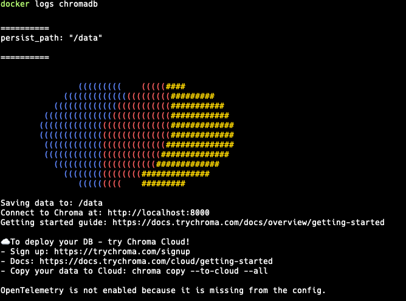
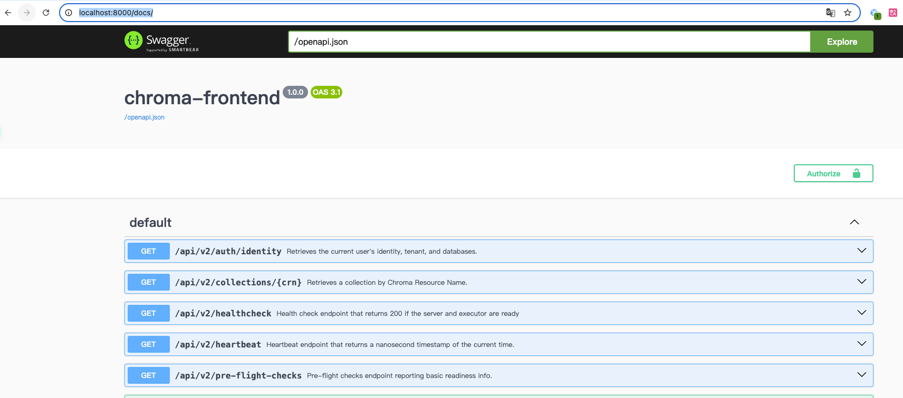
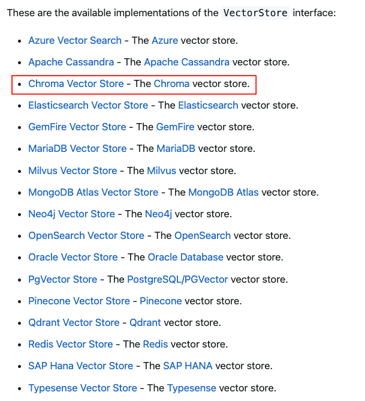
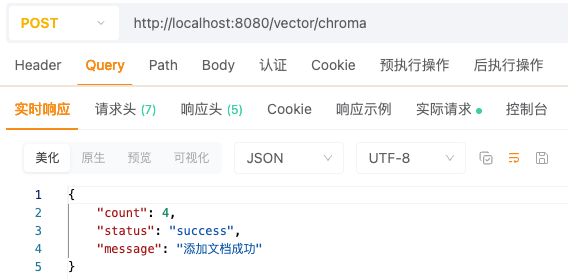
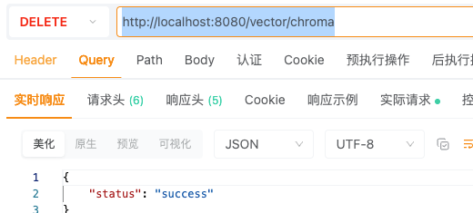
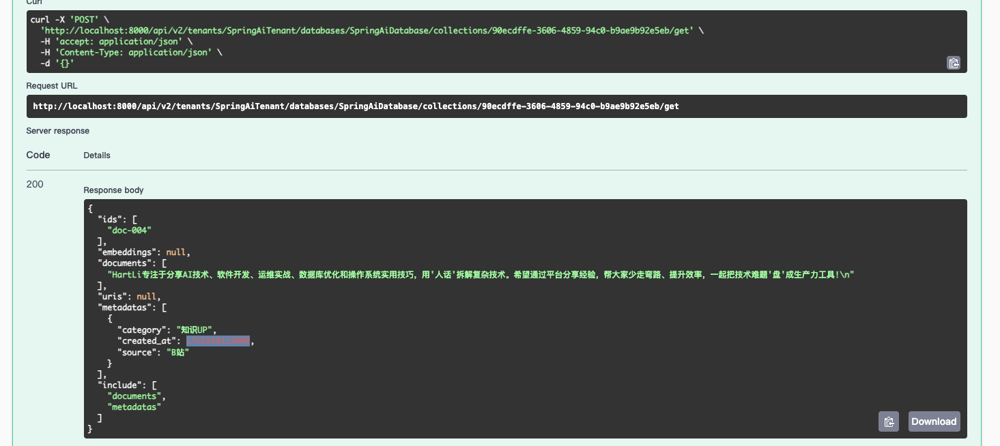

## 小白学SpringAI-Vector Database

### 1. 什么是 Vector Database？

`Vector Database` 即 "**向量数据库**"，也叫 "**矢量数据库**"。是专门用于存储、索引和管理高维向量数据的数据库系统，主要用于支持向量相似性的检索。

```
1. milvus: Zilliz 公司（中国公司）推出的开源向量数据库，分布式架构，适用于大规模数据的场景
2. pinecone:商业全托管云服务，无需运维，适用于企业级推荐系统、实时语义搜索
3. chroma：轻量级开源向量数据库，适用于小型 AI 应用、教育项目
4. elasticsearch:开源全文搜索引擎扩展了向量搜索功能，适用于混合搜索（关键词+语义）的应用（RagFlow）
5. redis:开源内存数据库，通过模块支持向量检索，适用于高并发实时场景（实时推荐）
...
```

> 搜索 VectorStoreProvider.class 可以查看SpringAI目前已经支持的全部向量数据库。

### 2.  安装 chroma 数据库

本教程使用 `Docker` 方式部署数据库。

```
# 拉取镜像
docker pull chromadb/chroma

# 运行容器
docker run -d --name chromadb -p 8000:8000 -v /Users/lijianwei/Documents/docker/chroma:/data chromadb/chroma

# 容器日志
docker logs chromadb

# 服务文档
http://localhost:8000/docs/
```

若是容器日志显示如下图所示，代表启动成功：



服务文档如下图所示：



若是 docker 拉取不下来镜像或拉取镜像慢，可以更换全局镜像：

```
# 打开文件
vi /etc/docker/daemon.json

# 在文件中添加或修改 registry-mirrors 字段
{
  "registry-mirrors": ["https://docker.m.daocloud.io"]
}

# 保存之后重启 docker
# Linux 系统下的话
sudo systemctl restart docker
# Mac 或 Windows 系统下的话直接重启 Docker Desktop 即可 
```

### 3. VectorStore 接口

引入依赖：
```
<dependency>
    <groupId>org.springframework.ai</groupId>
    <artifactId>spring-ai-starter-vector-store-chroma</artifactId>
    <version>1.0.1</version>
</dependency>
```

`SpringAI` 定义了 VectorStore 接口封装了与数据库进行交互的能力。

```java
public interface VectorStore extends DocumentWriter {
    // 往数据库中添加一组文档
    void add(List<Document> documents);
    // 按照ID批量删除
    void delete(List<String> idList);
    // 根据条件表达式删除
    void delete(Filter.Expression filterExpression);
    // 按字符串条件删除（默认实现）
    default void delete(String filterExpression) {...
    // 高级查询（支持过滤条件、返回数量等高级参数）
    List<Document> similaritySearch(SearchRequest request);
    // 根据字符串查询语义相似的文档
    default List<Document> similaritySearch(String query) {
        return this.similaritySearch(SearchRequest.builder().query(query).build());
    }
}
```

SpingAI 官网上支持的 VectorStore 的实现类如下图所示：



### 4. 使用 Chroma 数据库

#### 4.1 依赖与配置

```
<!-- 引入 ollama 依赖 -->
<dependency>
    <groupId>org.springframework.ai</groupId>
    <artifactId>spring-ai-starter-model-ollama</artifactId>
    <version>1.0.1</version>
</dependency>
<dependency>
    <groupId>org.springframework.ai</groupId>
    <artifactId>spring-ai-starter-vector-store-chroma</artifactId>
    <version>1.0.1</version>
</dependency>
```

> 引入 Ollama 的原因是：向量数据库必须要依赖于向量模型，本例使用的是 Ollama 本地部署的 Ollama 模型，因此引入 Ollama 依赖。

application.yml 配置：

```
spring:
  ai:
    ollama:
      base-url: http://127.0.0.1:11434
      embedding:
        model: qwen3-embedding:0.6b
```

#### 4.2 连接 Ollama 数据库

```
spring:
  ai:
    vectorstore:
      chroma:   # 向量数据库 chroma
        client: # 客户端配置
          host: http://localhost  # 主机地址
          port: 8000              # 端口号
        initialize-schema: true   # 是否自动创建 Collection，默认为 false
        collection-name: myCollection  # 自定义 Collection 的名字，默认为 SpringAiCollection
```

> Collection 类似于传统数据库中的表，是一种数据聚合的组件。

#### 4.3 添加文档

`org.springframework.ai.document.Document` 是 SpringAI 的标准文档类。主要属性说明如下：

```
Document
    |- text:必填。String类型，被向量模型转换的文本内容
    |- metadata:选填。Map<String, Object>类型的文档元数据，如来源、分类、时间等，便于过滤与分类。
    |- id:选填。用于检索和去重的唯一标识。
```

```
// 文档元数据
Map metadata = Map.of(
    "source", "美食中国",
    "category", "地方特色",
    "created_at", System.currentTimeMillis()
) 
// 基于 唯一标识 + 文本数据 + 元数据 创建文档
Document doc = new Document("doc-01", "兰州牛肉面是中国最著名的牛肉面之一...", metadata)
// 基于 文本数据 + 元数据 创建文档
Document doc = new Document("兰州牛肉面是中国最著名的牛肉面之一...", metadata)
// 基于 文本数据 创建文档
Document doc = new Document("兰州牛肉面是中国最著名的牛肉面之一...")
// 集合组织多份文档
List<Document> docs = List.of(doc1, ...)
// 添加到向量数据库
vectorStore.add(docs)
```

代码示例：

```java
@RestController
public class MyController {

    private final VectorStore vectorStore;

    public MyController(VectorStore vectorStore) {
        this.vectorStore = vectorStore;
    }

    @PostMapping("/vector/chroma")
    public Map<String, Object> save() {
        // 创建多分文档
        Document document1 = new Document("doc-001", """
            兰州牛肉面是中国最著名的牛肉面之一，
            以其'一清(汤清)、二白(萝卜白)、三红(辣椒油红)、四绿(香菜蒜苗绿)、五黄(面条黄亮)'著称。兰州本地人常称它为'牛肉拉面’，代表性的品牌有'马子禄’安泊尔’等。
            """,
            Map.of(
                "source", "美食中国",
                "category", "地方特色",
                "created_at", System.currentTimeMillis()
            ));

        Document document2 = new Document("doc-002", """
            台湾牛肉面是台湾的经典美食，主要分为'红烧牛肉面’和'清炖牛肉面’两种。其中'红烧牛肉面’汤头浓郁，常搭配牛腱肉和手工面条;而'清炖牛肉面’则更注重原汤鲜味。台北的'林东芳牛肉面’和'永康牛肉面’是知名老店。
            """,
            Map.of(
                "source", "台湾美食指南",
                "category", "地方特色",
                "created_at", System.currentTimeMillis()
            ));

        Document document3 = new Document("doc-003", """
            湖北襄阳牛肉面以麻辣鲜香闻名，汤底用牛骨熬制，搭配碱水面和卤牛肉片，常佐以豆芽和香菜。襄阳人通常将其作为早餐，本地老字号'张家牛肉面’和'王府牛肉面’深受食客喜爱。
            """,
            Map.of(
                "source", "湖北日报",
                "category", "地方特色",
                "created_at", System.currentTimeMillis()
            ));

        Document document4 = new Document("doc-004", """
            HartLi专注于分享AI技术、软件开发、运维实战、数据库优化和操作系统实用技巧，用'人话'拆解复杂技术。希望通过平台分享经验，帮大家少走弯路、提升效率，一起把技术难题'盘'成生产力工具!
            """,
            Map.of(
                "source", "B站",
                "category", "知识UP",
                "created_at", System.currentTimeMillis()
            ));

        List<Document> docs = List.of(document1, document2, document3, document4);
        vectorStore.add(docs);
        return Map.of(
            "status", "success",
            "message", "添加文档成功",
            "count", docs.size()
        );
    }
}
```

执行代码时总是遇到这样的问题：`Caused by: org.springframework.web.client.HttpClientErrorException$NotFound: 404 Not Found: "{"error":"NotFoundError","message":"Collection [myCollection] does not exist"}"`

原因是 SpringAI 目前有个小 bug，目前我已经提了 [issue](https://github.com/spring-projects/spring-ai/pull/5080)，等待他们修复了

临时解决方案：**通过手动创建 tenant、database、collection_id**

1. 使用 http://localhost:8000/docs/#/default/create_tenant 创建 tenant，参数如下：
   
    ```
    {
        "name": "SpringAiTenant"
    }
   ```
2. 使用 http://localhost:8000/docs/#/default/create_database 创建 database，tenant 需要填写 SpringAiTenant，参数如下：

    ```
    {
        "name": "SpringAiDatabase"
    }
    ```

3. 使用 http://localhost:8000/docs/#/default/create_collection 创建 collection，tenant 需要填写 SpringAiTenant，database需要填写SpringAiDatabase，参数如下：
    
   ```
    {
        "configuration": null,
        "get_or_create": true,
        "metadata": null,
        "name": "myCollection",
        "schema": null
    }
    ```
4. 创建完成之后使用第 3 步得到的 id 调用 http://localhost:8000/docs/#/default/get_collection 这个接口获取下 collection 试试，能获取到就没问题

测试结果：



#### 4.4 查询文档

查询都是基于 "相似性" 进行的查询，而非传统数据库中的那种 "内容匹配" 查询。

##### 4.4.1 基本查询

```java
@GetMapping("/vector/chroma")
public Map<String, Object> find(@RequestParam("query") String query) {
  // 1.查询所有文档（按相似得分由高到低排序）
  List<Document> documents1 = vectorStore.similaritySearch(query);
  // 2. 按照相似度分过滤
  List<Document> documents2 = vectorStore.similaritySearch(
      SearchRequest
          .builder().
          query(query)
          .similarityThreshold(0.5)  // 相似度得分 >= 0.5
          .build());
  // 3. 按照排序过滤出最相似的几个文档
  List<Document> documents3 = vectorStore.similaritySearch(
      SearchRequest
          .builder().
          query(query)
          .topK(1)  // 最相似的文档
          .build());
  return Map.of("documents1", documents1, "documents2", documents2, "documents3", documents3);
}
```

测试路由：http://localhost:8080/vector/chroma?query=好吃的牛肉面？

得到的结果：

```json
{
	"documents1": [
		{
			"id": "doc-001",
			"text": "兰州牛肉面是中国最著名的牛肉面之一，\n以其'一清(汤清)、二白(萝卜白)、三红(辣椒油红)、四绿(香菜蒜苗绿)、五黄(面条黄亮)'著称。兰州本地人常称它为'牛肉拉面’，代表性的品牌有'马子禄’安泊尔’等。\n",
			"media": null,
			"metadata": {
				"created_at": 1765503823350,
				"source": "美食中国",
				"category": "地方特色",
				"distance": 0.5688061
			},
			"score": 0.43119388818740845
		},
		{
			"id": "doc-003",
			"text": "湖北襄阳牛肉面以麻辣鲜香闻名，汤底用牛骨熬制，搭配碱水面和卤牛肉片，常佐以豆芽和香菜。襄阳人通常将其作为早餐，本地老字号'张家牛肉面’和'王府牛肉面’深受食客喜爱。\n",
			"media": null,
			"metadata": {
				"created_at": 1765503823350,
				"source": "湖北日报",
				"category": "地方特色",
				"distance": 0.66398
			},
			"score": 0.33601999282836914
		},
		{
			"id": "doc-002",
			"text": "台湾牛肉面是台湾的经典美食，主要分为'红烧牛肉面’和'清炖牛肉面’两种。其中'红烧牛肉面’汤头浓郁，常搭配牛腱肉和手工面条;而'清炖牛肉面’则更注重原汤鲜味。台北的'林东芳牛肉面’和'永康牛肉面’是知名老店。\n",
			"media": null,
			"metadata": {
				"created_at": 1765503823350,
				"source": "台湾美食指南",
				"category": "地方特色",
				"distance": 0.78380024
			},
			"score": 0.21619975566864014
		}
	],
	"documents2": [],
	"documents3": [
		{
			"id": "doc-001",
			"text": "兰州牛肉面是中国最著名的牛肉面之一，\n以其'一清(汤清)、二白(萝卜白)、三红(辣椒油红)、四绿(香菜蒜苗绿)、五黄(面条黄亮)'著称。兰州本地人常称它为'牛肉拉面’，代表性的品牌有'马子禄’安泊尔’等。\n",
			"media": null,
			"metadata": {
				"created_at": 1765503823350,
				"source": "美食中国",
				"category": "地方特色",
				"distance": 0.5688061
			},
			"score": 0.43119388818740845
		}
	]
}
```

##### 4.4.2 元数据过滤

1. 字符条件过滤

```java
@GetMapping("/vector/chroma/filter")
public Map<String, Object> searchFilter(@RequestParam("query") String query) {
  // 使用字符条件过滤
  String filterExpression1 = "source == '湖北日报'";
  String filterExpression2 = "source == '湖北日报' || source == '美食中国'";
  String filterExpression3 = "source in ['湖北日报', '美食中国']";
  String filterExpression4 = "source nin ['湖北日报'] && category == '地方特色'";

  // 执行相似性查询
  List<Document> documents1 = vectorStore.similaritySearch(
      SearchRequest.builder()
          .query(query)
          .filterExpression(filterExpression1)
          .build());
  List<Document> documents2 = vectorStore.similaritySearch(
      SearchRequest.builder()
          .query(query)
          .filterExpression(filterExpression2)
          .build());
  List<Document> documents3 = vectorStore.similaritySearch(
      SearchRequest.builder()
          .query(query)
          .filterExpression(filterExpression3)
          .build());
  List<Document> documents4 = vectorStore.similaritySearch(
      SearchRequest.builder()
          .query(query)
          .filterExpression(filterExpression4)
          .build());

  return Map.of("documents1", documents1, "documents2", documents2, "documents3", documents3,
      "documents4", documents4);
}
```

测试路由：http://localhost:8080/vector/chroma/filter?query=出名的牛肉面？

测试结果：

```json
{
	"documents1": [
		{
			"id": "doc-003",
			"text": "湖北襄阳牛肉面以麻辣鲜香闻名，汤底用牛骨熬制，搭配碱水面和卤牛肉片，常佐以豆芽和香菜。襄阳人通常将其作为早餐，本地老字号'张家牛肉面’和'王府牛肉面’深受食客喜爱。\n",
			"media": null,
			"metadata": {
				"created_at": 1765503823350,
				"source": "湖北日报",
				"category": "地方特色",
				"distance": 0.66398
			},
			"score": 0.33601999282836914
		}
	],
	"documents2": [
		{
			"id": "doc-001",
			"text": "兰州牛肉面是中国最著名的牛肉面之一，\n以其'一清(汤清)、二白(萝卜白)、三红(辣椒油红)、四绿(香菜蒜苗绿)、五黄(面条黄亮)'著称。兰州本地人常称它为'牛肉拉面’，代表性的品牌有'马子禄’安泊尔’等。\n",
			"media": null,
			"metadata": {
				"created_at": 1765503823350,
				"source": "美食中国",
				"category": "地方特色",
				"distance": 0.5688061
			},
			"score": 0.43119388818740845
		},
		{
			"id": "doc-003",
			"text": "湖北襄阳牛肉面以麻辣鲜香闻名，汤底用牛骨熬制，搭配碱水面和卤牛肉片，常佐以豆芽和香菜。襄阳人通常将其作为早餐，本地老字号'张家牛肉面’和'王府牛肉面’深受食客喜爱。\n",
			"media": null,
			"metadata": {
				"created_at": 1765503823350,
				"source": "湖北日报",
				"category": "地方特色",
				"distance": 0.66398
			},
			"score": 0.33601999282836914
		}
	],
	"documents3": [
		{
			"id": "doc-001",
			"text": "兰州牛肉面是中国最著名的牛肉面之一，\n以其'一清(汤清)、二白(萝卜白)、三红(辣椒油红)、四绿(香菜蒜苗绿)、五黄(面条黄亮)'著称。兰州本地人常称它为'牛肉拉面’，代表性的品牌有'马子禄’安泊尔’等。\n",
			"media": null,
			"metadata": {
				"created_at": 1765503823350,
				"source": "美食中国",
				"category": "地方特色",
				"distance": 0.5688061
			},
			"score": 0.43119388818740845
		},
		{
			"id": "doc-003",
			"text": "湖北襄阳牛肉面以麻辣鲜香闻名，汤底用牛骨熬制，搭配碱水面和卤牛肉片，常佐以豆芽和香菜。襄阳人通常将其作为早餐，本地老字号'张家牛肉面’和'王府牛肉面’深受食客喜爱。\n",
			"media": null,
			"metadata": {
				"created_at": 1765503823350,
				"source": "湖北日报",
				"category": "地方特色",
				"distance": 0.66398
			},
			"score": 0.33601999282836914
		}
	],
	"documents4": [
		{
			"id": "doc-001",
			"text": "兰州牛肉面是中国最著名的牛肉面之一，\n以其'一清(汤清)、二白(萝卜白)、三红(辣椒油红)、四绿(香菜蒜苗绿)、五黄(面条黄亮)'著称。兰州本地人常称它为'牛肉拉面’，代表性的品牌有'马子禄’安泊尔’等。\n",
			"media": null,
			"metadata": {
				"created_at": 1765503823350,
				"source": "美食中国",
				"category": "地方特色",
				"distance": 0.5688061
			},
			"score": 0.43119388818740845
		},
		{
			"id": "doc-002",
			"text": "台湾牛肉面是台湾的经典美食，主要分为'红烧牛肉面’和'清炖牛肉面’两种。其中'红烧牛肉面’汤头浓郁，常搭配牛腱肉和手工面条;而'清炖牛肉面’则更注重原汤鲜味。台北的'林东芳牛肉面’和'永康牛肉面’是知名老店。\n",
			"media": null,
			"metadata": {
				"created_at": 1765503823350,
				"source": "台湾美食指南",
				"category": "地方特色",
				"distance": 0.78380024
			},
			"score": 0.21619975566864014
		}
	]
}
```

2. 条件表达式过滤

```java
@GetMapping("/vector/chroma/filter2")
public Map<String, Object> searchFilter2(@RequestParam("query") String query) {
  // 条件表达式过滤
  Filter.Expression expression = new Filter.Expression(
      Filter.ExpressionType.GT,
      new Filter.Key("created_at"),
      new Filter.Value(System.currentTimeMillis())
  );
  List<Document> documents1 = vectorStore.similaritySearch(
      SearchRequest.builder()
          .query(query)
          .filterExpression(expression)
          .build()
  );
  return Map.of("documents1", documents1);
}
```

测试路由：http://localhost:8080/vector/chroma/filter2?query=Hart

测试结果：

```json
{
	"documents1": [
		{
			"id": "doc-004",
			"text": "HartLi专注于分享AI技术、软件开发、运维实战、数据库优化和操作系统实用技巧，用'人话'拆解复杂技术。希望通过平台分享经验，帮大家少走弯路、提升效率，一起把技术难题'盘'成生产力工具!\n",
			"media": null,
			"metadata": {
				"created_at": 1765850123000,
				"source": "B站",
				"category": "知识UP",
				"distance": 0.8712498
			},
			"score": 0.12875020503997803
		}
	]
}
```

##### 4.4.3 删除文档

```java
@DeleteMapping("/vector/chroma")
public Map<String, Object> delete() {
  // 根据文档ID批量删除
  vectorStore.delete(List.of("doc-001", "doc-002"));
  // 删除所有 source 为 湖北日报 的文档
  vectorStore.delete("source == '湖北日报'");
  // 删除所有 category 为 地方特色 的文档
  vectorStore.delete(new Filter.Expression(
      Filter.ExpressionType.EQ,
      new Filter.Key("category"),
      new Filter.Value("地方特色")
  ));
  return Map.of("status", "success");
}
```



可通过该API进行验证是否真的删除成功：http://localhost:8000/docs/#/default/collection_get



可以看到只剩一个文档了。