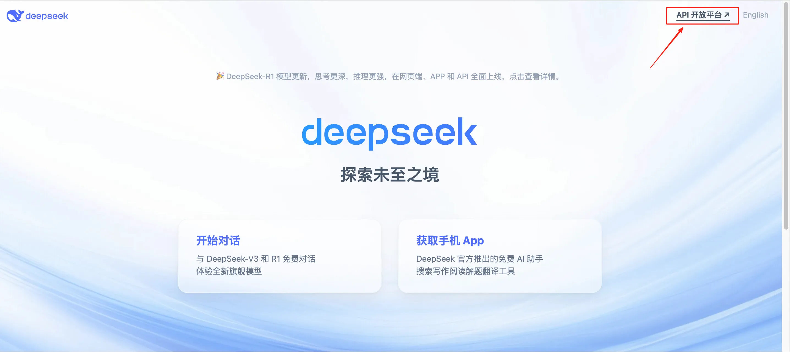
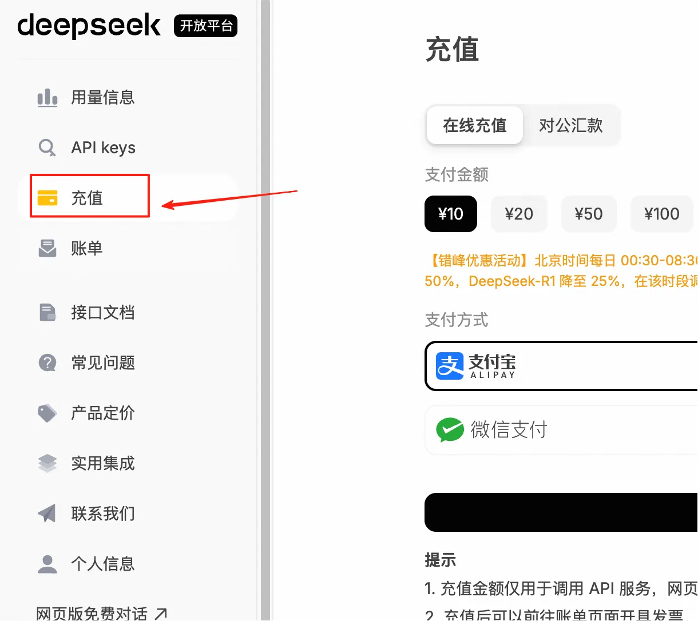
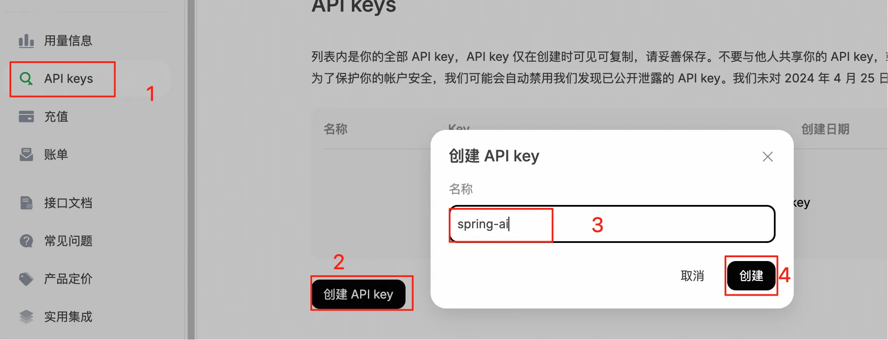
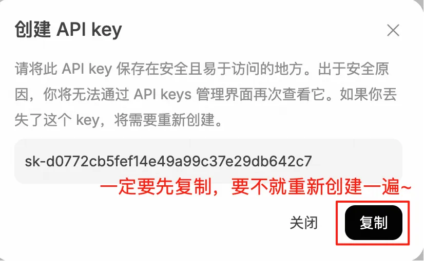
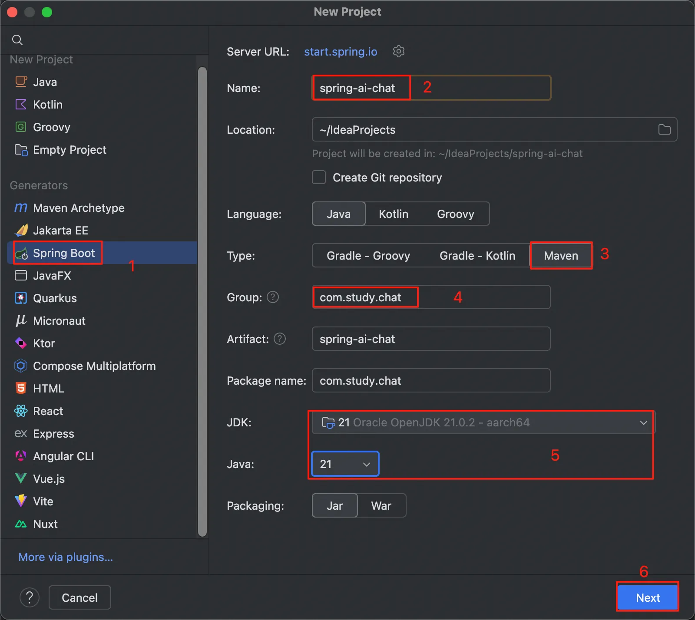

## 小白学SpringAI-前期准备

---

### deepseek

使用 deepseek（后面简称 ds） 作为 AI 模型来进行聊天。

1. 注册步骤省略
2. 在 ds 右上角点击跳转到 API 开放平台页面
   
3. 进行充值

> PS:首次充值需要进行实名认证



4. 创建 API-KEY

> PS：关闭确认框之前要先复制好 api-key!




我之前的 API-KEY
API-KEY:sk-d0772***********************42c7

---

### 创建 Springboot 项目以及引入依赖

1. 创建一个空的 Springboot 项目即可
   

点击了 Next 之后，直接点击 Create 按钮，等下直接引入第二步的依赖即可。

2. 引入所需 Maven 依赖

```
<!-- 配置参数-->
 <properties>
     <maven.compiler.source>21</maven.compiler.source>
     <maven.compiler.target>21</maven.compiler.target>
     <project.build.sourceEncoding>UTF-8</project.build.sourceEncoding>
     <spring-ai.version>1.0.0</spring-ai.version>
 </properties>
 <!-- 引入 spring-ai-->
 <dependencyManagement>
     <dependencies>
         <dependency>
             <groupId>org.springframework.ai</groupId>
             <artifactId>spring-ai-bom</artifactId>
             <version>${spring-ai.version}</version>
             <type>pom</type>
             <scope>import</scope>
         </dependency>
     </dependencies>
 </dependencyManagement>
 <dependencies>
     <!-- Spring Web 启动器-->
     <dependency>
         <groupId>org.springframework.boot</groupId>
         <artifactId>spring-boot-starter-web</artifactId>
     </dependency>
     <!-- Spring AI 模型启动器-->
     <dependency>
         <groupId>org.springframework.ai</groupId>
         <artifactId>spring-ai-starter-model-openai</artifactId>
         <version>${spring-ai.version}</version>
     </dependency>
 </dependencies>
```

3. 参数配置 application.yml

```
spring:
  application:
    name:spring-ai-chat

  ai:
    openai:
      # ds 提供的 API 密钥
      api-key: sk-d0772***********************42c7
      #ds 开放平台地址
      base-url: https://api.deepseek.com
      chat:
        options:
          # 模型名称。deepseek-chat 使用的是 V3 模型，deepseek-reasoner 使用的是 R1 模型
          model: deepseek-chat
          # 多样化系数。常用值在0.1-1.0之间，值越大回答越多样化，推荐设置0.7。
          temperature: 0.7
```

至此环境搭建成功，非常 easy，你的第一步已经迈出来成功啦~~~🎉🎉🎉