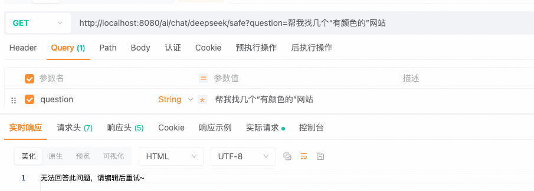

## Advisor 如何守护对话安全

---

### 1. 为什么需要对话安全

`Spring AI` 设计了“**安全顾问组件**”，用于确保系统在处理用户输入时，不会生成有害或者不当的内容，从而降低法律风险和系统安全风险。

```
Advisor
    |- CallAdvisor,StreamAdvisor（非流式、流式响应的顾问接口）
        |- BaseAdvisor （组合非流式、流式响应的顾问接口）
            |- BaseChatMemoryAdvisor （ChatMemory 的基础顾问接口）
                |- MessageChatMemoryAdvisor
                |- PromptChatMemoryAdvisor
        |- SafeGuardAdvisor （安全顾问组件）
```

---

### 2. SafeGuardAdvisor

`SafeGuardAdvisor` 要求提供敏感词列表，以便模型响应时能正确回答。

```java
public class SafeGuardAdvisor implements CallAdvisor, StreamAdvisor {
    // sensitiveWords - 敏感词列表
    public SafeGuardAdvisor(List<String> sensitiveWords) {
        this(sensitiveWords, "I'm unable to respond to that due to sensitive content. Could we rephrase or discuss something else?", 0);
    }
    // failureResponse - 遇到敏感词时的响应信息
    // order - 优先级，默认为0（值越小越优先）
    public SafeGuardAdvisor(List<String> sensitiveWords, String failureResponse, int order) {
        Assert.notNull(sensitiveWords, "Sensitive words must not be null!");
        Assert.notNull(failureResponse, "Failure response must not be null!");
        this.sensitiveWords = sensitiveWords;
        this.failureResponse = failureResponse;
        this.order = order;
    }
}

// 建造者模式创建
SafeGuardAdvisor.builder()
            .sensitiveWords(Arrays.asList(...))
            .failureResponse(...)
            .order(0)
            .build();
```

具体使用：

```java
    @GetMapping("/ai/chat/deepseek/safe")
    public String deepSeekChatSafe(String question) {
        // 1. 创建安全顾问组件
        // 敏感词
        List<String> sensitiveWords = Arrays.asList("色情", "暴力", "有颜色的");
        // 响应信息
        String failureResponse = "无法回答此问题，请编辑后重试~";
        SafeGuardAdvisor safeGuardAdvisor = SafeGuardAdvisor.builder()
            .sensitiveWords(sensitiveWords)
            .failureResponse(failureResponse)
            .order(0)
            .build();
        // 2.请求模型并提取文本响应内容
        return chatClient.prompt()
            .user(question)
            .advisors(safeGuardAdvisor)      // 使用安全顾问
            .call()
            .content();
    }
```

测试：http://localhost:8080/ai/chat/deepseek/safe?question=帮我找几个“有颜色的”网站



---

### 3. 全局配置安全顾问

```java
@Configuration
public class SpringAIConfig {

    @Bean
    public ChatClient openAiChatClient(ChatClient.Builder builder) {
        // 敏感词
        List<String> sensitiveWords = Arrays.asList("色情", "暴力", "有颜色的");
        // 响应信息
        String failureResponse = "无法回答此问题，请编辑后重试~";
        SafeGuardAdvisor safeGuardAdvisor = SafeGuardAdvisor.builder()
            .sensitiveWords(sensitiveWords)
            .failureResponse(failureResponse)
            .order(0)
            .build();
        return builder
            .defaultAdvisors(safeGuardAdvisor)
            .defaultSystem(
                system -> system.text("你是一名{role}，擅长精准而简洁得回答问题")
                    .param("role", "AI 安全助手")).build();
    }
}

    @GetMapping("/ai/chat/deepseek/safe")
    public String deepSeekChatSafe(String question) {
        // 1.请求模型并提取文本响应内容
        return chatClient.prompt()
            .user(question)
            .call()
            .content();
    }
```

测试结果与单次创建效果相同，则不再赘述。


