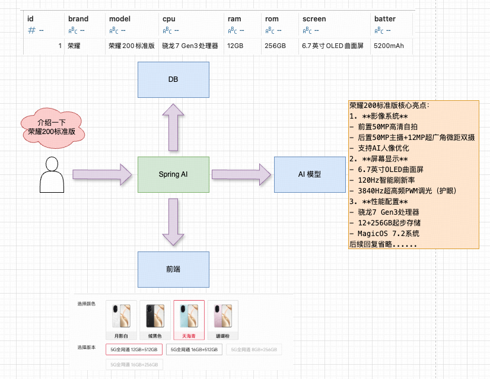

### 结构化输出

---

### 1. 为什么需要结构化输出

AI 模型生成的响应通常为“**自由文本格式**”，这给“**下游应用程序**”的处理和集成带来了不便。如果直接将该文本传递给前端展示或者写入数据库，需要额外的解析逻辑，容易出错。



---

### 2. 结构化数据

`Spring AI` 支持将模型的输出转化为“**结构化的数据**”格式。

准备实体类：

1. 使用 lombok 的注解。

```java
@Data
@NoArgsConstructor
@AllArgsConstructor
public class Phone {
    private String brand;
    private String model;
    private String cpu;
    private String ram;
    private String rom;
    private String screen;
    private String battery;
}
```

2. 使用 record 关键字（最早 jdk14 支持，jdk16 才确定下来）

> PS: record 关键字会自动帮助生成无参构造、全参构造、getter、setter、hashCode、equals、toString 方法。


```java
public record PhoneRecord(String brand, String model, String cpu, String ram, String rom,
                          String screen, String battery) {
}
```

---

### 3. 结构化输入核心 API

#### 3.1 StructuredOutputConverter

`StructuredOutputConverter` 是结构化输出的核心接口，该接口继承了 `Converter` 和 `FormatProvider` 接口，确保在调用模型 **之前和之后** 处理输入和输出。

```java
public interface StructuredOutputConverter<T> extends Converter<String, T>, FormatProvider {
    // 调用模型之前，FormatProvider 接口为模型提供特定的格式设置准则
    // 调用模型之后，Converter 接口负责将模型生成的输出转换为指定的目标类型
}
```

```
FormatProvider 的“设置准则”举例：
    Your response should be in JSON format.
    您的回复应采用 JSON 格式。
    Do not include any explanations, only provide a RFC8259 compliant JSON response following this format without deviation.
    请勿添加任何解释，仅需按照以下格式提供符合 RFC8259 标准的 JSON 响应，不要有偏差。
    Do not include markdown code blocks in your response. 
    请勿在您的回复中包含 markdown 代码块。
    Here is the JSON Schema instance your output must adhere to:
    以下是您的输出必须遵循的 JSON 模板实例：
```

#### 3.2 多种转换器的视线

`Spring AI` 提供了多种转换器实现，包括：

```
StructuredOutputConverter  // 接口
    |- BeanOutputConverter  // 将 AI 生成的响应转换为 Java 对象
    |- ListOutputConverter  // 将 AI 生成的响应转换为 List<T>
    |- MapOutputConverter   // 将 AI 生成的响应转换为 Map<String, T>
    |- AbstractConversionServiceOutputConverter  // 更高级的转换器
```

---

### 4. 结构化输出转换为 Java 对象

```java
@GetMapping("/ai/chat/deepseek/structured/bean")
public PhoneRecord deepSeekStructuredBean(String question) {
    // 请求模型并提取文本响应内容
    return chatClient.prompt()
        .user(question)
        .call()
        .entity(PhoneRecord.class);
}
```

测试路由：<br/>http://localhost:8080/ai/chat/deepseek/structured/bean?question=介绍一下荣耀200标准版（CPU、内存、屏幕和电池等等），描述尽量使用中文

测试结果：

```json
{
	"brand": "荣耀",
	"model": "荣耀200标准版",
	"cpu": "高通骁龙7 Gen3",
	"ram": "12GB",
	"rom": "256GB",
	"screen": "6.7英寸OLED曲面屏，120Hz刷新率",
	"battery": "5200mAh"
}
```

--- 

### 5. 结构化输出转换为 List

```java
// 存储多个手机Record的List集合
public record PhoneRecordList(List<PhoneRecord> phoneRecords) {
}
```

```java
@GetMapping("/ai/chat/deepseek/structured/list")
public PhoneRecordList deepSeekStructuredList(String question) {
    // 请求模型并提取文本响应内容
    return chatClient.prompt()
        .user(question)
        .call()
        .entity(PhoneRecordList.class);
}
```

测试路由：<br/>http://localhost:8080/ai/chat/deepseek/structured/list?question=介绍一下荣耀200标准版和荣耀300标准版以及荣耀400标准版（CPU、内存、屏幕和电池等等），描述尽量使用中文

测试结果：

```json
{
	"phoneRecords": [
		{
			"brand": "荣耀",
			"model": "荣耀200标准版",
			"cpu": "高通骁龙7 Gen 3",
			"ram": "12GB",
			"rom": "256GB",
			"screen": "6.7英寸OLED, 120Hz刷新率",
			"battery": "4800mAh"
		},
		{
			"brand": "荣耀",
			"model": "荣耀300标准版",
			"cpu": "高通骁龙8 Gen 2",
			"ram": "16GB",
			"rom": "512GB",
			"screen": "6.8英寸OLED, 144Hz刷新率",
			"battery": "5000mAh"
		},
		{
			"brand": "荣耀",
			"model": "荣耀400标准版",
			"cpu": "高通骁龙8 Gen 3",
			"ram": "16GB",
			"rom": "1TB",
			"screen": "6.9英寸OLED, 165Hz刷新率",
			"battery": "5200mAh"
		}
	]
}
```

--- 

### 6. 结构化输出转换为 Map

```java
public record PhoneRecordMap(Map<String, PhoneRecord> phoneRecords) {
}
```

```java
@GetMapping("/ai/chat/deepseek/structured/map")
public PhoneRecordMap deepSeekStructuredMap(String question) {
    return chatClient.prompt()
        .user(question)
        .call()
        .entity(PhoneRecordMap.class);
}
```

测试路由：<br/>http://localhost:8080/ai/chat/deepseek/structured/map?question=介绍一下荣耀200标准版和荣耀300标准版以及荣耀400标准版（CPU、内存、屏幕和电池等等），描述尽量使用中文

测试结果：

```json
{
  "phoneRecords": {
    "荣耀200标准版": {
      "brand": null,
      "model": null,
      "cpu": null,
      "ram": null,
      "rom": null,
      "screen": null,
      "battery": null
    },
    "荣耀300标准版": {
      "brand": null,
      "model": null,
      "cpu": null,
      "ram": null,
      "rom": null,
      "screen": null,
      "battery": null
    },
    "荣耀400标准版": {
      "brand": null,
      "model": null,
      "cpu": null,
      "ram": null,
      "rom": null,
      "screen": null,
      "battery": null
    }
  }
}
```

测试结果发现有点问题，AI 并没有给对应的对象赋值，需要修改下测试路由，将对象属性及其对应的释义同步给 AI

> PS:不一定是加载路由中，可以使用 AssistantMessage 来说明 Java 类。

第二次测试路由：<br/>
http://localhost:8080/ai/chat/deepseek/structured/map?question=介绍一下荣耀200标准版和荣耀300标准版以及荣耀400标准版（brand为品牌，model为名称，cpu，ram,rom,screen 为屏幕，battery为电池容量等等），描述尽量使用中文

测试结果：
```json
{
	"phoneRecords": {
		"荣耀200标准版": {
			"brand": "荣耀",
			"model": "200标准版",
			"cpu": "麒麟710A",
			"ram": "6GB",
			"rom": "128GB",
			"screen": "6.5英寸LCD",
			"battery": "4000mAh"
		},
		"荣耀300标准版": {
			"brand": "荣耀",
			"model": "300标准版",
			"cpu": "麒麟820",
			"ram": "8GB",
			"rom": "128GB",
			"screen": "6.57英寸OLED",
			"battery": "4300mAh"
		},
		"荣耀400标准版": {
			"brand": "荣耀",
			"model": "400标准版",
			"cpu": "麒麟985",
			"ram": "8GB",
			"rom": "256GB",
			"screen": "6.72英寸OLED",
			"battery": "4600mAh"
		}
	}
}
```