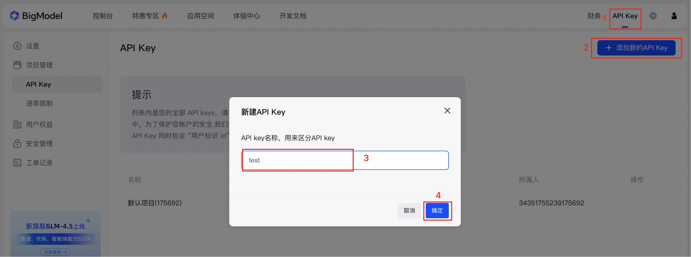
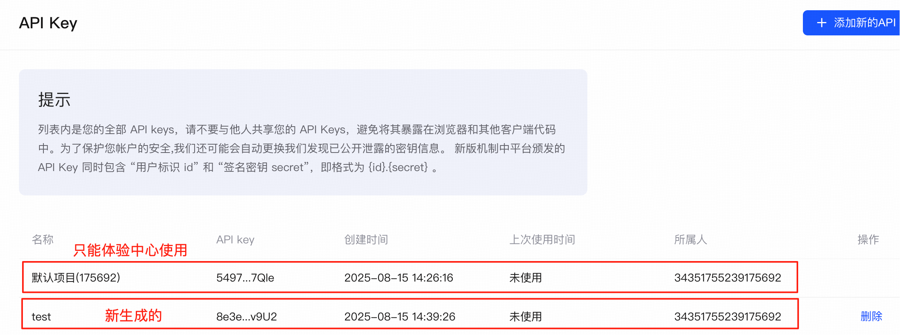
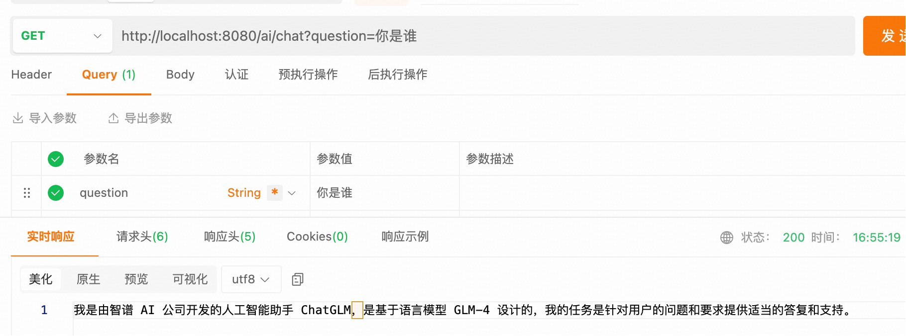
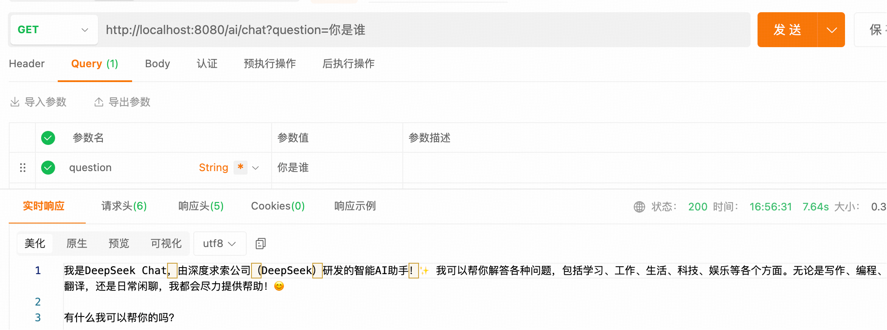

## 多模型整合与自由切换

---

### 1. 多模型整合

在以往的教程中，我们仅使用了唯一的模型 `DeepSeek`，例如：

```
spring:
  ai:
    openai:
      # ds 提供的 API 密钥
      api-key: sk-d0772***********************42c7
      #ds 开放平台地址
      base-url: https://api.deepseek.com
```

出于某些原因，`AI` 工程中还需要整合其他的模型并能够实现自由切换。

---

### 2. 智谱 AI 开放平台
[智谱 AI 开放平台](https://bigmodel.cn/)

1. 注册账号（步骤省略）
> PS: 注册完成之后要进行实名认证，点击右上角头像后选择个人中心，个人中心中安全设置部分需要进行实名认证。不实名认证是无法生成 API-KEY 的。
2. 获取 API 密钥
   1. 右上角点击 API Key 跳转到 API Key 的管理页面
   2. 点击 添加新的 API Key
   3. 填写 API Key 的名称，点击确定会生成一个新的 API Key


3. 获取基础服务地址（后面会在 application.yml 配置中体现）

--- 

### 3. 整合智谱 AI

```
<!-- zhipu ai 依赖 -->
<dependency>
    <groupId>org.springframework.ai</groupId>
    <artifactId>spring-ai-starter-model-zhipu</artifactId>
    <version>1.0.1</version>
</dependency>
```

配置文件配置（application.yml）：

```
spring:
  ai:
    zhipuai:
      api-key: 8e3ee8d0bf6049e88e14e7edd0f04ddc.2rUtcBtRqFISv9U2
      base-url: https://open.bigmodel.cn/api/paas/v4/
      chat:
        options:
          model: GLM-4-Flash
          temperature: 0.7
          max-tokens: 1024
```

---

### 4. 创建模型客户端

#### 4.1 配置多 ChatClient

以往 `AI` 工程只有唯一的模型 `DeepSeek`，客户端配置为“**使用系统默认模型**”。

```java
@Configuration
public class SpringAIConfig {
    @Bean
    public ChatClient openAiChatClient(ChatClient.Builder builder) {
        return builder
            .defaultSystem("你是 DeepSeek")
            .build();
    }
}
```

当工程中拥有两种及以上的模型时，需要为每一种模型单独配置客户端

```java
@Configuration
public class SpringAIConfig {
    // 创建基于 OpenAi 模型的客户端
    @Bean(name = "deepseek")
    public ChatClient openAiChatClient(OpenAiChatModel model) {
        return ChatClient.builder(model)
            .defaultSystem("你是 DeepSeek")
            .build();
    }

    // 创建基于 Zhipuai 模型的客户端
    @Bean(name = "zhipu")
    public ChatClient openAiChatClient(ZhiPuAiChatModel model) {
        return ChatClient.builder(model)
            .defaultSystem("你是智谱 AI")
            .build();
    }
}
```

#### 4.2 多客户端切换

切换为使用`Zhipu`模型

```java
@RestController
public class ChatController {

    @Resource(name = "zhipu")
    private ChatClient chatClient;

    @GetMapping("/ai/chat")
    public String chat(String question) {
        // 请求模型并提取文本响应内容
        return chatClient.prompt().user(question).call().content();
    }
}
```

测试路由：<br/>
http://localhost:8080/ai/chat?question=你是谁

测试结果：


切换为使用`DeepSeek`模型

```java
@RestController
public class ChatController {

    @Resource(name = "deepseek")
    private ChatClient chatClient;

    @GetMapping("/ai/chat")
    public String chat(String question) {
        // 请求模型并提取文本响应内容
        return chatClient.prompt().user(question).call().content();
    }
}
```

测试路由：<br/>
http://localhost:8080/ai/chat?question=你是谁

测试结果：


