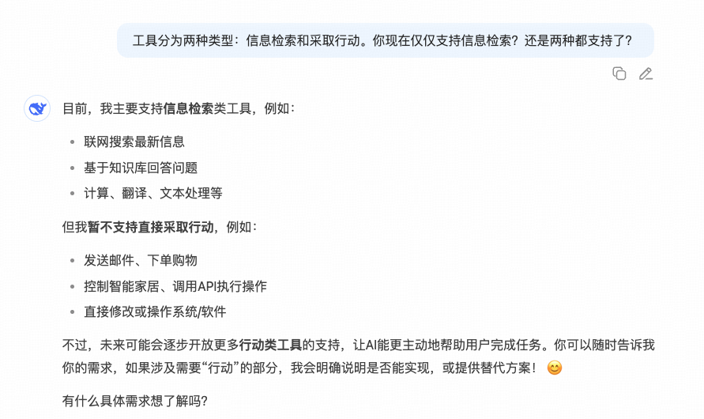
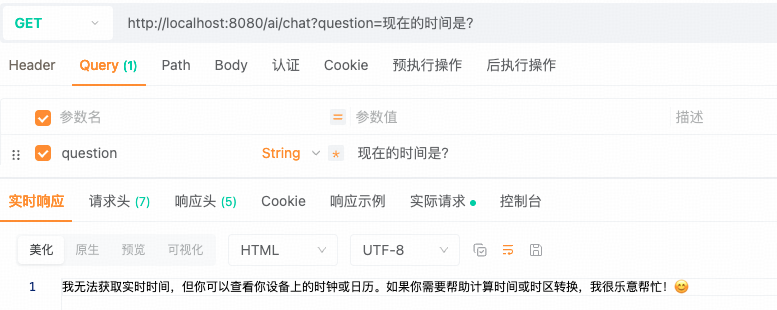
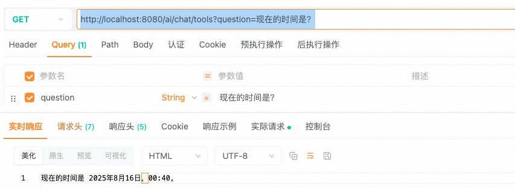
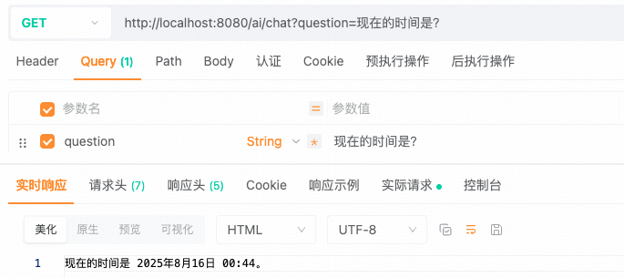
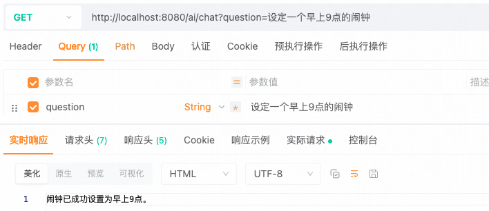

## 小白学SpringAI-工具调用

---

### 1. 什么是工具调用

模型的能力取决于训练模型所用的数据，有两个特点：1.公开的数据 2.数据时效性。

工具调用（之前也称为**函数调用**，自 `Spring AI 1.0.0.M6` [FunctionCallback](https://docs.spring.io/spring-ai/reference/api/tools-migration.html) 弃用），是允许模型与一组外部 `API` 或外部工具进行交互，从而增强模型能力。

```
场景设定：时间查询
用户：“现在的事件？”
未使用工具
    AI 模型：“我无法获取实时时间...”
使用工具
    AI 模型：
        1. 自动识别调用时间 API 需求
        2. 生成结构化参数
            如：{"tool":"datetime_api", "location": "Beijing"}
        3. 根据参数实际调用 API 获取实时数据
        4. 将API返回的数据转换为自然语言回复用户
            “现在是XX年XX月XX日，上午XX点XX分”。
```

---

### 2. 工具分类

根据功能，工具分类 “**信息检索**” 和 “**采取行动**” 两个类别。

```
1. 信息检索工具：工具从外部（如数据库、网络服务、文件系统或网络搜索引擎）检索信息，其目的是增强模型的知识，使其能够回答原本无法回答的问题。
2. 采取行动工具：可用于在软件系统中执行操作，例如发送电子邮件、在数据库中创建新纪录、提交表单或触发工作流，其目标是将原本需要人工干预或明确编程的任务实现自动化。
```

注意：并非所有模型都能支持所有类别的工具调用，详细情况参考 [模型对比](https://docs.spring.io/spring-ai/reference/api/chat/comparison.html)，也可以根据[第 2 章](./2-ChatModel.MD)的不同供应商的支持能力来做对比。

实测：DeepSeek（OpenAI-proxy）支持信息检索工具，采取行动工具受限。信息检索工具调用需要依赖用户侧集成（用户提供自定义工具）。



---

### 3. 信息检索的工具

#### 3.1 定义工具

`Spring AI` 提供了 `@Tool` 注解（不支持类，仅用于在方法和其他注解上），允许开发者注册自定义工具，并通过大模型生成工具调用请求。以下的 `DateTimeTools` 是自定义工具类。

```java
@Component
public class DateTimeTools {
    
    @Tool(name="current_datetime", description = "获取用户所在时区的当前日期和时间")
    String getCurrentDateTime() {
        return LocalDateTime.now().toString();
    }
    // @Component 可选，未添加则使用 new 方式注入工具
    // @Tool(name="工具名，未提供则使用方法名，类中唯一及特定聊天的工具库中唯一")
    // @Tool(description="工具描述，未提供则使用方法名，强烈建议提供详细的描述")
}
```

```
DateTimeTools
    |- tool (name = "a")
    |- tool (name = "b")
TimezoneTools
    |- tool (name = "c")
    |- tool (name = "d")
    
若是同时使用 DateTimeTools 和 TimezoneTools，则 a、b、c、d 四个工具组成一个工具库。
```

#### 3.2 调用工具

`ChatClient` 的 `tools()` 方法实现工具调用：

```java
@RestController
public class ChatController {
    @Resource(name = "deepseek")
    private ChatClient chatClient;
    @Resource
    private DateTimeTools dateTimeTools;
    @GetMapping("/ai/chat")
    public String chat(String question) {
        // 请求模型并提取文本响应内容
        return chatClient.prompt().user(question).call().content();
    }
    @GetMapping("/ai/chat/tools")
    public String chatWithTools(String question) {
        // 请求模型并提取文本响应内容
        return chatClient.prompt()
            .user(question)
            .tools(dateTimeTools)
            .call()
            .content();
    }
}
```

测试路由：<br/>
对比两个路由，看看有无工具的效果<br/>
1. http://localhost:8080/ai/chat?question=现在的时间是？

测试结果：


2. http://localhost:8080/ai/chat/tools?question=现在的时间是？


可以看到有工具是有结果的，无工具回答不了当前时间的问题。

#### 3.3 工具固化到客户端

```java
@Configuration
public class SpringAIConfig {
    @Resource
    private DateTimeTools dateTimeTools;
    // 创建基于 OpenAi 模型的客户端
    @Bean(name = "deepseek")
    public ChatClient deepSeekChatClient(OpenAiChatModel model) {
        return ChatClient.builder(model)
            .defaultSystem("你是 DeepSeek")
            .defaultTools(dateTimeTools)
            .build();
    }
}
```

> 注意：对于哪些在不同聊天请求中都经常使用的工具，这些默认设置非常有用。但如果某些工具包含敏感操作或数据访问，最好为特定的客户端单独配置，而不是设置为默认的共享工具。

再来测试一下，这次我们使用之前无指定 tool 的接口：http://localhost:8080/ai/chat?question=现在的时间是？

测试结果：


可以看到现在是能有结果的了。

---

### 4. 采取行动的工具

#### 4.1 定义工具

在这个示例中，将定义一个用于设置闹钟的工具。

```java
@Component
public class DateTimeTools {
    @Tool(description = "为用户设置闹钟，时间以 ISO-8601 格式提供")
    void setAlarm(String time) {
        // time: 2025-08-16T00:40:00
        // 也可省略 DateTimeFormatter.ISO_DATE_TIME，默认就是它
        LocalDateTime alarmTime = LocalDateTime.parse(time, DateTimeFormatter.ISO_DATE_TIME);
        // 异常处理
        if (alarmTime.isBefore(LocalDateTime.now())) {
            throw new IllegalArgumentException("闹钟时间不能是过去时间");
        }
        System.out.println("闹钟设置在：" + alarmTime);
    }
}
```

> 注意：调用工具需要添加合理的异常处理！

#### 4.2 调用工具

同 “信息检索工具” 的调用方式。

测试路由：<br/>http://localhost:8080/ai/chat?question=设定一个早上9点的闹钟

测试结果：



