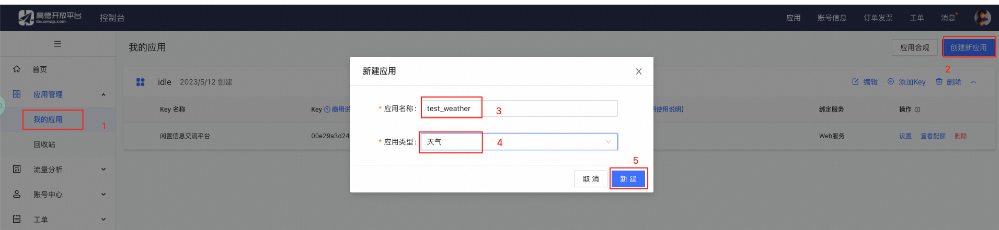
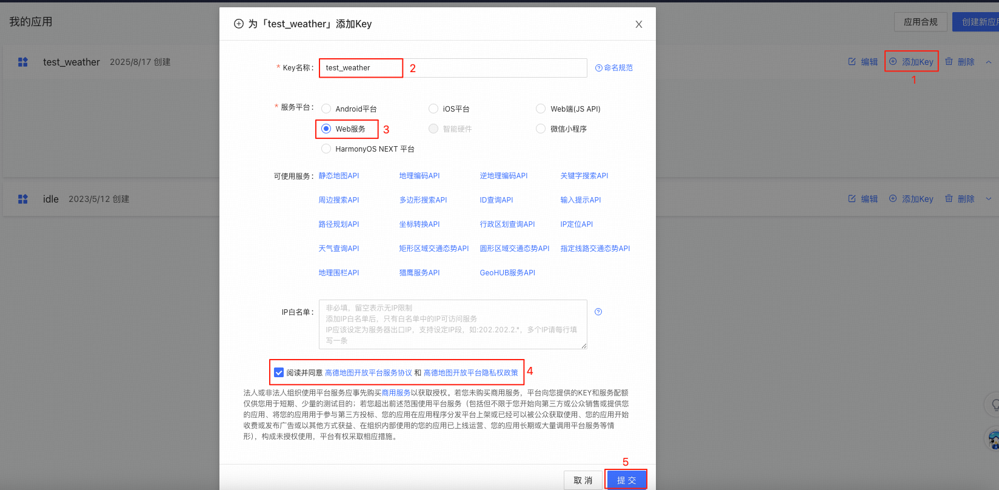
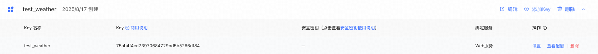
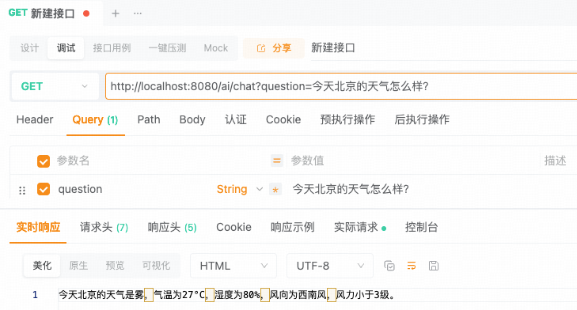

## 小白学SpringAI-获取实时天气数据

---

### 1. 天气数据的来源

实时天气数据提供商，例如：心知天气（中国气象局官方授权）、高德天气、和风天气以及韩小韩 `WebAPI` 等等。大多数提供商都设置了免费使用额度。

---

### 2. 高德天气

访问 [高德开放平台](https://lbs.amap.com/api/webservice/guide/api/weatherinfo)

1. 注册账号（省略）
2. 实名认证（省略）
3. 创建应用 
4. 添加 Key

与前边 DeepSeek 以及智谱AI的流程类似，这里不再赘述。

```
# 高德 API 的官方服务器地址，后续请求会基于此地址拼接路径
https://restapi.amap.com
# 实时天气数据的请求路径和参数， paramters 代表的参数
/v3/weather/weatherInfo?parameters
```

```
@Component
public class WeatherTools {

    @Value("${weather.gaode.key}")
    private String apiKey;

    @Tool(description = "获取指定地区的天气预报")
    String getCurrentWeather(String city) {
        // 1. 基础服务地址
        String baseUrl = "...";

        // 2. 基于 baseUrl 构建一个 RestClient
        RestClient restClient = RestClient.builder().baseUrl(baseUrl).build();

        // 3. 发起 HTTP GET 请求，并使用 Map 存储响应数据
        String uri = "/v3/weather/weatherInfo?city={0}&key={1}";
        Map<?, ?> result = restClient.get().uri(uri, city, apiKey)
            .retrieve()  // 执行 http 请求并获取响应
            .body(Map.class);  // 将响应的 JSON 解析成 Map 对象

        // 4. Jackson 库将 Map 转换为 JSON 字符串后返回给 AI 模型
        try {
            String jsonStr = new ObjectMapper().writeValueAsString(result);
            return jsonStr;
        } catch (JsonProcessingException e) {
            throw new RuntimeException(e);
        }
    }
}

@Configuration
public class SpringAIConfig {
    @Resource
    private WeatherTools weatherTools;
    // 创建基于 OpenAi 模型的客户端
    @Bean(name = "deepseek")
    public ChatClient deepSeekChatClient(OpenAiChatModel model) {
        return ChatClient.builder(model)
            .defaultSystem("你是 DeepSeek")
            .defaultTools(weatherTools)
            .build();
    }
}
```

测试路由：<br/>
http://localhost:8080/ai/chat?question=今天北京的天气怎么样？

