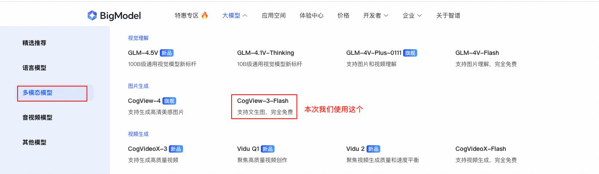
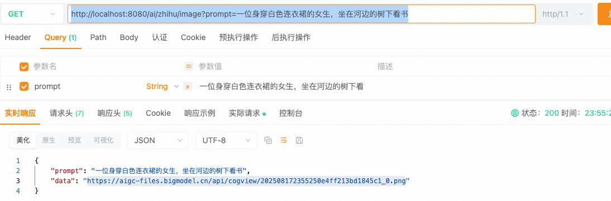

## 小白学SpringAI-文生图

---

### 1. 什么是文生图

文生图 `Text-to-Image`,是通过输入描述性文字直接生成图像的技术，属于“**多模态**”应用之一。它融合了文本（语言模态）和图像（视觉模态）两种不同数据类型的处理。

---

### 2. 文生图模型

支持文生图的大模型： `OpenAO`、`QianFan`、`智谱 AI` 等等。



PS: 本次文生图的前置知识点是 “Spring AI 整合智谱AI”，若不清楚的话可以参考 [12-multi-model](./12-multi-model.MD)。

`ImageModel` 接口是文生图功能的核心接口，它定义如何向模型发送请求及返回响应。

```java
@FunctionalInterface
public interface ImageModel extends Model<ImagePrompt, ImageResponse> {
    // ImagePrompt - 生图提示词
    // ImageResponse - 模型的生图响应 
    ImageResponse call(ImagePrompt request);
}
```

`Spring AI` 官网中明确提到已经为 `智谱 AI` 提供了接口实现类 ``。

---

### 3. 实现文生图

实现步骤分为：

1. 图像参数：文生图的模型名、图像分辨率、图像质量等等
2. 生图提示词：ImagePrompt 类可按用户请求与图像参数生成发送至模型的生图提示词
3. 发送生图请求：ImageModel 接口的 call() 方法发送生成图像的请求
4. 获取模型响应：ImageResponse 类存储 call() 方法返回的响应
5. 解析图像地址：ImageResponse.getResult().getOutput().getUrl()
6. 响应前端：  
```
正确响应：
    ResponseEntity.ok(Map.of("prompt", prompt, "data", url));
错误返回：
    ResponseEntity.status(HttpStatus.INTERNAL_SERVER_ERROR)
                .body(Map.of("prompt", prompt, "data", e.getMessage()));
```

---

### 4. 代码实现

```java
@RestController
public class ImageGenerationController {

    @Resource(name = "zhiPuAiImageModel")
    private ImageModel imageModel;

    @GetMapping("/ai/zhipu/image")
    public ResponseEntity<Map<String, Object>> getImage(
        @RequestParam(defaultValue = "毛和狗") String prompt) {
        // 1. 图像参数
        ImageOptions imageOptions = ZhiPuAiImageOptions.builder()
            .user("hartli")
            .model("cogview-3-flash")
            .build();
        // 2. 生图提示词
        ImagePrompt imagePrompt = new ImagePrompt(prompt, imageOptions);
        try {
            // 3. 发送生图请求 + 4. 获取模型响应
            ImageResponse response = imageModel.call(imagePrompt);
            // 5. 解析图像地址
            String url = response.getResult().getOutput().getUrl();
            // 6. 响应前端
            return ResponseEntity.ok(Map.of("prompt", prompt, "data", url));
        } catch (Exception e) {
            return ResponseEntity.status(HttpStatus.INTERNAL_SERVER_ERROR)
                .body(Map.of("prompt", prompt, "data", e.getMessage()));
        }
    }
}
```

测试路由：<br/>
http://localhost:8080/ai/zhipu/image?prompt=一位身穿白色连衣裙的女生，坐在河边的树下看书

测试结果：


PS:  通用的参数配置如下：

```java
ImageOptions imageOptions = ImageOptionsBuilder.builder()
            .model("cogview-3-flash")       // 使用模型
            .width(1024)                    // 图片宽度，智谱 AI 不支持
            .height(1024)                   // 图片高度，智谱 AI 不支持
            .N(2)                           // 一次生成 N 图，智谱 AI 不支持
            .style("netural")               // 图像风格，natural-自然风格，vivid-鲜艳风格，智谱 AI 不支持
            .responseFormat("Json")         // 响应格式，智谱 AI 不支持
            .build();
```