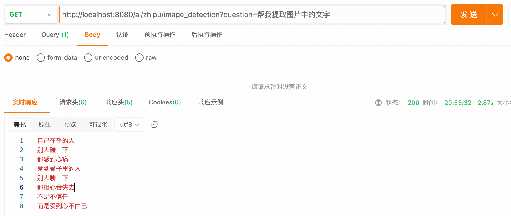

## 小白学SpringAI-视觉理解

---

### 1. 什么是视觉理解

视觉理解即图像转文本（Image-to-Text）,属于多模态应用之一。通过提取图像特征，将视觉信息转化为语言描述。广泛应用于图片分析、报告解读、提取文字等场景。

---

### 2. 视觉理解模型

支持视觉理解的大模型：`OpenAI`、`QianFan`、`智谱AI` 等等。


PS: 本次视觉理解的前置知识点是 “Spring AI 集成智谱AI”，若不清楚的话可以参考 [12-multi-model](./12-multi-model.MD)。

---

### 3. 实现视觉理解
实现步骤：

1. 配置大模型参数

    ```
    spring:
      ai:
        zhipuai:
          api-key: 8e3ee8d0bf6049e88e14e7edd0f04ddc.2rUtcBtRqFISv9U2
          base-url: https://open.bigmodel.cn/api/paas
          chat:
            options:
              model: glm-4.1v-thinking-flash     # 视觉理解大模型
              temperature: 0.7
    ```

2. 准备图像（图片分析、报告解读、文字提取）
3. 创建基于默认模型的客户端
```java
@Configuration
public class SpringAIConfig {
   // 创建基于 Zhipuai 模型的客户端
   @Bean(name = "zhipu")
   public ChatClient zhipuChatClient(ZhiPuAiChatModel model) {
      return ChatClient.builder(model)
              .defaultSystem("你是AI助手，回答问题简洁又明确")
              .build();
   }
}
```
4. 创建响应用户请求的Controller
5. 实现图像资源加载
6. 客户端方法链中设置用户请求和图像资源
上面三步的代码实现：

```java
@RestController
public class ImageDetectionController {

    @Resource(name = "zhipu")
    private ChatClient chatClient;

    @Value("classpath:images/girl.png")
    private org.springframework.core.io.Resource image; // 图像资源

    @GetMapping("/ai/zhipu/image_detection")
    public String imageDetection(String question) {
        return chatClient.prompt()
            .user(u -> {
                u.text(question);
                u.media(MimeTypeUtils.IMAGE_PNG, image);
            })
            .call()
            .content();
    }
}
```
* 测试1
  * 测试图片：[女生图片](materials/16/girl.png)
  * 测试路由：http://localhost:8080/ai/zhipu/image_detection?question=请分析图片中的内容
  * 测试结果：
   
* 测试2
  * 测试图片：[报告解析图片](materials/16/report.png)
  * 测试路由：http://localhost:8080/ai/zhipu/image_detection?question=帮我解读一下图片报告
  * 测试结果：
* 测试3
  * 测试图片：[文字提取图片](materials/16/text.png)
  * 测试路由：http://localhost:8080/ai/zhipu/image_detection?question=帮我提取图片中的文字
  * 测试结果：

