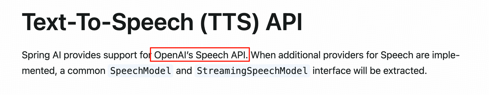
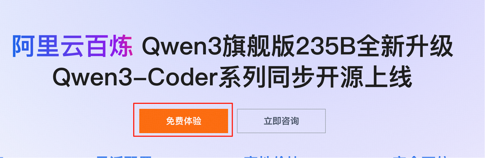
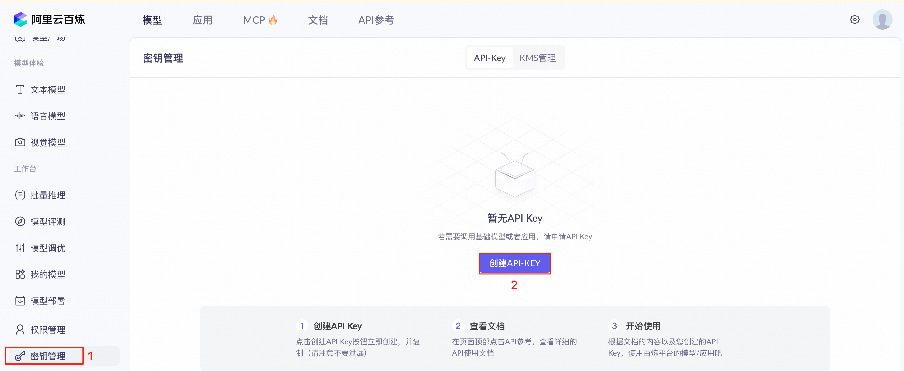
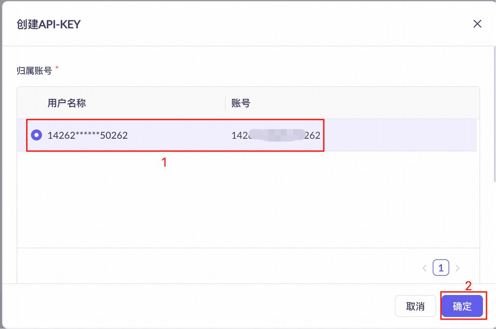
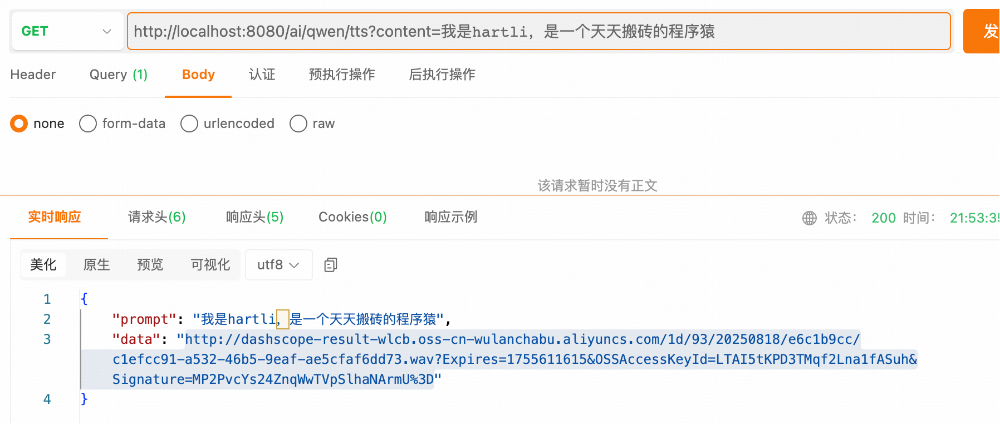

## 小白学SpringAI-文生语音（TTS）

---

### 1. 什么是文生语音

文生语音（Text-to-Speech，TTS）是文本转语音的简称，是一种将文本内容转换成语音的计算机技术，属于“**语音合成**”领域。可灵活调整语调、语速甚至方言等特性，使语音更自然生动。

```
1. 无障碍辅助：为视障用户提供文本转语音，解决视障限制
2. 配音服务：输入文字即可转换为视频配音
3. 客服语音：将知识库的文字转换为客服语音回答用户问题
......
```

---

### 2. 文生语音模型

`Spring AI` 目前仅支持 `OpenAI`的`tts`模型（如： tts-1），未来计划通过抽象通用接口兼容更多服务商。



> PS:本次教程不会使用 OpenAI 的 TTS 模型做演示：
> 1.网络访问限制
> 2.模型使用费用
> 总结：本系列语音模型方面的内容，都将无法使用 SpringAI 实现。

---

### 3. Qwen-TTS 模型
`Qwen-TTS` 是通义千问系列的语音合成模型，支持输入中文、英文、中英混合的文本，并流式输出音频。

---

### 4. 阿里云百炼平台

[百炼平台](https://www.aliyun.com/product/bailian)是阿里云推出的“**一站式大模型开发及应用搭建**”平台，在平台上需完成如下设置：
1. 注册（略）
2. 开通模型服务

3. 创建 API-Key



---

### 5. 实现 TTS
#### 5.1 引入 DashScope 依赖

`DashScope` 提供综合性 AI 解决方案，支持开发者通过 API 调用各类大模型。针对不同语言， `DashScope` 提供了不同软件开发工具包（SDK）。

添加依赖：

```
<!-- dashscope -->
<dependency>
    <groupId>com.alibaba</groupId>
    <artifactId>dashscope-sdk-java</artifactId>
    <!-- Qwen-TTS 模型要求 DashScope Java SDK 版本需要不小于 2.19.0 -->
    <version>2.21.3</version>
</dependency>
```

#### 5.2 配置 API-Key

```
spring:
  ai:
    dashscope:
      api-key: sk-f427c6f***************5afbfd  # 百炼平台创建的 API-Key
```

#### 5.3 开发 TTS 转换工具

```java
@Component
public class QwenTTS {

    // 读取 application.yml 文件中配置的 api-key
    @Value("${spring.ai.dashscope.api-key")
    private String apiKey;

    // 模型名称,“qwen-tts-2025-05-22” 支持更多音色配置
    private static final String MODEL = "qwen-tts";

    // 根据输入的文本转换为语音文件
    public ResponseEntity<Map<String ,String>> call(String content) {
        String url = null;   // 语音文件的 url
        try {
            // 1. 初始化多模态对话服务的客户端实现
            MultiModalConversation conversation = new MultiModalConversation();
            // 2. 语音参数配置
            MultiModalConversationParam param = MultiModalConversationParam.builder()
                .model(MODEL)
                .apiKey(apiKey)
                .text(content)
                .voice(AudioParameters.Voice.CHERRY)
                .build();
            // 3. 向模型发送请求并存储模型响应结果
            MultiModalConversationResult result = conversation.call(param);
            // 4. 从结果中解析出语音文件的 url
            url = result.getOutput().getAudio().getUrl();

        } catch (Exception e) {
            return ResponseEntity.status(HttpStatus.INTERNAL_SERVER_ERROR)
                .body(Map.of("prompt", content, "data", e.getMessage()));
        }
        // 5. 正常返回
        return ResponseEntity.ok(Map.of("prompt", content, "data", url));
    }
}
```

创建一个 Controller
```java
@RestController
public class AudioGenerationController {

    @Resource
    private QwenTTS qwenTTS;

    @GetMapping("/ai/qwen/tts")
    public ResponseEntity<Map<String, String>> getAudio(String content) {
        return qwenTTS.call(content);
    }
}
```

测试路由：<br/>
http://localhost:8080/ai/qwen/tts?content=我是hartli，是一个天天搬砖的程序猿

测试结果：


访问该地址会让你下载一个音频文件，下载到本地后访问即可。