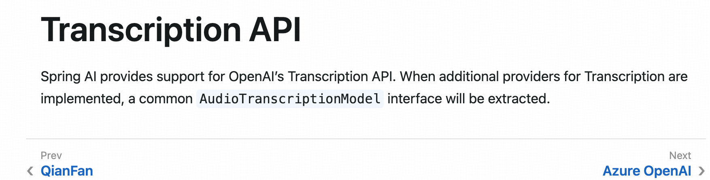
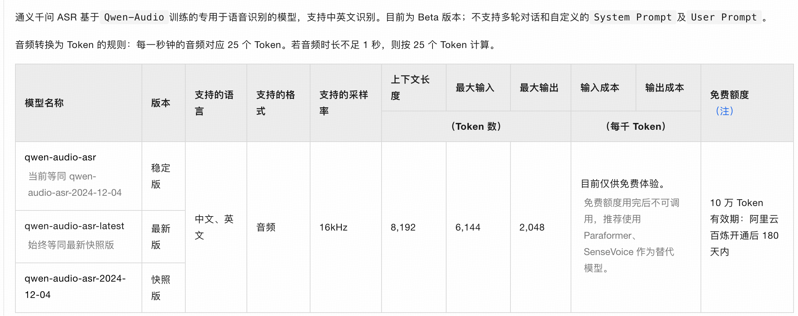
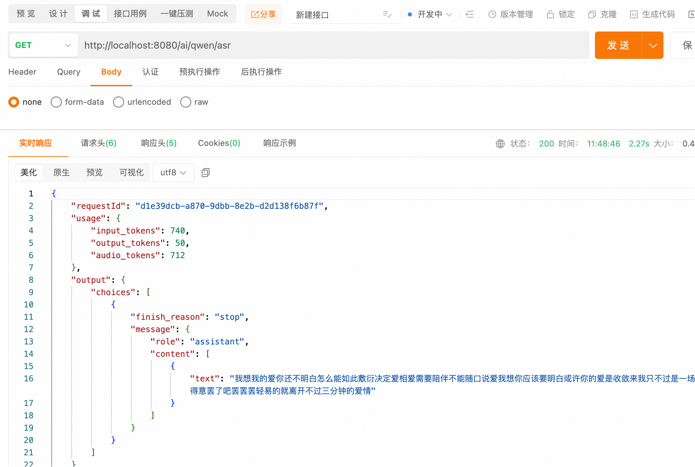
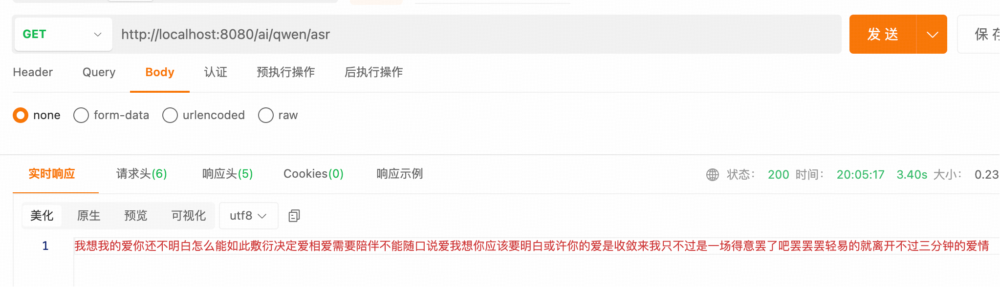

## 小白学SpringAI-听觉理解（语音识别）

---

### 1. 什么是听觉理解

听觉理解指对音、视频文件进行“**语音识别**”（Automatic Speech Recognition，ASR），将语音转换为文本。应用场景如下：
1. 录音记录：会议、课堂等将录音文件转成文字，方便后期快速进行信息检索、分析和整理。
2. 电话分析：自动记录并分析电话语言，快速理解需求、自动分类服务请求。
3. 字幕生成：帮助媒体制作与后期编辑识别音视频材料并生成对应的字幕。
4. ......

---

### 2. 听觉理解模型

`SpringAI`目前仅支持`OpenAI`的语音识别模型（如：whisper-1），未来计划通过抽象通用接口兼容更多服务商。


> PS:本次教程不会使用 OpenAI 的 ASR 模型做演示：
> 1.网络访问限制
> 2.模型使用费用
> 总结：本系列语音模型方面的内容，都将无法使用 SpringAI 实现。

---

### 3. Qwen-Audio-ASR

`Qwen-Audio-ASR` 是通义千问系列语音识别模型，支持中、英文识别。


### 4. 实现 ASR

下面 4.1~4.2 步骤与 [17-text-to-speech.MD](./17-text-to-speech.MD) 中 5.1~5.2 步骤一致。

#### 4.1 引入 DashScope 依赖

```xml
<!-- dashscope -->
<dependency>
    <groupId>com.alibaba</groupId>
    <artifactId>dashscope-sdk-java</artifactId>
    <!-- Qwen-TTS 模型要求 DashScope Java SDK 版本需要不小于 2.19.0 -->
    <version>2.21.3</version>
</dependency>
```

#### 4.2 配置 API-Key

```
spring:
  ai:
    dashscope:
      api-key: sk-f427c6f***************5afbfd  # 百炼平台创建的 API-Key
```

#### 4.3 创建 ASR 工具类

```java
@Component
public class QwenASR {

    // 读取 application.yml 文件中配置的 api-key
    @Value("${spring.ai.dashscope.api-key}")
    private String apiKey;

    // 模型名称,“qwen-tts-2025-05-22” 支持更多音色配置
    private static final String MODEL = "qwen-audio-asr";

    // 根据输入的文本转换为语音文件
    public String call(String filePath) {
        try {
            // 1. 初始化多模态对话服务的客户端实现
            MultiModalConversation conversation = new MultiModalConversation();
            // 2. 多模态消息对象
            MultiModalMessage msg = MultiModalMessage.builder()
                .role(Role.USER.getValue())
                .content(List.of(Collections.singletonMap("audio", filePath)))
                .build();
            // 3. 请求参数配置
            MultiModalConversationParam param = MultiModalConversationParam.builder()
                .model(MODEL)
                .apiKey(apiKey)
                .message(msg)
                .build();
            // 4. 向模型发送请求并存储模型响应结果
            MultiModalConversationResult result = conversation.call(param);
            // 5. 响应结果转换为 JSON 文本
            return JsonUtils.toJson(result);
        } catch (Exception e) {
            e.printStackTrace();
            return "识别异常！";
        }
    }
}
```

#### 4.4 创建 Controller

```java
@RestController
public class AudioDetectionController {

    @Resource
    private QwenASR qwenASR;

    @GetMapping("/ai/qwen/asr")
    public String qwenAsr() {
        String filePath = "src/main/resources/audios/陈亦洺-囚于永夜.mp3";
        return qwenASR.call(filePath);
    }
}
```

测试路由：<br/>
http://localhost:8080/ai/qwen/asr
测试结果：


可以看到目前的结果是一个多层数据结构，我们只想要最终的文本结果应该如何实现呢？

修改 QwenASR 类的第五步：5. 响应结果转换为 JSON 文本

```
// 5. 响应结果转换为 JSON 文本
            return result.getOutput().getChoices().get(0).getMessage().getContent().get(0).get("text").toString();
```

同样的测试路由

测试结果：

