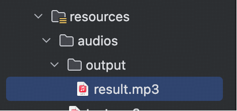

## 小白学SpringAI-语音克隆

---

### 1. 什么是语音克隆

语音克隆即声音复刻，根据提供的样例音频生成高度相似且听感自然的定制声音。

应用场景如下：
1. 陪伴场景：通过复刻加人的声音提供个性化的陪伴。
2. 教育场景：复刻老师的声音，加强师生互动，丰富教学视频和课件内容。
3. 音视频产业：复刻主播声音，以便于后期的补录与配音等。

---

### 2. 支持语音克隆的模型

`SpringAI`目前仅支持`OpenAI`的语音克隆模型。

> PS:本次教程不会使用 OpenAI 的 ASR 模型做演示：
> 1.网络访问限制
> 2.模型使用费用
> 总结：本系列语音模型方面的内容，都将无法使用 SpringAI 实现。

---

### 3. CosyVoice

`CosyVoice` 是由阿里通义实验室研发的语音生成模型，仅需短短数秒的录音变成完成声音复刻。

1. cosyvoice-v1:旧版本
2. cosyvoice-v2:新版本，推荐使用

> 声音复刻服务提供免费使用，但使用复刻的银色进行 **语音合成** 时需要收入费用；
> 百炼平台开通 180 天内，享受 `语音合成` 免费额度 100 万 Tokens。

---

### 4. 实现语音克隆

下面 4.1~4.2 步骤与 [17-text-to-speech.MD](./17-text-to-speech.MD) 中 5.1~5.2 步骤一致。

#### 4.1 引入 DashScope 依赖
`DashScope` 提供综合性 AI 解决方案，支持开发者通过 API 调用各类大模型。针对不同语言， `DashScope` 提供了不同软件开发工具包（SDK）。

添加依赖：

```
<!-- dashscope -->
<dependency>
    <groupId>com.alibaba</groupId>
    <artifactId>dashscope-sdk-java</artifactId>
    <!-- Qwen-TTS 模型要求 DashScope Java SDK 版本需要不小于 2.19.0 -->
    <version>2.21.3</version>
</dependency>
```

#### 4.2 配置 API-Key

```
spring:
  ai:
    dashscope:
      api-key: sk-f427c6f***************5afbfd  # 百炼平台创建的 API-Key
```

#### 4.3 上传音色文件

音色文件即被克隆的语音样本。音色文件需要提供公网可访问的URL方可使用。推荐将自定义音色文件上传至 七牛云 OSS。

步骤如下：
1. 创建 Bucket：用于存储文件的存储空间，空间具备各种配置属性（访问权限、存储类型等）
2. 本例演示将 Bucket 设置为公共读（公开访问有风险，仅做测试无所谓）
3. 获取音色文件的URL：http://media.463644535.xyz/Guodegang.mp3

#### 4.4 开发工具类

定义音色文件枚举：

```java
@Getter
@AllArgsConstructor
public enum VoiceUrl {

    GUODEGANG("guodegang", "http://media.463644535.xyz/Guodegang.mp3");

    private final String name;
    private final String url;

    public static final Map<String, VoiceUrl> VOICE_URL_MAP = Arrays.stream(VoiceUrl.values()).collect(
        Collectors.toMap(VoiceUrl::getName, v -> v));
}
```

开发语音克隆工具类：

```java
@Slf4j
@Component
public class VoiceCloneTools {

    // 读取 application.yml 文件中配置的 api-key
    @Value("${spring.ai.dashscope.api-key}")
    private String apiKey;

    // 模型名称
    private static final String MODEL = "cosyvoice-v2";

    // 自定义音色前缀（作为音色管理的分类标识符）
    private static final String PREFIX = "myVoice";

    // 根据输入的文本转换为语音文件
    public void audioClone(String content, String voiceName) {
        try {
            // 1. 根据音色复核声音
            VoiceEnrollmentService service = new VoiceEnrollmentService(apiKey);
            // 根据传入的音色匹配 url
            VoiceUrl voiceUrl = VOICE_URL_MAP.get(voiceName);
            if (voiceUrl == null) {
                log.error("音色不存在");
                return;
            }
            Voice voice = service.createVoice(MODEL, PREFIX, voiceUrl.getUrl());
            // 2. 模型合成语音
            SpeechSynthesisParam param = SpeechSynthesisParam.builder()
                .apiKey(apiKey)
                .model(MODEL)
                .voice(voice.getVoiceId())
                .build();
            SpeechSynthesizer speechSynthesizer = new SpeechSynthesizer(param, null);  // 非流式第二个参数设置为空
            ByteBuffer audio = speechSynthesizer.call(content);
            // 3. 空值校验
            if (audio == null) {
                throw new RuntimeException("语音合成失败");
            }
            // 4. 保存语音文件
            File file = new File("src/main/resources/audios/output/result.mp3");
            if (!file.exists()) {
                boolean created = file.getParentFile().mkdirs();
                if (!created) {
                    throw new RuntimeException("创建目录失败");
                }
                created = file.createNewFile();
                if (!created) {
                    throw new RuntimeException("创建文件失败");
                }
            }
            try (FileOutputStream fos = new FileOutputStream(file)) {
                fos.write(audio.array());
            } catch (Exception e) {
                throw new RuntimeException(e);
            }
        } catch (Exception e) {
            throw new RuntimeException(e);
        }
    }
}
```

#### 4.5 开发 Controller

```java
@RestController
public class AudioCloneController {

    @Resource
    private VoiceCloneTools voiceCloneTools;

    @GetMapping("/ai/voice/clone")
    public void audioClone(String content, String voiceName) {
        voiceCloneTools.audioClone(content, voiceName);
    }
}
```

测试路由：<br/>
http://localhost:8080/ai/voice/clone?content=我是hartli，是一个天天搬砖的程序猿&voiceName=guodegang

运行结果不报错，看到音频文件生成在 `src/main/resources/audios/output/result.mp3` 文件中。

   

