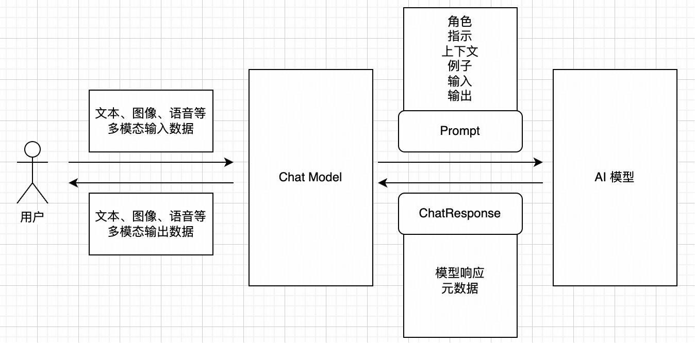
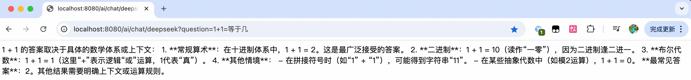
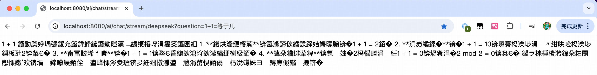
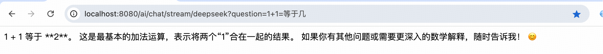

## 小白学SpringAI-Chat Model

---

### 1.什么是 Chat Model

`Chat Model`即**聊天模型**，他是 `Spring AI` 中处理对话的核心组件，负责将用户的输入（如文本、图像、语音等多模态数据）转换为AI模型的指令，并返回结构化的响应。

`Spring AI`支持不同提供商的聊天模型（[模型对比](https://docs.spring.io/spring-ai/reference/api/chat/comparison.html)
），包括但不限于如下模型：

| 提供商                       | 多模态支持                              | 工具/函数 | 流式传输 | 重试机制 | 可观测性 | 内置JSON | 本地运行 | OpenAI API兼容 |
|:--------------------------|:-----------------------------------|:-----:|:----:|:----:|:----:|:------:|:----:|:------------:|
| Anthropic Claude          | 文本、PDF、图像                          |   ✅   |  ✅   |  ✅   |  ✅   |   ❌    |  ❌   |      ❌       |
| Azure OpenAI              | 文本、图像                              |   ✅   |  ✅   |  ✅   |  ✅   |   ✅    |  ❌   |      ✅       |
| DeepSeek (OpenAI-proxy)   | 文本                                 |   ❌   |  ✅   |  ✅   |  ✅   |   ✅    |  ✅   |      ✅       |
| Google VertexAI Gemini    | 文本、PDF、图像、音频、视频                    |   ✅   |  ✅   |  ✅   |  ✅   |   ✅    |  ❌   |      ✅       |
| Groq (OpenAI-proxy)       | 文本、图像                              |   ✅   |  ✅   |  ✅   |  ✅   |   ❌    |  ❌   |      ✅       |
| HuggingFace               | 文本                                 |   ❌   |  ❌   |  ❌   |  ❌   |   ❌    |  ❌   |      ❌       |
| Mistral AI                | 文本、图像                              |   ✅   |  ✅   |  ✅   |  ✅   |   ✅    |  ❌   |      ✅       |
| MiniMax                   | 文本                                 |   ✅   |  ✅   |  ✅   |  ✅   |   ❌    |  ❌   |              |
| Moonshot AI               | 文本                                 |   ❌   |  ✅   |  ✅   |  ✅   |   ❌    |  ❌   |              |
| NVIDIA (OpenAI-proxy)     | 文本、图像                              |   ✅   |  ✅   |  ✅   |  ✅   |   ❌    |  ❌   |      ✅       |
| OCI GenAI/Cohere          | 文本                                 |   ❌   |  ❌   |  ❌   |  ✅   |   ❌    |  ❌   |      ❌       |
| Ollama                    | 文本、图像                              |   ✅   |  ✅   |  ✅   |  ✅   |   ✅    |  ✅   |      ✅       |
| OpenAI                    | 输入: 文本、图像、音频<br>输出: 文本、音频          |   ✅   |  ✅   |  ✅   |  ✅   |   ✅    |  ❌   |      ✅       |
| Perplexity (OpenAI-proxy) | 文本                                 |   ❌   |  ✅   |  ✅   |  ✅   |   ❌    |  ❌   |      ✅       |
| QianFan                   | 文本                                 |   ❌   |  ✅   |  ✅   |  ✅   |   ❌    |  ❌   |      ❌       |
| ZhiPu AI                  | 文本                                 |   ✅   |  ✅   |  ✅   |  ✅   |   ❌    |  ❌   |      ❌       |
| Amazon Bedrock Converse   | 文本、图像、视频、文档<br>(PDF、HTML、MD、DOCX…) |   ✅   |  ✅   |  ✅   |  ✅   |   ❌    |  ❌   |      ❌       |

---

### 2.Chat Model API

#### 2.1 工作原理

完整的提示词示例：


```
[角色]你是一位经验丰富的家居改造顾问
[指示]针对老厨房改造需求，提供具体的方案
[上下文]房屋类型：90年代70㎡老房，家庭成员：夫妻+小学子女，预算5千~3万
[例子]参考样式《非改不可》节目的第3期
[输入]请基于以下新需求规划，期望新增洗碗机、浅色系、易清洁
[输出]生成md文件格式（或JSON格式）
```

#### 2.2 ChatModel 接口

`ChatModel` 接口定义了与 AI 模型交互的基本方法，是一个入口规范。

```java
public interface ChatModel extends Model<Prompt, ChatResponse>, StreamingChatModel {

    // 标准的 AI 模型交互入口
    ChatResponse call(Prompt prompt);

    // 简化的 AI 模型交互入口，无需掌握Prompt和ChatResponse的细节即可立马入手
    //  1.message 参数被封装为Prompt
    //  2.返回的 ChatResponse 的 String 部分
    default String call(String message) {
        Prompt prompt = new Prompt(new UserMessage(message));
        Generation generation = this.call(prompt).getResult();
        return generation != null ? generation.getOutput().getText() : "";
    }

    // 流式响应（逐字符响应，打印机效果）的交互入口
    // 此默认实现作为兜底逻辑，具体的聊天模型未覆盖本方法时，会抛出异常
    default Flux<ChatResponse> stream(Prompt prompt) {
        throw new UnsupportedOperationException("streaming is not supported");
    }

}
```

#### 2.3 StreamingChatModel 接口

```java
public interface StreamingChatModel extends StreamingModel<Prompt, ChatResponse> {

    // 简化的流式 AI 模型交互入口
    default Flux<String> stream(String message) {
        Prompt prompt = new Prompt(message);
        return this.stream(prompt).map((response) ->
            response.getResult() != null && response.getResult().getOutput() != null &&
                response.getResult().getOutput().getText() != null ? response.getResult().getOutput().getText() : "");
    }

    // 标准的 AI 模型流式交互入口
    Flux<ChatResponse> stream(Prompt prompt);
}
```

#### 2.4 Demo 测试

测试代码：

```java
@RestController
public class ChatController {

    @Resource
    private ChatModel chatModel;

    @GetMapping("/ai/chat/deepseek")
    public String deepSeek(String question) {
        return chatModel.call(question);
    }

    @GetMapping("/ai/chat/stream/deepseek")
    public Flux<String> deepSeekStream(String question) {
        return chatModel.stream(question);
    }

}
```
测试普通对话：
http://localhost:8080/ai/chat/deepseek?question=1+1=%E7%AD%89%E4%BA%8E%E5%87%A0

测试流式对话：
http://localhost:8080/ai/chat/stream/deepseek?question=1+1=%E7%AD%89%E4%BA%8E%E5%87%A0


由此发现一个问题：模型返回的流式结果是乱码的，需要处理一下。
```java
@RestController
public class ChatController {

    @Resource
    private ChatModel chatModel;

    @GetMapping("/ai/chat/stream/deepseek")
    public Flux<String> deepSeekStream(String question) {
        return chatModel.stream(question);
    }

}
```
此时得到的结果就是正确的了。


### 2.5 ChatClient 接口
`ChatClient` 接口提供了`高层封装`（如 `Fluent API`流式API，提供链式调用），简化了开发，但是底层还是使用的 ChatModel。

```java
public interface ChatClient {
    // 手动模式创建指定模型的 ChatClient 实例
    static ChatClient create(ChatModel chatModel) {
        return create(chatModel, ObservationRegistry.NOOP);
    }
    // 建造者模式创建系统默认的 ChatClient 实例
    public interface Builder {
        ChatClient build();
    }
    // 其他方法省略
}
```

ChatClient 的配置与使用：
```java
@Configuration
public class SpringAIConfig {

    // 创建基于默认的大模型的客户端 
    @Bean
    public ChatClient openAiChatClient(ChatClient.Builder builder) {
        return builder.build();
    }
}

@RestController
public class ChatController {
    @Resource
    private ChatClient chatClient;

    @GetMapping("/ai/chat/deepseek")
    public String deepSeek(String question) {
        return chatClient.
            prompt().           // 设置请求的上下文
            user(question).     // 设置用户输入
            call().             // 发送请求并获取模型生成的响应
            content();          // 从响应中提取文本内容
    }
}
```


