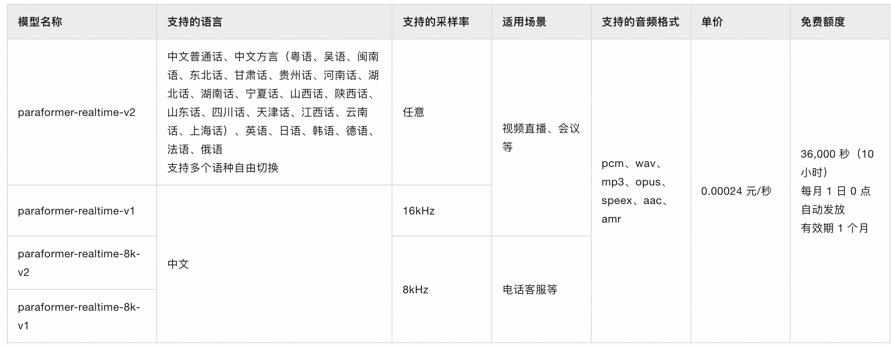

## 小白学SpringAI-实时语音识别

---

### 1. 什么是实时语音识别

实时语音识别可以将音频流实时转换为文本，实现“边说边出文字”的效果。它适用于对麦克风语音进行实时识别，以及对本地音频文件进行实时转录。应用场景如：

1. 会议：为会议、演讲、培训、庭审等提供实时记录
2. 直播：为直播带货、赛事直播提供实时字幕
3. 聊天：使用社交 APP 或输入法时，语音自动转文本
4. ......

---

### 2. 模型选择

`SpringAI`目前仅支持`OpenAI`的语音识别模型，本次教程不会采用 `OpenAI` 模型。

> PS:本次教程不会使用 OpenAI 的 ASR 模型做演示：
> 1.网络访问限制
> 2.模型使用费用
> 总结：本系列语音模型方面的内容，都将无法使用 SpringAI 实现。

---

### 3. Paraformer

`Paraformer` 是阿里通义实验室研发的实时语音识别模型，基于 Transformer 架构，具有实时性、精度和效率的优秀性能。



---

### 4. 实现实时语音识别

下面 4.1~4.2 步骤与 [17-text-to-speech.MD](./17-text-to-speech.MD) 中 5.1~5.2 步骤一致。

#### 4.1 引入 DashScope 依赖

`DashScope` 提供综合性 AI 解决方案，支持开发者通过 API 调用各类大模型。针对不同语言， `DashScope` 提供了不同软件开发工具包（SDK）。

添加依赖：

```
<!-- dashscope -->
<dependency>
    <groupId>com.alibaba</groupId>
    <artifactId>dashscope-sdk-java</artifactId>
    <!-- Qwen-TTS 模型要求 DashScope Java SDK 版本需要不小于 2.19.0 -->
    <version>2.21.3</version>
</dependency>
```

#### 4.2 配置 API-Key

```
spring:
  ai:
    dashscope:
      api-key: sk-f427c6f***************5afbfd  # 百炼平台创建的 API-Key
```

#### 4.3 开发实时语音识别工具类

```java
@Slf4j
@Component
public class RealTimeSpeechRecognitionTools {

    // 读取 application.yml 文件中配置的 api-key
    @Value("${spring.ai.dashscope.api-key}")
    private String apiKey;

    // 模型名称
    private static final String MODEL = "paraformer-realtime-v2";

    public void recognition() {
        // 创建语音数据源
        Flowable<ByteBuffer> source = Flowable.create(
            flowableEmitter -> {
                // 定义一个异步线程来处理音频数据采集
                new Thread(() -> {
                    // ... 参考官方示例代码<略>
                }).start();
            },
            // 设置背压策略为缓冲，当消费者处理不过来时缓冲数据
            BackpressureStrategy.BUFFER
        );
        // 创建语音识别器
        Recognition recognition = new Recognition();
        // 构建语音识别参数
        RecognitionParam param = RecognitionParam.builder()
            .apiKey(apiKey)
            .model(MODEL)
            .format("pcm")  // 音频格式为 pcm（标准数字音频模式）
            .sampleRate(16000)  // 设置采样率 16HZ
            .build();
        try {
            // 语音识别器执行语音识别（参数，语音数据源），以流式方式进行识别
            recognition.streamCall(param, source)
                // 阻塞式遍历每一个识别结果
                .blockingForEach(result -> {
                    // 判断当前识别结果是否是一个完整句子的结尾
                    if (result.isSentenceEnd()) {
                        // 识别完成并输出句子
                        log.info("识别结果：{}", result.getSentence().getText());
                    }
                });
        } catch (Exception e) {
            throw new RuntimeException(e);
        }
    }
}
```

#### 4.4 创建 Controller

```java
@RestController
public class RealTimeSpeechRecognitionController {

    @Resource
    private RealTimeSpeechRecognitionTools realTimeSpeechRecognitionTools;

    @GetMapping("/ai/realtime/speech")
    public void realtimeSpeech() {
        realTimeSpeechRecognitionTools.recognition();
    }
}
```

测试路由：<br/>
http://localhost:8080/ai/realtime/speech


