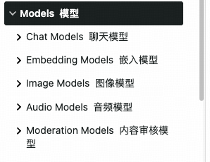
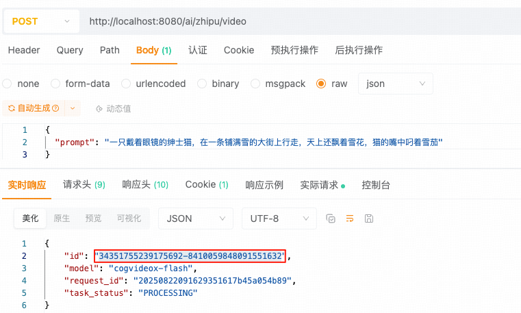
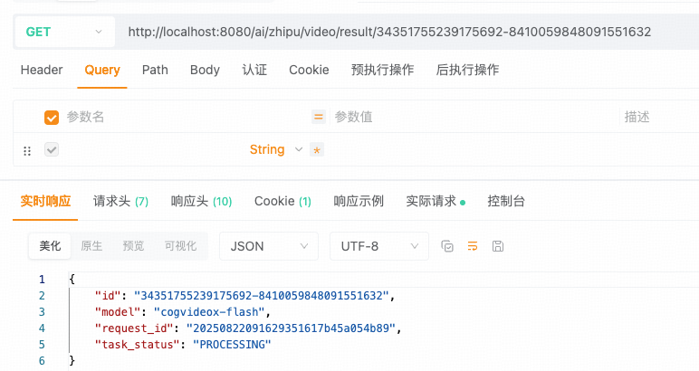
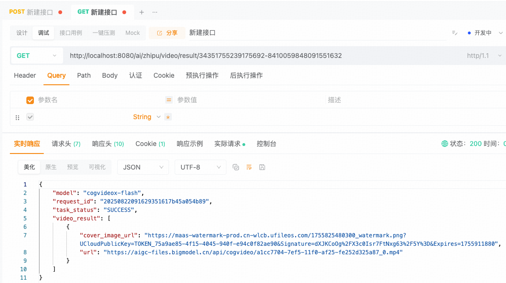

## 小白学SpringAI-文生视频

---

### 1. 什么是文生视频

文生视频，即将描述自动转化为动态视频内容的技术。

1. 社交媒体创作：制作爆款短视频内容
2. 影视与广告制作：制作产品演示、品牌宣传视频等，降低拍摄成本
3. 教育与知识传播：将文字转化成视频增强学习的趣味性
4. ......

---

### 2. 文生视频模型

支持文生视频的模型，如：
1. OpenAI Sora：可生成 1 分钟高清视频，支持复杂光影和物理模拟
2. CogVideoX 系列：清华推出的视频模型系列，支持多帧率分层训练，适用于影视和教育领域
3. Step-Video-T2V：阶跃星辰的视频模型，支持中英文输入，可生成搞清视频

> `SpringAI` 尚未提供任何可支持的文生视频模型接口实现类。



---

### 3. CogVideoX-Flash 模型

`CogVideoX-Flash` 模型是由智谱AI（清华背景）开发的视频生成大模型，具备强大的视频生成能力，只需输入文本或图片就可以轻松完成视频创作。[`CogVideoX-Flash` 模型的官方文档](https://docs.bigmodel.cn/cn/guide/models/free/cogvideox-flash)

---

### 4. 实现文生视频

#### 4.1 引入依赖

本次创建的就是普通的 Springboot 项目，需要引入依赖包含：
1. spring-boot-starter-web
2. lombok

#### 4.2 创建配置类

配置文件配置数据
```
spring:
  ai:
    zhipuai:
      api-key: 8e3ee8d0bf6049e88e14e7edd0f04ddc.2rUtcBtRqFISv9U2
      base-url: https://open.bigmodel.cn/api/paas
```

```java
@Configuration
public class ZhipuAIConfig {
    
    // 从配置文件中读取 api-key
    @Value("${spring.ai.zhipuai.api-key}")
    private String apiKey;
    
    // 从配置文件中读取 base-url
    @Value("${spring.ai.zhipuai.base-url}")
    private String baseUrl;
    
    @Bean
    public RestClient restClient() {
        return RestClient.builder()
            .baseUrl(baseUrl)  // 设置 baseUrl
            .defaultHeader("Authorization", "Bearer " + apiKey)  // 设置授权信息
            .build();
    }
}
```

#### 4.3 开发请求参数

请求参数是发送给模型的配置项目，包含：model（模型名）、prompt（生成视频的提示词）、withAudio（是否自动生成AI音效）等方面的配置项。

```java
@Data
@AllArgsConstructor
@NoArgsConstructor
public class VideoGenerationRequest {

    // 模型名
    private String model = "cogvideox-flash";
    // 视频描述文本
    private String prompt;
    // 是否生成 AI 音效，实测 cogvideox-flash 模型不支持
    private Boolean withAudio = true;
    // 以下配置参数是智谱官方提供，但 cogvideox-flash 不支持
    // 默认质量优先模式，"quality"为质量优先，"speed"为生成速度优先
    private String quality = "quality";
    // 默认 1080P 分辨率（1920*1080），支持最高4K（如："3840*2160"）
    private String size = "1920*1080";
    // 默认 30 帧，支持最高60帧
    private Integer fps = 30; 
}
```

#### 4.4 开发 Service

`Service` 重点在于实现 "**生成视频**" 和 "**查看视频**" 两部分业务。

```java
@Service
public class ZhipuAIVideoService {

    // 注入 RestClient 对象
    @Resource
    private RestClient restClient;

    // 生成视频
    public ResponseEntity<String> generateVideo(VideoGenerationRequest request) {
        // 生成视频的API接口地址
        final String API_URL = "/v4/videos/generations";
        // 发送 POST 请求
        return restClient.post()
            .uri(API_URL)  // 配置请求路由
            .contentType(MediaType.APPLICATION_JSON)  // 请求体为 json 格式
            .body(request)  // 具体请求参数
            .retrieve()  // 执行 http 请求并获取响应
            .toEntity(String.class);  // 将响应的 JSON 解析成 String 响应体
    }

    // 查看视频（videoId）代表视频ID
    public ResponseEntity<String> retrieveVideoResult(String videoId) {
        // 查看视频的 API 接口地址
        final String API_URL = "/v4/async-result/{id}";
        // 发送 GET 请求，将ID 作为路径参数
        return restClient.get()
            .uri(API_URL, videoId)
            .retrieve()
            .toEntity(String.class);
    }
}
```

#### 4.5 创建 Controller

```java
@RestController
public class VideoGenerationController {

    private final ZhipuAIVideoService zhipuAIVideoService;

    public VideoGenerationController(ZhipuAIVideoService zhipuAIVideoService) {
        this.zhipuAIVideoService = zhipuAIVideoService;
    }

    @PostMapping("/ai/zhipu/video")
    public ResponseEntity<String> generateVideo(@RequestBody VideoGenerationRequest request) {
        return zhipuAIVideoService.generateVideo(request);
    }

    @GetMapping("/ai/zhipu/video/result/{id}")
    public ResponseEntity<String> retrieveVideoResult(@PathVariable String id) {
        return zhipuAIVideoService.retrieveVideoResult(id);
    }
}
```

测试路由：<br/>
http://localhost:8080/ai/zhipu/video
参数：
```json
{
  "prompt": "一只戴着眼镜的绅士猫，在一条铺满雪的大街上行走，天上还飘着雪花，猫的嘴中叼着雪茄"
}
```

测试结果：



http://localhost:8080/ai/zhipu/video/result/{id}

测试结果：


可以看到目前图片的状态是 PROCESSING，表示正在处理中。当出现如下图示时，表示处理完成：




