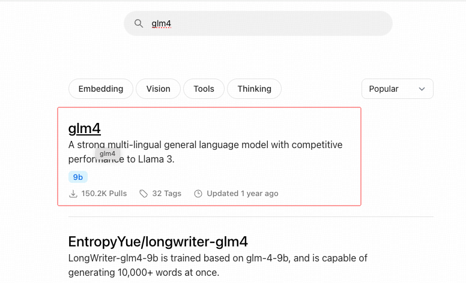
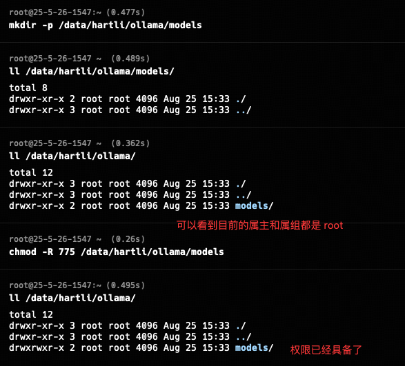

## 小白学SpringAI-调用本地大模型

---

### 1. 安装 Ollama

`Ollama` 简介：开源跨平台大模型工具。让用户能够轻松得在本地运行、管理和与大模型进行交互。

#### 1.1 安装 curl 命令

`curl` 命令在下载安装脚本时使用，需要提前准备好。

```shell
# ubuntu
sudo apt update && sudo apt install -y curl
# centos
sudo yum update && sudo yum install -y curl
```


#### 1.2 下载安装脚本

`Ollama`  [官方](https://ollama.com/) 为 linux  系统提供了一键安装脚本，执行如下命令即可：

```shell
# 下载并执行安装脚本（不指定 "OLLAMA_VERSION" 则默认安装 0.10.1 版本）
curl -fsSL https://ollama.com/install.sh | OLLAMA_VERSION=0.3.9 sh
# 查看 ollama 版本号
ollama -v
# 查看 ollama 服务状态
systemctl status ollama
```


#### 1.3 运行模型

Ollama [支持的模型](https://ollama.com/search)很多，本次选择国产模型 `GLM-4-9B` (智谱AI推出的模型)。



所有的模型首次运行时会自动从模型官网下载对应的本地副本，下载速度取决于网络条件和模型大小。`Ollama` 用于存储本地模型副本的默认路径如下：

```shell
# Windows
C:\Users\username\.ollama\models
#linux
~/.ollama/models
```
如果需要自定义模型副本的存储路径：
```shell
# Windows
在系统属性 - 高级系统设置 - 环境变量，新建 "OLLAMA_MODELS" 环境变量，值为自定义路径
```

```shell
# 我的环境：Ubuntu
# 目前我以 root 用户登录，因此下面有一些命令不会执行，也不需要使用 sudo 权限

# 停止 ollama 服务
sudo systemctl stop ollama
# 创建保存模型的自定义目录
sudo mkdir -p /data/hartli/ollama/models
# 修改自定义目录（递归）的属主和属组为当前用户和当前组
sudo chown -R hartli:hartli /data/hartli/ollama/models
# 赋予属主和属组读、写和执行权限
sudo chmod -R 775 /data/hartli/ollama/models

# 修改 ollama 服务配置，添加模型路径
sudo systemctl edit ollama --full
# 在 [Service] 节点修改两个参数：
User=root
Group=root
新增一个参数：
Environment="OLLAMA_MODELS=/data/hartli/ollama/models"
# 修改完成之后 :wq 保存并退出

# 重新加载 ollama 配置
sudo systemctl daemon-reload
# 重启 ollama 服务
sudo systemctl restart ollama
```





```shell
# 运行模型
ollama run glm4:9b
ollama run deepseek-r1:7b
# 查看已下载模型
ollama list
# 删除模型
ollama rm deepseek-r1:7b
```


---

### 2. Spring AI 调用本地模型

#### 2.1 引入 Ollama 依赖
```xml
<!-- 引入 ollama 依赖 -->
<dependency>
    <groupId>org.springframework.ai</groupId>
    <artifactId>spring-ai-starter-model-ollama</artifactId>
    <version>1.0.1</version>
</dependency>
```

> PS：确保当前工程已经引入了 "spring-ai-bom"

#### 2.2 配置文件
```
spring:
  ai:
    ollama:
      base-url: http://127.0.0.1:11434
      chat:
          options:
            model: glm4:9b
            temperature: 0.7
```

#### 2.3 聊天客户端
```java
@Configuration
public class SpringAIConfig {
    
    @Bean(name = "ollama")
    public ChatClient chatClient(OllamaChatModel model){
        return ChatClient.builder(model).build();
    }
}
```

#### 2.4 Controller

```java
@RestController
public class OllamaController {


    @Resource(name = "ollama")
    private ChatClient chatClient;

    @GetMapping(value = "/ai/ollama/zhipu", produces = "text/html;charset=UTF-8")
    public Flux<String> hello(String question) {
        return chatClient.prompt()
            .user(question)
            .stream()
            .content();
    }
}
```

测试路由：<br/>
http://localhost:8080/ai/ollama/zhipu?question=你是谁

测试结果：<br/>
