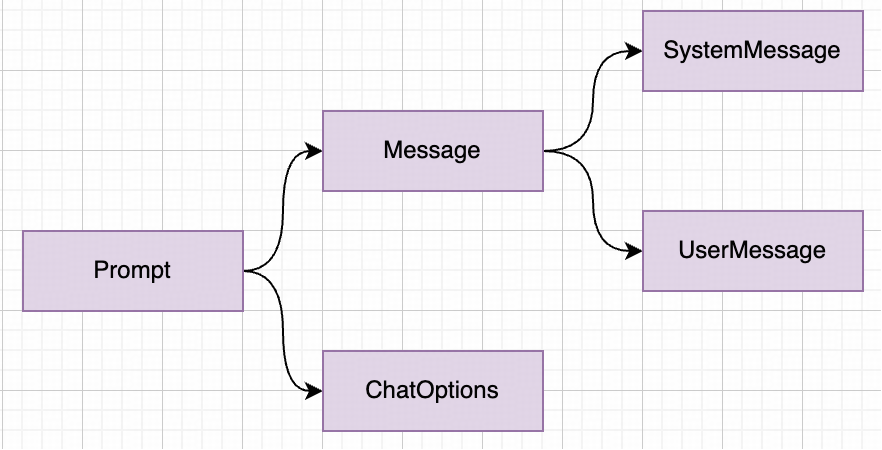
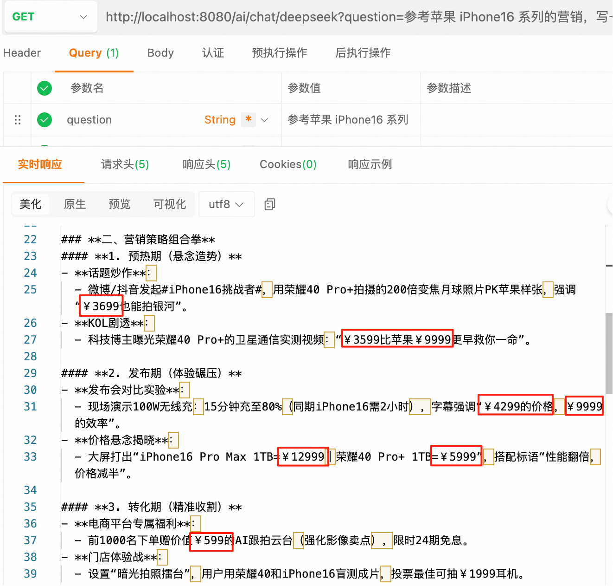

## Prompt

---

### 1.什么是 Prompt

`Prompt` 即"**提示词**"，也可叫做"**引导词**"。它是引导`AI`生成特定输出的输入指令，直接影响模型响应的质量。
> PS:本文从开发者的角度讨论 Prompt，而不是使用者的角度！
```
使用者的角度：
    |- v1: 写一份荣耀40系列的产品推广方案
    |- v2: 写一份突出独特卖点、能吸引消费者购买的荣耀40系列产品推广方案
    |- v3: 你是营销总监，写一份突出独特卖点、能吸引消费者购买的荣耀40系列产品推广方案
    |- v4: 你是营销总监，参考苹果 iPhone16 系列的营销，写一份突出独特卖点、能吸引消费者购买的荣耀40系列产品推广方案
    |- v5: ......
```
开发者的角度则是我们已经得到了一份提示词，我们需要怎样将这份提示词转换成代码去访问 AI 模型，才能得到我们想要的结果呢？


---
### 2. 使用 Prompt
#### 2.1 标准使用
```java
@RestController
public class ChatController {

    @Resource
    private ChatClient chatClient;

    @GetMapping("/ai/chat/deepseek")
    public String deepSeek(String question) {
        // 总结：System+User+Options -> Prompt -> ChatClient
        // 1. 系统角色的消息
        Message systemMessage = new SystemMessage("你是营销总监");
        // 2. 用户角色的消息
        Message userMessage = new UserMessage(question);
        // 3.模型参数
        ChatOptions chatOptions = ChatOptions.builder()
            .temperature(0.7)  // 多样化系数
//            .maxTokens(500)    // 限制 Token 用量，如是限制了 Token 用量，那么返回的模型结果可能会被截断导致返回的数据不全，按需进行使用
            .build();
        // 4. 组合 Prompt
        Prompt prompt = new Prompt(List.of(systemMessage, userMessage), chatOptions);
        return chatClient
            .prompt(prompt)     // 提示词
            .call()             // 发送请求并获取模型生成的响应
            .content();         // 从响应中提取文本内容
    }
}
```

测试路由：http://localhost:8080/ai/chat/deepseek?question=参考苹果 iPhone16 系列的营销，写一份突出独特卖点、能吸引消费者购买的荣耀40系列产品推广方案
若是限制了 Token 的用量，结果如下：
```
**荣耀40系列产品推广方案**  
**——「智慧影像，超越所见」**

---

### **一、核心策略：聚焦差异化卖点，打造「人无我有」的科技体验**  
以苹果iPhone 16系列“Pro级技术下放”的营销逻辑为参考，荣耀40系列将围绕**「AI影像革命」**和**「续航黑科技」**两大核心优势，通过对比式营销与场景化体验，强化消费者对“荣耀=技术普惠”的品牌认知。

---

### **二、独特卖点提炼（对比iPhone 16痛点）**  
1. **「AI超级影像」——随手拍出电影感**  
   - **卖点**：全球首搭荣耀自研「鹰眼AI算法」，支持动态追焦+夜景人像实时优化（对比iPhone 16仍需后期修图）。  
   - **话术**：_“iPhone 16拍得到？荣耀40系列拍得美——AI自动构图调色，你的私人摄影团队。”_  

2. **「青海湖电池2.0」——续航焦虑终结者**  
   - **卖点**：5800mAh硅碳负极电池，重度使用1.5天续航（对比iPhone 16续航提升仅10%）。  
   - **数据佐证**：第三方测试“连续游戏8小时剩余电量23%”。  

3. **「灵动交互」——更懂中国用户的AI**  
   - **卖点**：MagicOS 8.0的AI助手支持微信语音转文字、快递自动跟踪等本土化功能（对比Siri功能单一）。  

---

### **三、营销组合拳**  
#### **1. 预热期：悬念营销**  
- **动作**：社交媒体发起#手机摄影天花板在哪#话题，用模糊AI生成对比图（左图“普通旗舰”，右图“神秘新机”），暗示荣耀40影像突破。  
- **KOL联动**：邀请摄影博主用“马赛克遮挡的荣耀40”拍vlog，强调“不用修图直出”。  

#### **2. 发布会：场景化对比**  
- **关键环节**：  
  - **现场挑战**：观众用iPhone 16和荣耀40同时拍逆光人像，大屏实时展示AI算法优化效果。  
  - **续航实验**：两台手机满
```
若是没有限制 Token 的用量，那么结果如下：
```
**荣耀40系列产品推广方案：超越想象的智慧体验**

---

### **一、核心策略：以“AI+影像革命”重构用户体验**
借鉴iPhone16“Pro级下放”策略，荣耀40系列将打造**“越级旗舰”**概念，聚焦三大颠覆性卖点：
1. **【独有】** **MagicAI 3.0全域引擎**：行业首款可自主学习用户习惯的AI系统（对比iPhone16的Siri仅限基础交互）
2. **【突破】** **双星轨鹰眼相机**：暗光拍摄速度超越iPhone16 Pro 30%，支持AI构图指导（技术参数可视化）
3. **【生态】** **跨设备智慧流转3.0**：比苹果生态多2种设备互联方式（制造场景化对比）

---

### **二、差异化传播框架**
**主Slogan**  
*“荣耀40系列：你的第一台AI导演手机”*  
（对标iPhone16的“强悍全在行”强调性能，突出荣耀的创作赋能）

**子主题矩阵**  
- **技术篇**：实验室暴力测试视频（AI夜间视频 vs iPhone16样片盲测）  
- **人文篇**：用户用AI一键生成微电影的真实案例（对比传统剪辑软件3小时工作量）  
- **生态篇**：与特斯拉车机、大疆无人机联动的场景彩蛋（制造社交话题）

---

### **三、引爆市场的“三波次”营销节奏**
**▶ 第一波：悬念造势（发布会前15天）**  
- **神秘符号营销**：线下投放“40→∞”灯光艺术装置（隐喻性能无限）  
- **KOL盲测计划**：邀请摄影博主对比未标注的荣耀40/iPhone16样张  

**▶ 第二波：技术狂欢（发布会当天）**  
- **虚拟主持人**：用MagicAI生成数字人全程解说（实时演示AI能力）  
- **价格狙击战术**：公布价格时同步对比iPhone16（同配置省3000元）  

**▶ 第三波：场景渗透（发售期）**  
- **AI导演挑战赛**：用户上传AI生成视频，点赞最高获导演合作机会  
- **故障艺术快闪店**：用手机拍摄故障特效可解锁隐藏优惠  

---

### **四、精准渠道组合**
- **线上**：B站“AI手机测评大赛”+小红书“暗光人像挑战”  
- **线下**：高校“48小时AI电影工坊”（培养种子用户）  
- **电商**：天猫首发赠“导演配件包”（手机支架+滤镜礼盒）  

---

### **五、数据化效果锚点**
1. 将AI相机启动速度、夜景成片率等6项指标做成动态对比H5  
2. 在京东详情页植入“荣耀40帮你省下____元”计算器（对比苹果三星）  

--- 

**关键创新点**：  
- 用“AI导演”概念降低专业摄影门槛（iPhone16未覆盖的痛点）  
- 通过特斯拉/大疆联名打破手机行业对比框架  
- 让参数营销变得可感知（用户生成内容即是最好的证明）  

（注：实际执行需根据芯片等供应链信息调整技术表述）
```
可以根据两者的结果对比发现，没有限制 Token 的用量的结果是没有被截断的。

#### 2.2 简化用法

```java
    @GetMapping("/ai/chat/deepseek")
    public String deepSeek(String question) {
        // 1.模型参数
        ChatOptions chatOptions = ChatOptions.builder()
            .temperature(0.7)  // 多样化系数
            .maxTokens(500)    // 限制 Token 用量
            .build();
        // 2. 模型调用
        return chatClient
            .prompt()               // 提示词
            .system("你是营销总监")   // 系统角色
            .user(question)         // 用户输入
            .options(chatOptions)   // 模型参数
            .call()                 // 发送请求并获取模型生成的响应
            .content();             // 从响应中提取文本内容
    }
```

#### 2.3 全局配置

可将 `系统角色`、`模型参数` 等每次对话中相对固定的部分作为全局配置，如果需要使用全局配置时可不再额外指定。

```
# 配置文件配置
spring:
  ai:
    openai:
      chat:
        options:
          # 模型名称。deepseek-chat 使用的是 V3 模型，deepseek-reasoner 使用的是 R1 模型
          model: deepseek-chat
          # 多样化系数。常用值在0.1-1.0之间，值越大回答越多样化，推荐设置0.7。
          temperature: 0.7
          # 限制 Token 的用量
          max-tokens: 500
          
初始化 client 时的配置：
@Configuration
public class SpringAIConfig {

    @Bean
    public ChatClient openAiChatClient(ChatClient.Builder builder) {
        return builder.defaultSystem("你是营销总监").build();
    }
}
```

---

### 3.角色定义

Prompt 通过结构化消息角色（SYSTEM/USER/ASSISTANT）明确交互意图。
```
1. SYSTEM:定义系统角色（给 AI 立个人设，如"你是营销总监"）
2. USER:定义用户请求（接收用户输入，如"参考苹果 iPhone16 系列的营销，写一份突出独特卖点、能吸引消费者购买的荣耀40系列产品推广方案"）
3. ASSISTANT:定义助手角色（存储和传递聊天内容，如"要求价格价格前必须加￥"）
```

```java
    @GetMapping("/ai/chat/deepseek")
    public String deepSeek(String question) {
        // 1. 系统角色的消息
        Message systemMessage = new SystemMessage("你是营销总监");
        // 2. 用户角色的消息
        Message userMessage = new UserMessage(question);
        // 3. 助手角色消息
        Message assistantMessage = new AssistantMessage("要求价格价格前必须加￥");
        // 4. 组合 Prompt
        Prompt prompt = new Prompt(List.of(systemMessage, userMessage, assistantMessage));
        return chatClient
            .prompt(prompt)     // 提示词
            .call()             // 发送请求并获取模型生成的响应
            .content();         // 从响应中提取文本内容
    }
```

测试路由：http://localhost:8080/ai/chat/deepseek?question=参考苹果 iPhone16 系列的营销，写一份突出独特卖点、能吸引消费者购买的荣耀40系列产品推广方案

测试结果：


以历史顾问的方式填充助手角色
```java
@Resource
private ChatClient chatClient;
// 1.注入 ChatMemory
@Resource
private ChatMemory chatMemory;

@GetMapping("/ai/chat/deepseek")
public String deepSeek(String question) {
    // 2. 定义会话ID
    String conversationId = "Honor40";
    // 3. 基于内存保存特定会话的聊天历史
    chatMemory.add(conversationId, new AssistantMessage("要求价格价格前必须加￥"));
    // 4. 创建 Advisor 实例
    Advisor advisor = MessageChatMemoryAdvisor.builder(chatMemory)
        .conversationId(conversationId)
        .build();
    // 5. 模型调用
    return chatClient.prompt() // 提示词
        .system("你是营销总监") // 系统角色
        .advisors(advisor) // 历史顾问
        .user(question) // 用户输入
        .call() // 发送请求并获取模型生成的响应
        .content(); // 从响应中提取文本内容
}
```