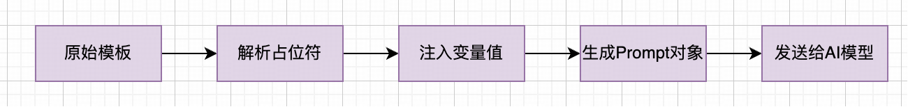

## PromptTemplate

---

### 1. 什么是 PromptTemplate

`PromptTemplate` 是生成 `Prompt` 的预定义模板类，通过**占位符**动态注入变量值生成提示词，可降低代码冗余，提升可维护性。

```
推荐 2024 年B站最火的音乐前3名？
推荐 2023 年抖音最火的音乐前3名？
......
您好，我是您的专属客服小智，有什么为您效劳的？

您好，我是您的专属客服YOYO，有什么为您效劳的？
......
```
