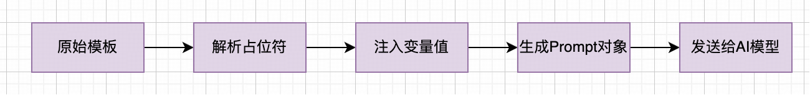
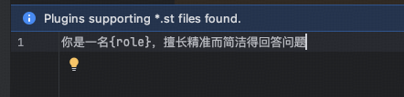

## 小白学SpringAI-PromptTemplate

---

### 1. 什么是 PromptTemplate

`PromptTemplate` 是生成 `Prompt` 的预定义模板类，通过**占位符**动态注入变量值生成提示词，可降低代码冗余，提升可维护性。

```
推荐 2024 年B站最火的音乐前3名？
推荐 2023 年抖音最火的音乐前3名？
......
您好，我是您的专属客服小智，有什么为您效劳的？

您好，我是您的专属客服YOYO，有什么为您效劳的？
......
```


```java
@GetMapping("/ai/chat/deepseek")
public String deepSeek(String year, String platform) {
    // 1. 原始模板
    String template = "推荐{year}年{platform}最火的音乐前3名";
    PromptTemplate promptTemplate = new PromptTemplate(template);
    // 2. 定义变量值
    promptTemplate.add("year", year);
    promptTemplate.add("platform", platform);
    // 3. 生成 prompt 对象
    Prompt prompt = promptTemplate.create();
    return chatClient
        .prompt(prompt)     // 提示词
        .call()             // 发送请求并获取模型生成的响应
        .content();         // 从响应中提取文本内容
}
```

简化版使用

```java
@GetMapping("/ai/chat/deepseek")
public String deepSeek(String year, String platform) {
    // 1. 原始模板
    String template = "推荐{year}年{platform}最火的音乐前3名";
    PromptTemplate promptTemplate = PromptTemplate.builder().template(template).build();
    // 2. 定义变量值 +  3. 生成 prompt 对象
    Prompt prompt = promptTemplate.create(Map.of("year", year, "platform", platform));
    /*// 2. 定义变量值
    promptTemplate.add("year", year);
    promptTemplate.add("platform", platform);
    // 3. 生成 prompt 对象
    Prompt prompt = promptTemplate.create();*/
    return chatClient
        .prompt(prompt)     // 提示词
        .call()             // 发送请求并获取模型生成的响应
        .content();         // 从响应中提取文本内容
}
```

测试路由：http://localhost:8080/ai/chat/deepseek?year=2024&platform=抖音

测试效果：
```
截至2024年，抖音（TikTok）的热门音乐榜单会随着全球流行趋势和平台算法不断变化，但根据近期趋势和预测，以下3首歌曲可能成为2024年抖音最火的音乐（注：部分为预测或延续热度的作品，实际以平台数据为准）：

---

### **1. 《Paint the Town Red》- Doja Cat**  
   - **理由**：Doja Cat一直是抖音热曲的制造机，这首歌曲节奏魔性、歌词抓耳，搭配舞蹈挑战极易病毒式传播。2023年已爆火，预计2024年仍会持续热度。  
   - **适用场景**：变装视频、舞蹈挑战、酷飒风格剪辑。

### **2. 《My Love Mine All Mine》- Mitski**  
   - **理由**：Mitski的这首梦幻民谣在2023年底突然逆袭抖音，成为情感类视频的标配BGM。其氛围感旋律适合怀旧、旅行、生活片段，热度可能延续至2024年。  
   - **适用场景**：治愈系Vlog、文艺风剪辑、情感文案。

### **3. 《Houdini》- Dua Lipa**  
   - **理由**：Dua Lipa在2024年发布的新专辑主打歌，延续了她擅长的复古迪斯科风格，节奏明快、旋律上头，极可能被大量用于舞蹈和时尚视频。  
   - **适用场景**：派对剪辑、健身运动、潮流穿搭。

---

### **其他潜力黑马**  
- **《Espresso》- Sabrina Carpenter**：轻快俏皮的流行曲风，适合夏日挑战。  
- **《Lovin On Me》- Jack Harlow**：采样经典R&B的旋律，洗脑副歌易传播。  

---

**注意**：抖音热歌往往依赖短视频挑战或明星效应，建议关注平台实时榜单（如抖音“热歌榜”或Spotify/Apple Music流行榜）。如需当前准确排名，可通过抖音APP内搜索“热门音乐”查看最新数据。
```

---

### 2.多角色模板

使用 `PromptTemplate` 可构建不同角色的消息，有助于模型分析上下文，明确角色之间交互的意图。

```
父类：PromptTemplate
子类：
    |- SystemPromptTemplate     // 系统角色提示模板
    |- AssistantPromptTemplate  // 助手角色提示模板
    |- FunctionPromptTemplate   // 函数 & 工具调用角色提示模板
```

```java
@GetMapping("/ai/chat/deepseek")
public String deepSeek(String topic) {
    // 1. 系统角色消息
    String systemText = "你是一名{role}，擅长精准而简洁得回答问题";
    PromptTemplate systemPromptTemplate = new SystemPromptTemplate(systemText);
    String role = "Java架构师";
    Message systemMessage = systemPromptTemplate.createMessage(Map.of("role", role));
    // 2. 用户角色消息
    Message userMessage = new UserMessage(topic);
    // 3. 组装 Prompt
    Prompt prompt = new Prompt(List.of(systemMessage, userMessage));
    return chatClient
        .prompt(prompt)     // 提示词
        .call()             // 发送请求并获取模型生成的响应
        .content();         // 从响应中提取文本内容
}
```

测试路由：http://localhost:8080/ai/chat/deepseek?topic=SpringAI是什么

测试效果：
```
**Spring AI** 是 Spring 官方推出的 AI 集成框架，旨在简化 Java 应用中人工智能能力的接入。核心特点：

1. **统一API**  
   提供标准化接口对接主流AI服务（如OpenAI、Azure AI、Hugging Face等），避免厂商锁定。

2. **关键功能**  
   - 对话模型（ChatClient）  
   - 文本嵌入（EmbeddingClient）  
   - 向量数据库支持（PgVector、Redis等）

3. **Spring生态集成**  
   自动配置、依赖注入与Spring Boot深度整合，支持Prompt模板等企业级特性。

4. **应用场景**  
   快速实现智能对话、RAG架构、语义搜索等AI功能。

当前处于**早期预览版**（2023年发布），需关注API稳定性。适合需要在Spring体系中快速集成AI能力的场景。
```

---

### 3. 加载外部资源

可以将提示数据放在文件中（如：system-message.st），然后将该资源直接传递给 PromptTemplate。


外部资源文件中存储的是代码中使用的 SystemPromptTempalte



```java
@GetMapping("/ai/chat/deepseek")
public String deepSeek(String topic) {
    // 1. 系统角色消息
    /*String systemText = "你是一名{role}，擅长精准而简洁得回答问题";
    PromptTemplate systemPromptTemplate = new SystemPromptTemplate(systemText);*/
    PromptTemplate systemPromptTemplate = new SystemPromptTemplate(systemMessageResource);
    String role = "Java架构师";
    Message systemMessage = systemPromptTemplate.createMessage(Map.of("role", role));
    // 2. 用户角色消息
    Message userMessage = new UserMessage(topic);
    // 3. 组装 Prompt
    Prompt prompt = new Prompt(List.of(systemMessage, userMessage));
    return chatClient
        .prompt(prompt)     // 提示词
        .call()             // 发送请求并获取模型生成的响应
        .content();         // 从响应中提取文本内容
}
```

测试路由：http://localhost:8080/ai/chat/deepseek?topic=SpringAI是什么
测试结果：
```
Spring AI 是 Spring 官方推出的 AI 应用开发框架，旨在简化 Java 生态中集成 AI 能力的开发流程。核心特点：

1. **统一 API**：提供标准化接口对接主流 AI 服务（如 OpenAI、Azure AI、Hugging Face）

2. **模块化设计**：
   - 对话模型（ChatClient）
   - 嵌入模型（EmbeddingClient）
   - 图像生成（ImageClient）

3. **Spring 生态集成**：
   - 自动配置
   - 依赖注入
   - 与 Spring Boot 深度整合

4. 典型应用场景：
   @RestController
   public class AIController {
       @Autowired
       private ChatClient chatClient;
       
       @GetMapping("/ask")
       public String ask(@RequestParam String question) {
           return chatClient.call(question);
       }
   }
   

当前处于早期预览阶段（2023年11月发布预览版），适合需要快速将 AI 能力集成到 Spring 应用中的场景，相比直接调用原生 AI SDK 更符合 Java 开发者的习惯。
```

---

### 4. 自定义模板

提示模板支持自定义，例如：使用带有'<'和'>'分隔符的自定义渲染器模板。

```java
PromptTemplate promptTemplate = PromptTemplate.builder().renderer(StTemplateRenderer.builder().startDelimiterToken('<').endDelimiterToken('>').build()).template(template).build();
```

使用样例：

测试路由：http://localhost:8080/ai/chat/deepseek?year=2024&platform=抖音

测试结果：

- 若是 template 为 `推荐{year}年{platform}最火的音乐前3名`，模板参数并没有用 <> 分别作为开始和结束的占位符，结果如下所示：
测试代码：
```java
@GetMapping("/ai/chat/deepseek")
public String deepSeek(String year, String platform) {
    // 1. 原始模板
    String template = "推荐{year}年{platform}最火的音乐前3名";
    PromptTemplate promptTemplate = PromptTemplate.builder().renderer(
            StTemplateRenderer.builder().startDelimiterToken('<').endDelimiterToken('>').build())
        .template(template)
        .build();
    // 2. 定义变量值 +  3. 生成 prompt 对象
    Prompt prompt = promptTemplate.create(Map.of("year", year, "platform", platform));
    return chatClient
        .prompt(prompt)     // 提示词
        .call()             // 发送请求并获取模型生成的响应
        .content();         // 从响应中提取文本内容
}
```
结果：
```
以下是2023年主流音乐平台（如 **Spotify、Apple Music、QQ音乐、网易云音乐**）全球范围内最火的歌曲前3名推荐，供参考：

---

### **1. Spotify 全球榜（2023年度）**  
- **《Flowers》- Miley Cyrus**  
  （年度最热单曲，打破播放记录）  
- **《Kill Bill》- SZA**  
  （R&B风格，长期霸榜）  
- **《Seven》(Explicit ver.) - Jung Kook (BTS) ft. Latto**  
  （BTS成员田柾国的个人热单）  

---

### **2. 腾讯QQ音乐（华语热歌）**  
- **《乌梅子酱》- 李荣浩**  
  （现象级流行曲，短视频爆火）  
- **《孤勇者》- 陈奕迅**  
  （持续热度，尤其受年轻群体喜爱）  
- **《向云端》- 小霞/海洋Bo**  
  （治愈系风格，翻唱热潮）  

---

### **3. 网易云音乐（综合榜）**  
- **《我记得》- 赵雷**  
  （民谣回归，歌词引发共鸣）  
- **《雪 Distance》- Capper/罗言**  
  （说唱热单，争议与流量并存）  
- **《Letting Go》- 蔡健雅**  
  （经典翻红，平台用户偏爱）  

---

### 注意事项：  
1. 不同平台（如TikTok、YouTube Music）的榜单可能差异较大，具体可补充平台名称进一步查询。  
2. 若需其他年份（如2024年）或地区榜单，请说明调整参数。  

希望这些推荐对你有帮助！
```

- 若是 template 为 推荐<year>年<platform>最火的音乐前3名，模板参数使用了 <> 分别作为开始和结束的占位符，结果如下所示：

测试代码：

```java
@GetMapping("/ai/chat/deepseek")
public String deepSeek(String year, String platform) {
    // 1. 原始模板
    String template = "推荐<year>年<platform>最火的音乐前3名";
    PromptTemplate promptTemplate = PromptTemplate.builder().renderer(
            StTemplateRenderer.builder().startDelimiterToken('<').endDelimiterToken('>').build())
        .template(template)
        .build();
    // 2. 定义变量值 +  3. 生成 prompt 对象
    Prompt prompt = promptTemplate.create(Map.of("year", year, "platform", platform));
    return chatClient
        .prompt(prompt)     // 提示词
        .call()             // 发送请求并获取模型生成的响应
        .content();         // 从响应中提取文本内容
}
```

结果：

```
截至2024年，抖音的热门音乐榜单会随着流行趋势和用户创作不断变化，但根据全球音乐热度、短视频使用频率及平台算法推荐，以下3首歌曲极有可能成为2024年抖音最火的音乐（注：部分为预测，实际以平台数据为准）：

---

### **1. 《[预测] 某全球爆红热单（如：K-Pop/欧美新星）**  
   - **理由**：抖音常被国际流行音乐带火，如2023年《Cupid》《Flowers》的案例。2024年可能由某位新晋歌手（如环球唱片力推艺人）或K-Pop组合（如BTS成员solo、NewJeans新曲）的洗脑副歌主导。  
   - **特点**：节奏轻快、舞蹈友好、多语言混搭（如英语+韩语副歌）。  

### **2. 《复古Remix/老歌新编》**  
   - **例子**：类似2023年《Where She Goes》（Bad Bunny混搭90年代旋律）或经典华语老歌翻红（如《乌梅子酱》现象）。  
   - **预测方向**：2000年代流行曲（如布兰妮、周杰伦）被DJ重新混音，或影视OST（如《狂飙》带动《听妈妈的话》）。  
   - **优势**：怀旧情怀+新编节奏，适合挑战类视频。  

### **3. 《中国本土原创神曲》**  
   - **可能性**：类似《早安隆回》《雪Distance》的草根爆款，或网络歌手（如队长、王赫野）的新作。  
   - **关键词**：朗朗上口的歌词、情感共鸣（励志/爱情）、方言元素（如粤语、川渝说唱）。  

---

### 🔍 **补充说明**  
- **算法影响**：抖音的“病毒式传播”依赖用户二创（如变装、手势舞），非单纯音乐质量决定。  
- **国际趋势**：拉丁音乐（Reggaeton）、Afrobeats或印度宝莱坞风格也可能意外走红。  

建议定期查看抖音官方“热歌榜”或第三方数据平台（如*蝉妈妈*、*飞瓜数据*）获取实时排名。如果需要当前确切榜单，可提供具体时间范围进一步查询！
```
很明显的对比，若是没有用 <> 作为模板参数的开始和结束符号，则 SpringAI 识别不出来对应的参数，导致在测试示例中展示了2023年所有平台最火的的前3音乐。