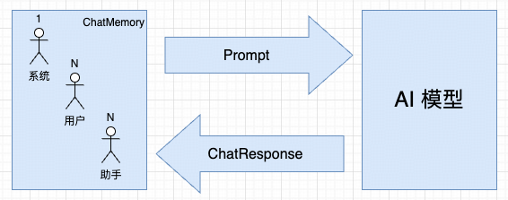

## 基于内存的多轮对话实现

---

### 1. 什么是对话记忆

对话记忆是指大模型在一段时间内记住用户提供的信息。

```
1. 用户信息持久化：使用内存或数据库保存用户的背景和偏好
2. 上下文跟踪：在多轮对话中保持上下文一致
3. 较高的回答质量：用户询问或者追问之前提到的内容时可“记忆回溯”
```


对话记忆需要区分不同的会话ID，以便于隔离不同用户的会话。

---

### 2. ChatMemory 接口

`ChatMemory` 接口用于存储和管理“**对话记忆**”。

```java
public interface ChatMemory {
    // 向指定会话(conversationId)添加单挑消息(message)，默认实现
    default void add(String conversationId, Message message) {
        Assert.hasText(conversationId, "conversationId cannot be null or empty");
        Assert.notNull(message, "message cannot be null");
        this.add(conversationId, List.of(message));
    }
    // 向指定会话添加多条消息
    void add(String conversationId, List<Message> messages);
    // 检索指定会话的全部历史消息
    List<Message> get(String conversationId);
    // 清空指定会话的全部历史消息
    void clear(String conversationId);
}

// PS:默认情况下使用内存作为 Repository (底层使用 ConcurrentHashMap)，支持扩展为持久化存储（如 Redis，Cassandra，JDBC）
```

---

### 3. 基于内存的多轮对话实现

