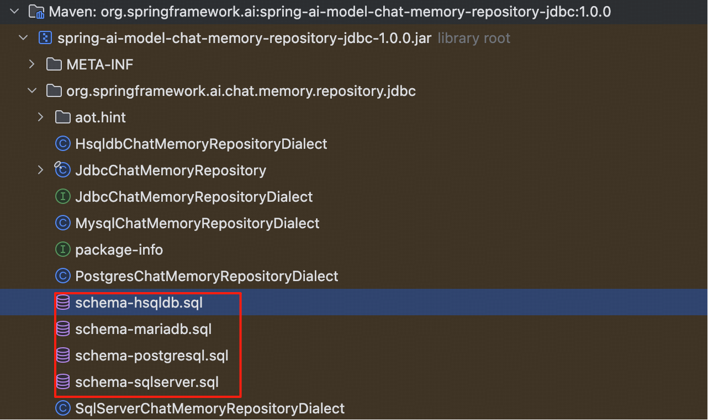
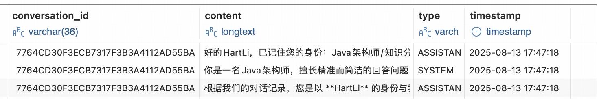
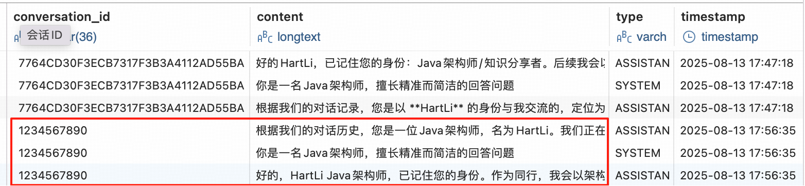
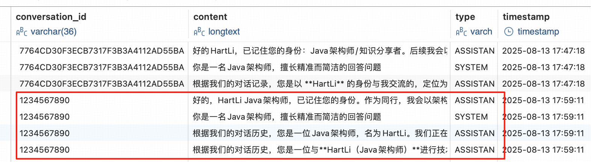

## 基于 JDBC 的多轮对话实现

---

### 1. 基于 JDBC 的原因

**对话记忆**的存储库默认使用内存（`InMemoryChatMemoryRepository`），数据容易丢失。

```java
// 创建特定的 ChatMemory实例
@Bean
public ChatMemory chatMemory() {
    return MessageWindowChatMemory.builder()
        .chatMemoryRepository(new InMemoryChatMemoryRepository())  // 对话记忆默认使用内存存储库
        .maxMessages(3)  // 保留最近的 3 条历史记录
        .build();
}
```

上一节中最后初始化特定的 ChatMemory 实例时，使用的是内存作为存储库 `new InMemoryChatMemoryRepository()`。

---

### 2. ChatMemoryRepository

`ChatMemoryRepository` 接口是对话记忆存储的抽象，支持多种存储方式，例如：内存、`JDBC`、`Redis`等等，每种存储方式都有特定的实现类。

```java
public interface ChatMemoryRepository {
    // 获取所有活跃会话ID的列表
    List<String> findConversationIds();

    // 按会话ID查询消息列表（返回最新消息集合）
    List<Message> findByConversationId(String conversationId);

    // 全量替换存储，清空旧消息，写入新消息列表（实现需保证原子性）
    void saveAll(String conversationId, List<Message> messages);

    // 按会话ID删除所有关联消息
    void deleteByConversationId(String conversationId);
}
```

---

### 3. JdbcChatMemoryRepository

`JdbcChatMemoryRepository` 是使用 `JDBC` 存储对话记忆的实现类。它包含在
`spring-ai-starter-model-chat-memory-repository-jdbc` 模块中。

引入相关 maven 依赖：

```
<!-- 引入 hat-memory-repository-jdbc -->
<dependency>
    <groupId>org.springframework.ai</groupId>
    <artifactId>spring-ai-starter-model-chat-memory-repository-jdbc</artifactId>
    <version>1.0.1</version>
</dependency>
<!-- mysql驱动 -->
<dependency>
    <groupId>com.mysql</groupId>
    <artifactId>mysql-connector-j</artifactId>
    <version>9.1.0</version>
</dependency>
```

使用：

```java
// 创建基于 JDBC 存储对话记忆的 ChatMemory 实例
@Bean
public ChatMemory chatMemory(JdbcChatMemoryRepository jdbcChatMemoryRepository) {
    return MessageWindowChatMemory.builder()
        .chatMemoryRepository(jdbcChatMemoryRepository)  // 对话记忆使用基于 JDBC 的存储库
        .maxMessages(10)  // 保留最近的 10 条历史记录
        .build();
}
// PS: SpringAI 为 JDBC 存储提供了自动配置，可以直接使用。
```

配置文件（application.yml）:

```
spring:
  # 数据库配置
  datasource:
    driver-class-name: com.mysql.cj.jdbc.Driver
    url: jdbc:mysql://111.231.63.169:3306/spring_ai_chat?autoReconnect=true&serverTimezone=UTC%2B8&useSSL=false&useUnicode=true&characterEncoding=UTF-8
    username: root
    password: jQ^kd9I28MfWM9p#

  ai:
    chat:
      memory:
        repository:
          jdbc:
            schema: classpath:/schema/mysql.sql  # 建表的 SQL 脚本
            # 是否初始化表结构，可选值包括：
              # 1. embedded - 仅针对嵌入式数据库自动创建表。默认值
              # 2. always - 任意数据库都强制建表。首次执行推荐
              # 3. never - 禁用自动建表。首次执行后推荐
            initialize-schema: always


```



`schema-hsqldb.sql` 内部的 SQL 脚本如下：

```hsqldb
CREATE TABLE SPRING_AI_CHAT_MEMORY
(
    conversation_id VARCHAR(36)                         NOT NULL,
    content         LONGVARCHAR                         NOT NULL,
    type            VARCHAR(10)                         NOT NULL,
    timestamp       TIMESTAMP DEFAULT CURRENT_TIMESTAMP NOT NULL
);

CREATE INDEX SPRING_AI_CHAT_MEMORY_CONVERSATION_ID_TIMESTAMP_IDX ON SPRING_AI_CHAT_MEMORY (conversation_id, timestamp DESC);

ALTER TABLE SPRING_AI_CHAT_MEMORY
    ADD CONSTRAINT TYPE_CHECK CHECK (type IN ('USER', 'ASSISTANT', 'SYSTEM', 'TOOL'));
```

发现核心内容就四个字段：

| **表名**          | **SPRING_AI_CHAT_MEMORY** |       |
|-----------------|---------------------------|-------|
| 列               | 类型                        | 含义    |
| conversation_id | VARCHAR(36)               | 会话ID  |
| content         | LONGVARCHAR               | 消息内容  |
| type            | VARCHAR(10)               | 消息类型  |
| timestamp       | TIMESTAMP                 | 消息时间戳 |

根据配置文件中的配置，我们需要建文件 /resources/scheme/mysql.sql，文件内容如下：
```mysql
CREATE TABLE spring_ai_chat.SPRING_AI_CHAT_MEMORY (
    conversation_id VARCHAR ( 36 ) NOT NULL DEFAULT '' COMMENT '会话ID',
    content LONGTEXT NOT NULL COMMENT '消息内容',
    type VARCHAR ( 10 ) NOT NULL DEFAULT '' COMMENT '消息类型',
    `timestamp` TIMESTAMP DEFAULT CURRENT_TIMESTAMP NOT NULL COMMENT '消息时间戳',
    INDEX idx_conversation_id_timestamp ( conversation_id, `timestamp` DESC )
) COMMENT 'Spring AI 会话记忆表';
```

PS: 注意这里的表名必须是 `SPRING_AI_CHAT_MEMORY` 大写，不能小写！

启动项目就可以创建表了。

测试路由(每次调用路由可以观察下表内的数据是否增加)：

1. http://localhost:8080/ai/chat/deepseek?question=我是HartLi，是一名Java架构师，知识分享者，请记住我，以便我们后面的对话
2. http://localhost:8080/ai/chat/deepseek?question=我是谁

全部执行完成之后看到 MySQL 中存储了三条消息，如下所示：


> 若是重启项目，对应的 DB 数据不会清空，但是 AI 却不能识别我的身份了。
> 
> 原因是目前会话ID使用的是sessionId，每次重启项目，sessionId都会改变，导致对话记忆无法关联。

这个时候就需要修改下代码了，会话ID不能通过session拿到，而是由前端传过来。

修改代码如下：

```java
@GetMapping("/ai/chat/deepseek")
public String deepSeek(String question, String conversationId) {
    // 1. 生成会话ID（使用session id 确保用户隔离）
    // String conversationId = session.getId();
    System.out.println("conversationId: " + conversationId);
    // 2. 初始化系统消息
    Message systemMessage = new SystemMessage("你是一名Java架构师，擅长精准而简洁的回答问题");
    if (chatMemory.get(conversationId).isEmpty()) {
        chatMemory.add(conversationId, systemMessage);  // 添加至对话记忆
    }

    // 3. 手动获取历史消息
    List<Message> historyMessages = chatMemory.get(conversationId);
    System.out.println("historyMessages: " + historyMessages);
    // 4.用户消息
    Message userMessage = new UserMessage(question);
    // 新建集合，避免污染历史消息
    List<Message> promptMessages = new ArrayList<>(historyMessages);
    // 本次用户消息合并到历史消息中
    promptMessages.add(userMessage);
    // 5. 完成 Prompt 对象
    Prompt prompt = new Prompt(promptMessages);
    // 6. 发送至 AI 模型，提取响应文本
    String responseText = chatClient.prompt(prompt).call().content();
    // 7. 本次 AI 响应添加至对话记忆（助手角色）
    chatMemory.add(conversationId, new AssistantMessage(responseText));
    // 8. 返回响应文本
    return responseText;
}
```
测试路由：
1. http://localhost:8080/ai/chat/deepseek?question=我是HartLi，是一名Java架构师，知识分享者，请记住我，以便我们后面的对话&conversationId=1234567890
2. http://localhost:8080/ai/chat/deepseek?question=我是谁&conversationId=1234567890

DB 数据如下：


重启项目后继续测试：
1. http://localhost:8080/ai/chat/deepseek?question=我是谁&conversationId=1234567890

此时仍然可以知道我的身份。

