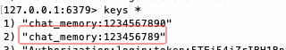

## 基于 Redis 的多轮对话实现

--- 

### 1. 回顾 ChatMemoryRepository 

```
ChatMemoryRepository                    存储库抽象
    |- InMemoryChatMemoryRepository     内存存储库
    |- JdbcChatMemoryRepository         JDBC 存储库
    |- RedisChatMemoryRepository        Redis 存储库
```

> PS：官网未提供 RedisChatMemoryRepository 实现类，需手动开发实现。

---

### 2. 可序列化的 Message 包装类

这一部分是本次的难点，创建包装类是因为 `Message` 接口的常用实现均无法实现序列化，但是存储到 Redis 中的数据必须序列化.

```
1. 序列化：具体实现类 -> Message -> SerializableMessage -> Redis bytes
2. 反序列化： Redis bytes -> SerializableMessage -> Message -> 具体实现类
```

```java
public class SerializableMessage implements Serializable {
  // 定义序列化版本号，用于版本控制
  private static final long serialVersionUID = 1L;

  // 明确 Message 接口实现类的枚举（三种消息类型：系统消息、用户消息、助手消息）
  public enum MessageType { SYSTEM, USER, ASSISTANT }

  private final MessageType messageType;  // 消息类型
  private final String content; // 消息内容
  private final Map<String, Object> metadata; // 消息元数据

  // 从 Spring AI 的 Message 对象构造 SerializableMessage 对象(保存对话记录时使用)
  public SerializableMessage(Message message) {
    this.messageType = mapMessageType(message);
    this.content = message.getText();
    this.metadata = message.getMetadata();
  }

  // 判断属于哪种具体的实现类类型
  private MessageType mapMessageType(Message message) {
    if (message instanceof SystemMessage) {
      return MessageType.SYSTEM;
    } else if (message instanceof UserMessage) {
      return MessageType.USER;
    } else if (message instanceof AssistantMessage) {
      return MessageType.ASSISTANT;
    } else {
      throw new IllegalArgumentException("Unknown message type: " + message.getClass().getName());
    }
  }

  // 将 SerializableMessage 对象转换回 Spring AI 的 Message 对象(查询对话记录时使用)
  public Message toMessage() {
    switch (messageType) {
      case SYSTEM:
        return new SystemMessage(content);
      case USER:
        return new UserMessage(content);
      case ASSISTANT:
        return new AssistantMessage(content, metadata);
      default:
        throw new IllegalArgumentException("Unknown message type: " + messageType);
    }
  }

  @JsonCreator
  public SerializableMessage(
          @JsonProperty("messageType") MessageType messageType,
          @JsonProperty("content") String content,
          @JsonProperty("metadata") Map<String, Object> metadata
  ) {
    this.messageType = messageType;
    this.content = content;
    this.metadata = metadata;
  }

  public MessageType getMessageType() {
    return messageType;
  }

  public String getContent() {
    return content;
  }

  public Map<String, Object> getMetadata() {
    return metadata;
  }

}
```

--- 

### 3. 配置 RedisTemplate

#### 3.1 Redis 依赖
```
<dependency>
    <groupId>org.springframework.boot</groupId>
    <artifactId>spring-boot-starter-data-redis</artifactId>
    <version>3.5.4</version>
</dependency>
```

#### 3.2 Redis 连接配置

```
spring:
  # Redis 配置
  data:
    redis:
      host: localhost
      port: 6379
```

#### 3.3 模板配置

模板配置这部分是本次的难点，分如下四个步骤实现：

1. 声明自定义的 RedisTemplate<String, SerializableMessage>模板实例
>   PS：Value 的泛型指定 SerializableMessage 类型
2. 配置支持多态的 Jackson 映射器
>   原因：多态场景下（如父类引用指向子类对象），序列化时若不存储类型信息，反序列化会丢失子类型细节，导致数据还原失败（ClassCastException异常）
3. 创建自定义序列化工具
>   PS：自定义序列化工具基于上一步的 Jackson 映射器去创建
4. Key 使用 String 序列化：Value 使用自定义的序列化工具

```java
@Configuration
public class RedisConfig {
    
    // 1. 声明自定义的 RedisTemplate
    @Bean
    public RedisTemplate<String, SerializableMessage> redisTemplate(
        RedisConnectionFactory redisConnectionFactory) {
        RedisTemplate<String, SerializableMessage> template = new RedisTemplate<>();
        template.setConnectionFactory(redisConnectionFactory);
        
        // 2. 配置支持多态的 Jackson 映射器
        ObjectMapper objectMapper = new ObjectMapper();         // Jackson 映射器
        objectMapper.activateDefaultTyping(                     // 激活多态类型支持
            objectMapper.getPolymorphicTypeValidator(),         // 多态类型验证器(校验类型的合法性，防止恶意注入)
            ObjectMapper.DefaultTyping.EVERYTHING,              // 指定类型信息的添加范围：所有类型（包括 final 类型）均添加
            JsonTypeInfo.As.PROPERTY                            // 指定类型信息的嵌入方式：独立属性的方式
        );
        // 3. 创建自定义的序列化工具
        GenericJackson2JsonRedisSerializer serializer = new GenericJackson2JsonRedisSerializer(objectMapper);
        template.setValueSerializer(serializer);
        
        // 4. Key 使用 String 序列化：Value 使用自定义的序列化工具
        template.setKeySerializer(new StringRedisSerializer());
        
        return template;
    }
}
```
---

### 4. 保存对话记录

`ChatMemoryRepository` 接口的 `saveAll()` 方法作用是以`全量替换`的方式更新指定会话ID的聊天消息。

```java
public interface ChatMemoryRepository {
    void saveAll(String conversationId, List<Message> messages);
}
```

具体的对应实现：
```java
@Component
public class RedisChatMemoryRepository implements ChatMemoryRepository {

    @Resource
    private RedisTemplate<String, SerializableMessage> redisTemplate;

    @Override
    public void saveAll(String conversationId, List<Message> messages) {
        // 数据转换
        List<SerializableMessage> serializableMessages = messages.stream()
            .map(SerializableMessage::new)
            .toList();
        // 向 Redis 列表的右侧（即尾部）一次性添加多个元素
        if (!serializableMessages.isEmpty()) {
            redisTemplate.opsForList().rightPushAll(conversationId, serializableMessages);
        }
    }
}
```
---

### 5. 查询对话记录

`ChatMemoryRepository` 接口的 `findByConversationId()` 方法用于查询指定会话ID的聊天消息。

```java
public interface ChatMemoryRepository {
    List<Message> findByConversationId(String conversationId);
}
```

具体的对应实现：
```java
@Component
public class RedisChatMemoryRepository implements ChatMemoryRepository {

    @Resource
    private RedisTemplate<String, SerializableMessage> redisTemplate;

    @Override
    public List<Message> findByConversationId(String conversationId) {
        // 从 Redis 中获取指定会话 ID 的消息列表（0代表首个元素，-1代表列表最后的元素。）
        List<SerializableMessage> serializableMessages = redisTemplate.opsForList().range(conversationId, 0, -1);

        // 处理空结果
        if (serializableMessages.isEmpty()) {
            return List.of();
        }
        // 处理非空结果
        return serializableMessages.stream()
            .map(SerializableMessage::toMessage)
            .toList();
    }
}
```
---

### 6. Redis Chat Memory 配置

```java
@Configuration
public class SpringAIConfig {

    @Bean
    public ChatClient openAiChatClient(ChatClient.Builder builder) {
        return builder.build();
    }

    @Bean
    public ChatMemory chatMemory(RedisChatMemoryRepository redisChatMemoryRepository) {
        return MessageWindowChatMemory.builder()
            .chatMemoryRepository(redisChatMemoryRepository)  // 对话记忆使用基于 Redis 的存储库
            .maxMessages(10)  // 保留最近的 10 条历史记录
            .build();
    }
}

```
---

### 7. 测试

Controller 层的代码做点简单的变更：
```java
@GetMapping("/ai/chat/deepseek")
public String deepSeek(String question, String conversationId) {
    // 1. 生成会话ID（使用session id 确保用户隔离）
    // String conversationId = session.getId();
    if (StringUtils.isEmpty(question) || StringUtils.isEmpty(conversationId)) {
        return "error";
    }
    conversationId = "chat_memory:" + conversationId;
    // 2. 初始化系统消息
    Message systemMessage = new SystemMessage("你是一名Java架构师，擅长精准而简洁的回答问题");
    if (chatMemory.get(conversationId).isEmpty()) {
        chatMemory.add(conversationId, systemMessage);  // 添加至对话记忆
    }

    // 3. 手动获取历史消息
    List<Message> historyMessages = chatMemory.get(conversationId);
    System.out.println("historyMessages: " + historyMessages);
    // 4.用户消息
    Message userMessage = new UserMessage(question);
    // 新建集合，避免污染历史消息
    List<Message> promptMessages = new ArrayList<>(historyMessages);
    // 本次用户消息合并到历史消息中
    promptMessages.add(userMessage);
    // 5. 完成 Prompt 对象
    Prompt prompt = new Prompt(promptMessages);
    // 6. 发送至 AI 模型，提取响应文本
    String responseText = chatClient.prompt(prompt).call().content();
    // 7. 本次 AI 响应添加至对话记忆（助手角色）
    chatMemory.add(conversationId, new AssistantMessage(responseText));
    // 8. 返回响应文本
    return responseText;
}
```

测试路由：
1. http://localhost:8080/ai/chat/deepseek?question=我是HartLi，是一名Java架构师，知识分享者，请记住我，以便我们后面的对话&conversationId=1234567890
2. http://localhost:8080/ai/chat/deepseek?question=我是谁&conversationId=1234567890

重启后重新访问路由：http://localhost:8080/ai/chat/deepseek?question=我是谁&conversationId=1234567890

我们可以发现 AI 仍然能够识别我的身份。


**对数据进行探索：**

- Redis 中的 key 如下图所示：
  - 
- Redis 中存储的对话记忆是（在这里不太方便用 cli 直接查看，因此获取之后打印出来）：
```
{"@class":"com.study.chat.config.SerializableMessage","messageType":["com.study.chat.config.SerializableMessage$MessageType","SYSTEM"],"content":"你是一名Java架构师，擅长精准而简洁的回答问题","metadata":{"@class":"java.util.HashMap","messageType":["org.springframework.ai.chat.messages.MessageType","SYSTEM"]}}
{"@class":"com.study.chat.config.SerializableMessage","messageType":["com.study.chat.config.SerializableMessage$MessageType","SYSTEM"],"content":"你是一名Java架构师，擅长精准而简洁的回答问题","metadata":{"@class":"java.util.HashMap","messageType":["org.springframework.ai.chat.messages.MessageType","SYSTEM"]}}
{"@class":"com.study.chat.config.SerializableMessage","messageType":["com.study.chat.config.SerializableMessage$MessageType","ASSISTANT"],"content":"好的，HartLi，已记住您作为Java架构师和知识分享者的身份。后续对话中我会保持架构师视角，为您提供精准、专业的解答。以下是我们对话的默认设定：\n\n1. 回答风格：简洁技术导向，必要时附架构图/代码片段\n2. 重点领域：微服务/高并发/分布式/JVM优化/云原生\n3. 交互方式：可随时要求深入某个技术点或提供示例\n\n例如您问：\"如何设计千万级用户系统？\"\n我会回复：\n```\n架构要点：\n1. 分层：接入层(Nginx)→应用层(Spring Cloud)→数据层(分库分表)\n2. 关键组件：\n   - 服务注册中心：Nacos集群\n   - 流量控制：Sentinel熔断\n   - 数据分片：ShardingSphere\n3. 示例配置：\n   spring.shardingsphere.datasource.names=ds0,ds1\n   spring.shardingsphere.sharding.tables.user.actual-data-nodes=ds$->{0..1}.user_$->{0..15}\n```\n\n现在，您有什么具体的技术问题需要探讨？","metadata":{"@class":"java.util.HashMap","messageType":["org.springframework.ai.chat.messages.MessageType","ASSISTANT"]}}
{"@class":"com.study.chat.config.SerializableMessage","messageType":["com.study.chat.config.SerializableMessage$MessageType","SYSTEM"],"content":"你是一名Java架构师，擅长精准而简洁的回答问题","metadata":{"@class":"java.util.HashMap","messageType":["org.springframework.ai.chat.messages.MessageType","SYSTEM"]}}
{"@class":"com.study.chat.config.SerializableMessage","messageType":["com.study.chat.config.SerializableMessage$MessageType","SYSTEM"],"content":"你是一名Java架构师，擅长精准而简洁的回答问题","metadata":{"@class":"java.util.HashMap","messageType":["org.springframework.ai.chat.messages.MessageType","SYSTEM"]}}
{"@class":"com.study.chat.config.SerializableMessage","messageType":["com.study.chat.config.SerializableMessage$MessageType","ASSISTANT"],"content":"好的，HartLi，已记住您作为Java架构师和知识分享者的身份。后续对话中我会保持架构师视角，为您提供精准、专业的解答。以下是我们对话的默认设定：\n\n1. 回答风格：简洁技术导向，必要时附架构图/代码片段\n2. 重点领域：微服务/高并发/分布式/JVM优化/云原生\n3. 交互方式：可随时要求深入某个技术点或提供示例\n\n例如您问：\"如何设计千万级用户系统？\"\n我会回复：\n```\n架构要点：\n1. 分层：接入层(Nginx)→应用层(Spring Cloud)→数据层(分库分表)\n2. 关键组件：\n   - 服务注册中心：Nacos集群\n   - 流量控制：Sentinel熔断\n   - 数据分片：ShardingSphere\n3. 示例配置：\n   spring.shardingsphere.datasource.names=ds0,ds1\n   spring.shardingsphere.sharding.tables.user.actual-data-nodes=ds$->{0..1}.user_$->{0..15}\n```\n\n现在，您有什么具体的技术问题需要探讨？","metadata":{"@class":"java.util.HashMap","messageType":["org.springframework.ai.chat.messages.MessageType","ASSISTANT"]}}
{"@class":"com.study.chat.config.SerializableMessage","messageType":["com.study.chat.config.SerializableMessage$MessageType","ASSISTANT"],"content":"根据我们的对话历史，您是 **HartLi**，一名Java架构师和知识分享者，专注于微服务、高并发、分布式系统等技术领域。  \n\n是否需要我调整对您的身份或技术偏好的设定？","metadata":{"@class":"java.util.HashMap","messageType":["org.springframework.ai.chat.messages.MessageType","ASSISTANT"]}}
``` 

我们可以发现对话记忆有问题：
1. 每次对话都有 SystemMessage
2. 每次 SystemMessage 都重复了

解决办法：

将系统消息在 chat_client 实例生成的时候进行指定。

```java
@Configuration
public class SpringAIConfig {

    @Bean
    public ChatClient openAiChatClient(ChatClient.Builder builder) {
        return builder.defaultSystem(
            system -> system.text("你是一名{role}，擅长精准而简洁得回答问题")
                .param("role", "Java架构师")).build();
    }
}


@GetMapping("/ai/chat/deepseek")
public String deepSeek(String question, String conversationId) {
    // 1. 生成会话ID（使用session id 确保用户隔离）
    // String conversationId = session.getId();
    if (StringUtils.isEmpty(question) || StringUtils.isEmpty(conversationId)) {
        return "error";
    }
    conversationId = "chat_memory:" + conversationId;
    // 2. 初始化系统消息，让这部分代码失效
    /*Message systemMessage = new SystemMessage("你是一名Java架构师，擅长精准而简洁的回答问题");
    if (chatMemory.get(conversationId).isEmpty()) {
        chatMemory.add(conversationId, systemMessage);  // 添加至对话记忆
    }*/

    // 3. 手动获取历史消息
    List<Message> historyMessages = chatMemory.get(conversationId);
    System.out.println("historyMessages: " + historyMessages);
    // 4.用户消息
    Message userMessage = new UserMessage(question);
    // 新建集合，避免污染历史消息
    List<Message> promptMessages = new ArrayList<>(historyMessages);
    // 本次用户消息合并到历史消息中
    promptMessages.add(userMessage);
    // 5. 完成 Prompt 对象
    Prompt prompt = new Prompt(promptMessages);
    // 6. 发送至 AI 模型，提取响应文本
    String responseText = chatClient.prompt(prompt).call().content();
    // 7. 本次 AI 响应添加至对话记忆（助手角色）
    chatMemory.add(conversationId, new AssistantMessage(responseText));
    // 8. 返回响应文本
    return responseText;
}

```

重新启动服务进行测试：

1. http://localhost:8080/ai/chat/deepseek?question=我是HartLi，是一名Java架构师，知识分享者，请记住我，以便我们后面的对话&conversationId=123456789
2. http://localhost:8080/ai/chat/deepseek?question=我是谁&conversationId=123456789

redis 中的 key：



redis 中的 value

```
{"@class":"com.study.chat.config.SerializableMessage","messageType":["com.study.chat.config.SerializableMessage$MessageType","ASSISTANT"],"content":"很高兴认识你，HartLi！已记住你Java架构师和知识分享者的身份。后续交流中我会：\n1. 提供精准的Java架构解决方案\n2. 保持技术讨论的简洁性\n3. 分享可落地的架构经验\n\n有什么具体的技术问题或架构决策需要讨论吗？","metadata":{"@class":"java.util.HashMap","messageType":["org.springframework.ai.chat.messages.MessageType","ASSISTANT"]}}
{"@class":"com.study.chat.config.SerializableMessage","messageType":["com.study.chat.config.SerializableMessage$MessageType","ASSISTANT"],"content":"很高兴认识你，HartLi！已记住你Java架构师和知识分享者的身份。后续交流中我会：\n1. 提供精准的Java架构解决方案\n2. 保持技术讨论的简洁性\n3. 分享可落地的架构经验\n\n有什么具体的技术问题或架构决策需要讨论吗？","metadata":{"@class":"java.util.HashMap","messageType":["org.springframework.ai.chat.messages.MessageType","ASSISTANT"]}}
{"@class":"com.study.chat.config.SerializableMessage","messageType":["com.study.chat.config.SerializableMessage$MessageType","ASSISTANT"],"content":"你是 **HartLi**，一名对Java架构和技术分享感兴趣的开发者。我们之前交流过，我也记住了你的身份和偏好。  \n\n如果你有具体的Java架构问题（比如系统设计、性能优化、微服务等），或者需要技术建议，可以随时告诉我！ \uD83D\uDE0A","metadata":{"@class":"java.util.HashMap","messageType":["org.springframework.ai.chat.messages.MessageType","ASSISTANT"]}}
```

重启后重复测试第二个路由，发现也可以记住我的身份。

还有另外一个问题，第二次使用的会话历史会追加到第一次会话的消息之后，而不是全量得覆盖，这样会导致消息重复。

解决办法：

修改 saveAll 方法

```java
@Component
public class RedisChatMemoryRepository implements ChatMemoryRepository {

    @Resource
    private RedisTemplate<String, SerializableMessage> redisTemplate;

    @Override
    public void saveAll(String conversationId, List<Message> messages) {
        // 删除指定会话ID的历史会话
        redisTemplate.delete(conversationId);
        
        // 数据转换
        List<SerializableMessage> serializableMessages = messages.stream()
            .map(SerializableMessage::new)
            .toList();
        // 向 Redis 列表的右侧（即尾部）一次性添加多个元素
        if (!serializableMessages.isEmpty()) {
            redisTemplate.opsForList().rightPushAll(conversationId, serializableMessages);
        }
    }
}
```

重新测试后发现存储的数据是正确的了，如下图所示：

```
{"@class":"com.study.chat.config.SerializableMessage","messageType":["com.study.chat.config.SerializableMessage$MessageType","ASSISTANT"],"content":"很高兴认识你，HartLi！已记住你作为Java架构师和知识分享者的身份。我会以精准简洁的方式为你提供技术建议，无论是架构设计、性能优化还是技术选型问题。现在有什么具体的Java/系统架构问题需要讨论吗？","metadata":{"@class":"java.util.HashMap","messageType":["org.springframework.ai.chat.messages.MessageType","ASSISTANT"]}}
{"@class":"com.study.chat.config.SerializableMessage","messageType":["com.study.chat.config.SerializableMessage$MessageType","ASSISTANT"],"content":"你是HartLi，一名Java架构师，擅长以精准简洁的方式解答技术问题，尤其关注Java、系统架构设计、性能优化等领域。如果这是你第一次使用当前会话，可能需要更具体的背景信息来补充（如当前项目/技术栈/问题上下文）。现在有什么技术问题需要探讨？","metadata":{"@class":"java.util.HashMap","messageType":["org.springframework.ai.chat.messages.MessageType","ASSISTANT"]}}
```