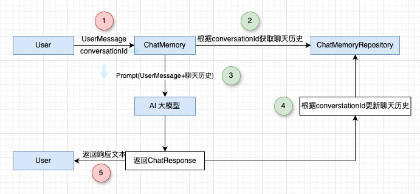

## 小白学SpringAI-Advisor 自动管理对话记忆

---

### 1. 什么是 Advisor

> Advisor，复数 Advisors。原意指"顾问、指导老师、劝告者"。

通过 `Advisor` 可在 **`请求发送到模型前`** 或 **`模型返回响应后`** 插入自定义数据，而无需修改核心业务代码。它类似于 `Spring-AOP` 中的拦截器，支持聊天记忆（`ChatMemory`）、检索增强生成（`RAG`）、日志、安全等多种 AI 场景。

---

### 2. 为什么需要 Advisor

回顾 **`基于内存的多轮会话`** 的实现流程：



> 核心业务在于发送请求、模型响应，聊天记忆的管理属于业务增强。

---

### 3. MessageChatMemoryAdvisor

`MessageChatMemoryAdvisor` 是提供 **记忆顾问功能** 的类。通过他可以自动获取历史消息、自动合并消息列表和自动存储模型响应。

```
Advisor
    |- CallAdvisor,StreamAdvisor（非流式、流式响应的顾问接口）
        |- BaseAdvisor （组合非流式、流式响应的顾问接口）
            |- BaseChatMemoryAdvisor （ChatMemory 的基础顾问接口）
                |- MessageChatMemoryAdvisor
```

`MessageChatMemoryAdvisor` 类的两个核心方法：

```java
public final class MessageChatMemoryAdvisor implements BaseChatMemoryAdvisor {
    // 用户请求发送至模型之前：
    public ChatClientRequest before(ChatClientRequest chatClientRequest, AdvisorChain advisorChain) {
        // 1. 获取 conversationId
        String conversationId = this.getConversationId(chatClientRequest.context(), this.defaultConversationId);
        // 2. 获取当前 conversationId 的对话记忆
        List<Message> memoryMessages = this.chatMemory.get(conversationId);
        // 3. 合并消息列表
        List<Message> processedMessages = new ArrayList(memoryMessages);
        processedMessages.addAll(chatClientRequest.prompt().getInstructions());
        // 4. 创建一个新的请求
        ChatClientRequest processedChatClientRequest = chatClientRequest.mutate().prompt(chatClientRequest.prompt().mutate().messages(processedMessages).build()).build();
        // 5. 将新的消息添加到对话记忆中
        UserMessage userMessage = processedChatClientRequest.prompt().getUserMessage();
        this.chatMemory.add(conversationId, userMessage);
        // 返回本次请求
        return processedChatClientRequest;
    }
    // 模型响应之后
    public ChatClientResponse after(ChatClientResponse chatClientResponse, AdvisorChain advisorChain) {
        // 1. 新建消息集合保存模型的响应内容
        List<Message> assistantMessages = new ArrayList();
        // 2. 模型响应非空，则将模型的响应内容转换为 Message 类型保存到消息集合中
        if (chatClientResponse.chatResponse() != null) {
            assistantMessages = chatClientResponse.chatResponse().getResults().stream().map((g) -> g.getOutput()).toList();
        }
        // 3. 将新的消息集合添加到对话记忆中
        this.chatMemory.add(this.getConversationId(chatClientResponse.context(), this.defaultConversationId), assistantMessages);
        // 4. 返回本次模型响应
        return chatClientResponse;
    }
}
```

---

### 4. 实现自动管理对话记忆

- 创建记忆顾问（单次）：

```java
@GetMapping("/ai/chat/deepseek/advisor")
public String deepSeekChatAdvisor(String question, String conversationId) {
    // 1. 生成会话ID（使用session id 确保用户隔离）
    // String conversationId = session.getId();
    if (StringUtils.isEmpty(question) || StringUtils.isEmpty(conversationId)) {
        return "error";
    }
    conversationId = "chat_memory:" + conversationId;
    // 2. 创建 Advisor 对象 （单次）
    MessageChatMemoryAdvisor advisor = MessageChatMemoryAdvisor
        .builder(chatMemory)   // 基于 chatMemory 构建顾问
        .conversationId(conversationId)  // 配置会话ID
        .build();
    // 3.请求模型并提取文本响应内容
    return chatClient.prompt()
        .user(question)
        .advisors(advisor)      // 使用顾问管理对话记忆
        .call()
        .content();
}
```

测试路由：

1. http://localhost:8080/ai/chat/deepseek/advisor?question=我是HartLi，是一名Java架构师，知识分享者，请记住我，以便我们后面的对话&conversationId=1
2. http://localhost:8080/ai/chat/deepseek/advisor?question=我是谁&conversationId=1

测试结果(基于上一节Redis存储的ChatMemory)：
```
{"@class":"com.study.chat.config.SerializableMessage","messageType":["com.study.chat.config.SerializableMessage$MessageType","USER"],"content":"我是HartLi，是一名Java架构师，知识分享者，请记住我，以便我们后面的对话","metadata":{"@class":"java.util.HashMap","messageType":["org.springframework.ai.chat.messages.MessageType","USER"]}}
{"@class":"com.study.chat.config.SerializableMessage","messageType":["com.study.chat.config.SerializableMessage$MessageType","ASSISTANT"],"content":"很高兴认识你，HartLi！已记住你作为Java架构师和知识分享者的身份。我会以简洁专业的风格与你交流技术问题，期待后续的架构设计讨论。","metadata":{"@class":"java.util.HashMap","role":"ASSISTANT","messageType":["org.springframework.ai.chat.messages.MessageType","ASSISTANT"],"finishReason":"STOP","refusal":"","index":0,"annotations":["java.util.ArrayList",[]],"id":"9470ec09-fa8b-4d78-aefd-1655749231f4"}}
{"@class":"com.study.chat.config.SerializableMessage","messageType":["com.study.chat.config.SerializableMessage$MessageType","USER"],"content":"我是谁","metadata":{"@class":"java.util.HashMap","messageType":["org.springframework.ai.chat.messages.MessageType","USER"]}}
{"@class":"com.study.chat.config.SerializableMessage","messageType":["com.study.chat.config.SerializableMessage$MessageType","ASSISTANT"],"content":"你是HartLi，一名Java架构师和知识分享者。我会继续保持简洁专业的技术交流风格与你讨论问题。需要探讨任何Java架构或技术话题，请随时提出。","metadata":{"@class":"java.util.HashMap","role":"ASSISTANT","messageType":["org.springframework.ai.chat.messages.MessageType","ASSISTANT"],"finishReason":"STOP","refusal":"","index":0,"annotations":["java.util.ImmutableCollections$ListN",[]],"id":"e66d2fea-ba1d-4af7-9ff5-f61d8ebb61de"}}
```

- 创建记忆顾问（全局）：

```java
@Configuration
public class SpringAIConfig {

    @Resource
    private RedisChatMemoryRepository redisChatMemoryRepository;

    @Bean
    public ChatClient openAiChatClient(ChatClient.Builder builder) {
        return builder.defaultAdvisors(MessageChatMemoryAdvisor
                .builder(chatMemory(redisChatMemoryRepository))
                .build())
            .defaultSystem(
                system -> system.text("你是一名{role}，擅长精准而简洁得回答问题")
                    .param("role", "Java架构师")).build();
    }
    
    // 其他配置方法保持原样
}

@GetMapping("/ai/chat/deepseek/advisor")
public String deepSeekChatAdvisor(String question, String conversationId) {
    // 1. 生成会话ID（使用session id 确保用户隔离）
    // String conversationId = session.getId();
    if (StringUtils.isEmpty(question) || StringUtils.isEmpty(conversationId)) {
        return "error";
    }
    conversationId = "chat_memory:" + conversationId;
    // 2.请求模型并提取文本响应内容
    String finalConversationId = conversationId;
    return chatClient.prompt()
        .user(question)
        .advisors(advisor -> advisor.param(ChatMemory.CONVERSATION_ID, finalConversationId))      // 使用顾问管理对话记忆
        .call()
        .content();
}
```

测试路由：

1. http://localhost:8080/ai/chat/deepseek/advisor?question=我是HartLi，是一名Java架构师，知识分享者，请记住我，以便我们后面的对话&conversationId=2
2. http://localhost:8080/ai/chat/deepseek/advisor?question=我是谁&conversationId=2

测试结果(基于上一节Redis存储的ChatMemory)：
```
{"@class":"com.study.chat.config.SerializableMessage","messageType":["com.study.chat.config.SerializableMessage$MessageType","USER"],"content":"我是HartLi，是一名Java架构师，知识分享者，请记住我，以便我们后面的对话","metadata":{"@class":"java.util.HashMap","messageType":["org.springframework.ai.chat.messages.MessageType","USER"]}}
{"@class":"com.study.chat.config.SerializableMessage","messageType":["com.study.chat.config.SerializableMessage$MessageType","ASSISTANT"],"content":"好的，HartLi Java架构师，已记住您的身份。后续我会以简洁专业的架构师视角为您解答问题，聚焦Java技术栈、系统设计和架构决策要点。若有具体场景或技术细节需求，请随时说明。","metadata":{"@class":"java.util.HashMap","role":"ASSISTANT","messageType":["org.springframework.ai.chat.messages.MessageType","ASSISTANT"],"finishReason":"STOP","refusal":"","annotations":["java.util.ArrayList",[]],"index":0,"id":"80529891-5a0a-43bc-b1af-4710cefbda3a"}}
{"@class":"com.study.chat.config.SerializableMessage","messageType":["com.study.chat.config.SerializableMessage$MessageType","USER"],"content":"我是谁","metadata":{"@class":"java.util.HashMap","messageType":["org.springframework.ai.chat.messages.MessageType","USER"]}}
{"@class":"com.study.chat.config.SerializableMessage","messageType":["com.study.chat.config.SerializableMessage$MessageType","ASSISTANT"],"content":"HartLi，Java架构师兼知识分享者。这是您最初自我介绍的关键信息，我会在后续对话中始终保持这一认知。若有其他需要补充的身份标签或专业背景，请随时告知。","metadata":{"@class":"java.util.HashMap","role":"ASSISTANT","messageType":["org.springframework.ai.chat.messages.MessageType","ASSISTANT"],"finishReason":"STOP","refusal":"","annotations":["java.util.ImmutableCollections$ListN",[]],"index":0,"id":"dce27da9-2571-4aed-86c9-8f28e0989480"}}
```