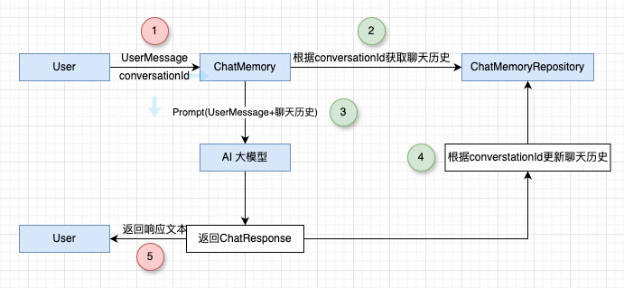

## Advisor 自动管理对话记忆

---

### 1. 什么是 Advisor

> Advisor，复数 Advisors。原意指"顾问、指导老师、劝告者"。

通过 `Advisor` 可在 **`请求发送到模型前`** 或 **`模型返回响应后`** 插入自定义数据，而无需修改核心业务代码。它类似于 `Spring-AOP` 中的拦截器，支持聊天记忆（`ChatMemory`）、检索增强生成（`RAG`）、日志、安全等多种 AI 场景。

---

### 2. 为什么需要 Advisor

回顾 **`基于内存的多轮会话`** 的实现流程：



> 核心业务在于发送请求、模型响应，聊天记忆的管理属于业务增强。

---

### 3. MessageChatMemoryAdvisor

`MessageChatMemoryAdvisor` 是提供 **记忆顾问功能** 的类。通过他可以自动获取历史消息、自动合并消息列表和自动存储模型响应。

```java
Advisor
    |- CallAdvisor,StreamAdvisor（非流式、流式响应的顾问接口）
        |- BaseAdvisor （组合非流式、流式响应的顾问接口）
            |- BaseChatMemoryAdvisor （ChatMemory 的基础顾问接口）
                |- MessageChatMemoryAdvisor
```

`MessageChatMemoryAdvisor` 类的两个核心方法：

```java
public final class MessageChatMemoryAdvisor implements BaseChatMemoryAdvisor {
    // 用户请求发送至模型之前：
    public ChatClientRequest before(ChatClientRequest chatClientRequest, AdvisorChain advisorChain) {
        // 1. 获取 conversationId
        String conversationId = this.getConversationId(chatClientRequest.context(), this.defaultConversationId);
        // 2. 获取当前 conversationId 的对话记忆
        List<Message> memoryMessages = this.chatMemory.get(conversationId);
        // 3. 合并消息列表
        List<Message> processedMessages = new ArrayList(memoryMessages);
        processedMessages.addAll(chatClientRequest.prompt().getInstructions());
        // 4. 创建一个新的请求
        ChatClientRequest processedChatClientRequest = chatClientRequest.mutate().prompt(chatClientRequest.prompt().mutate().messages(processedMessages).build()).build();
        // 5. 将新的消息添加到对话记忆中
        UserMessage userMessage = processedChatClientRequest.prompt().getUserMessage();
        this.chatMemory.add(conversationId, userMessage);
        // 返回本次请求
        return processedChatClientRequest;
    }
    // 模型响应之后
    public ChatClientResponse after(ChatClientResponse chatClientResponse, AdvisorChain advisorChain) {
        // 1. 新建消息集合保存模型的响应内容
        List<Message> assistantMessages = new ArrayList();
        // 2. 模型响应非空，则将模型的响应内容转换为 Message 类型保存到消息集合中
        if (chatClientResponse.chatResponse() != null) {
            assistantMessages = chatClientResponse.chatResponse().getResults().stream().map((g) -> g.getOutput()).toList();
        }
        // 3. 将新的消息集合添加到对话记忆中
        this.chatMemory.add(this.getConversationId(chatClientResponse.context(), this.defaultConversationId), assistantMessages);
        // 4. 返回本次模型响应
        return chatClientResponse;
    }
}
```


